# omniroute — 코드베이스 문서

🌐 **Languages:** 🇺🇸 [English](../../CODEBASE_DOCUMENTATION.md) | 🇧🇷 [Português (Brasil)](../pt-BR/CODEBASE_DOCUMENTATION.md) | 🇪🇸 [Español](../es/CODEBASE_DOCUMENTATION.md) | 🇫🇷 [Français](../fr/CODEBASE_DOCUMENTATION.md) | 🇮🇹 [Italiano](../it/CODEBASE_DOCUMENTATION.md) | 🇷🇺 [Русский](../ru/CODEBASE_DOCUMENTATION.md) | 🇨🇳 [中文 (简体)](../zh-CN/CODEBASE_DOCUMENTATION.md) | 🇩🇪 [Deutsch](../de/CODEBASE_DOCUMENTATION.md) | 🇮🇳 [हिन्दी](../in/CODEBASE_DOCUMENTATION.md) | 🇹🇭 [ไทย](../th/CODEBASE_DOCUMENTATION.md) | 🇺🇦 [Українська](../uk-UA/CODEBASE_DOCUMENTATION.md) | 🇸🇦 [العربية](../ar/CODEBASE_DOCUMENTATION.md) | 🇯🇵 [日本語](../ja/CODEBASE_DOCUMENTATION.md) | 🇻🇳 [Tiếng Việt](../vi/CODEBASE_DOCUMENTATION.md) | 🇧🇬 [Български](../bg/CODEBASE_DOCUMENTATION.md) | 🇩🇰 [Dansk](../da/CODEBASE_DOCUMENTATION.md) | 🇫🇮 [Suomi](../fi/CODEBASE_DOCUMENTATION.md) | 🇮🇱 [עברית](../he/CODEBASE_DOCUMENTATION.md) | 🇭🇺 [Magyar](../hu/CODEBASE_DOCUMENTATION.md) | 🇮🇩 [Bahasa Indonesia](../id/CODEBASE_DOCUMENTATION.md) | 🇰🇷 [한국어](../ko/CODEBASE_DOCUMENTATION.md) | 🇲🇾 [Bahasa Melayu](../ms/CODEBASE_DOCUMENTATION.md) | 🇳🇱 [Nederlands](../nl/CODEBASE_DOCUMENTATION.md) | 🇳🇴 [Norsk](../no/CODEBASE_DOCUMENTATION.md) | 🇵🇹 [Português (Portugal)](../pt/CODEBASE_DOCUMENTATION.md) | 🇷🇴 [Română](../ro/CODEBASE_DOCUMENTATION.md) | 🇵🇱 [Polski](../pl/CODEBASE_DOCUMENTATION.md) | 🇸🇰 [Slovenčina](../sk/CODEBASE_DOCUMENTATION.md) | 🇸🇪 [Svenska](../sv/CODEBASE_DOCUMENTATION.md) | 🇵🇭 [Filipino](../phi/CODEBASE_DOCUMENTATION.md)

> **옴니루트** 다중 제공자 AI 프록시 라우터에 대한 포괄적이고 초보자 친화적인 가이드입니다.

---

## 1. 옴니루트란?

omniroute는 AI 클라이언트(Claude CLI, Codex, Cursor IDE 등)와 AI 공급자(Anthropic, Google, OpenAI, AWS, GitHub 등) 사이에 위치하는 **프록시 라우터**입니다. 이는 하나의 큰 문제를 해결합니다.

> **다양한 AI 클라이언트는 서로 다른 "언어"(API 형식)를 사용하며, 다양한 AI 제공업체도 서로 다른 "언어"를 기대합니다.** omniroute는 이들 사이를 자동으로 변환합니다.

UN의 범용 통역사처럼 생각해보세요. 모든 대표는 모든 언어를 말할 수 있으며 번역자는 다른 대표를 위해 이를 변환합니다.

---

## 2. 아키텍처 개요

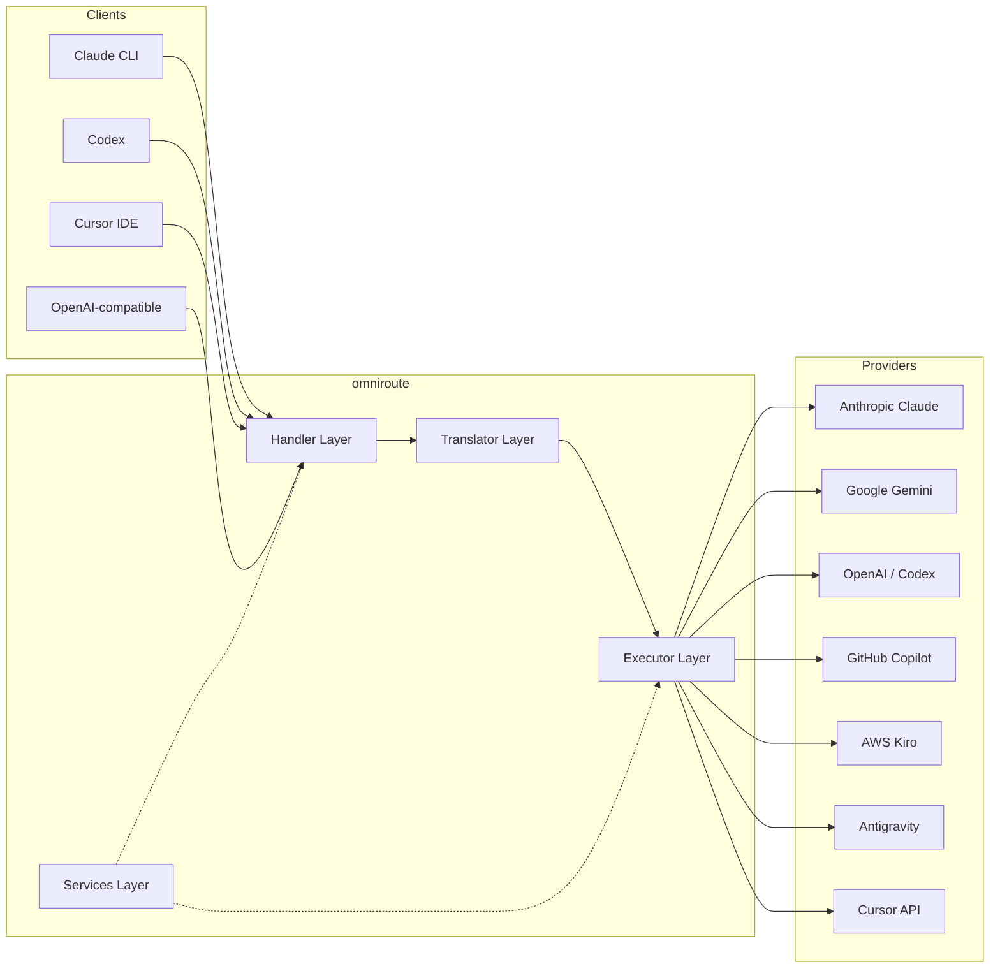

### 핵심 원칙: 허브 앤 스포크 번역

모든 형식 번역은 **OpenAI 형식을 허브**로 통과합니다.

```
Client Format → [OpenAI Hub] → Provider Format    (request)
Provider Format → [OpenAI Hub] → Client Format    (response)
```

즉, **N²**(모든 쌍) 대신 **N 번역자**(형식당 하나)만 필요하다는 의미입니다.

---

## 3. 프로젝트 구조

```
omniroute/
├── open-sse/                  ← Core proxy library (portable, framework-agnostic)
│   ├── index.js               ← Main entry point, exports everything
│   ├── config/                ← Configuration & constants
│   ├── executors/             ← Provider-specific request execution
│   ├── handlers/              ← Request handling orchestration
│   ├── services/              ← Business logic (auth, models, fallback, usage)
│   ├── translator/            ← Format translation engine
│   │   ├── request/           ← Request translators (8 files)
│   │   ├── response/          ← Response translators (7 files)
│   │   └── helpers/           ← Shared translation utilities (6 files)
│   └── utils/                 ← Utility functions
├── src/                       ← Application layer (Express/Worker runtime)
│   ├── app/                   ← Web UI, API routes, middleware
│   ├── lib/                   ← Database, auth, and shared library code
│   ├── mitm/                  ← Man-in-the-middle proxy utilities
│   ├── models/                ← Database models
│   ├── shared/                ← Shared utilities (wrappers around open-sse)
│   ├── sse/                   ← SSE endpoint handlers
│   └── store/                 ← State management
├── data/                      ← Runtime data (credentials, logs)
│   └── provider-credentials.json   (external credentials override, gitignored)
└── tester/                    ← Test utilities
```

---

## 4. 모듈별 분석

### 4.1 구성(`open-sse/config/`)

모든 공급자 구성에 대한 **단일 정보 소스**.

| 파일                          | 목적                                                                                                                                                                                                                    |
| ----------------------------- | ----------------------------------------------------------------------------------------------------------------------------------------------------------------------------------------------------------------------- |
| `constants.ts`                | 모든 공급자에 대한 기본 URL, OAuth 자격 증명(기본값), 헤더 및 기본 시스템 프롬프트가 포함된 `PROVIDERS` 개체입니다. 또한 `HTTP_STATUS`, `ERROR_TYPES`, `COOLDOWN_MS`, `BACKOFF_CONFIG` 및 `SKIP_PATTERNS`을 정의합니다. |
| `credentialLoader.ts`         | `data/provider-credentials.json`에서 외부 자격 증명을 로드하고 `PROVIDERS`의 하드코딩된 기본값에 병합합니다. 이전 버전과의 호환성을 유지하면서 소스 제어에서 비밀을 유지합니다.                                         |
| `providerModels.ts`           | 중앙 모델 레지스트리: 공급자 별칭 → 모델 ID를 매핑합니다. `getModels()`, `getProviderByAlias()`과 같은 함수입니다.                                                                                                      |
| `codexInstructions.ts`        | Codex 요청에 주입된 시스템 지침(제약 조건, 샌드박스 규칙, 승인 정책 편집)                                                                                                                                               |
| `defaultThinkingSignature.ts` | Claude 및 Gemini 모델의 기본 "사고" 서명입니다.                                                                                                                                                                         |
| `ollamaModels.ts`             | 로컬 Ollama 모델에 대한 스키마 정의(이름, 크기, 계열, 양자화)                                                                                                                                                           |

#### 자격 증명 로드 흐름

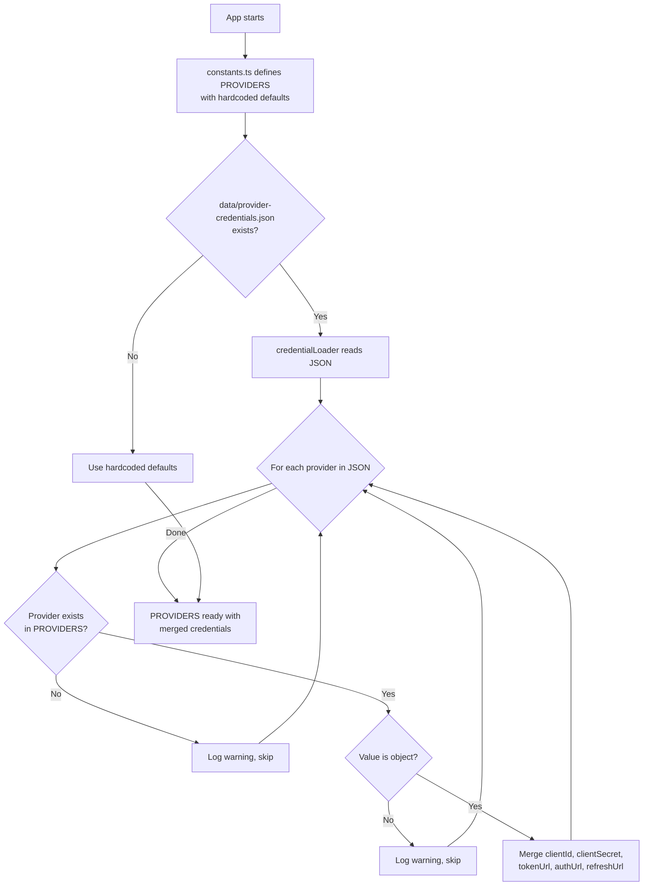

---

### 4.2 실행자(`open-sse/executors/`)

실행자는 **전략 패턴**을 사용하여 **제공자별 로직**을 캡슐화합니다. 각 실행자는 필요에 따라 기본 메서드를 재정의합니다.

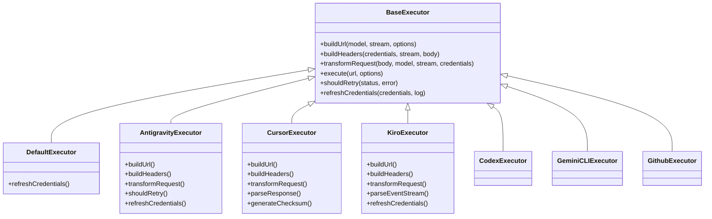

| 집행자           | 공급자                                      | 주요 전문 분야                                                                                                 |
| ---------------- | ------------------------------------------- | -------------------------------------------------------------------------------------------------------------- |
| `base.ts`        | —                                           | 추상 기반: URL 구축, 헤더, 재시도 논리, 자격 증명 새로 고침                                                    |
| `default.ts`     | 클로드, 제미니, OpenAI, GLM, 키미, 미니맥스 | 표준 공급자를 위한 일반 OAuth 토큰 새로 고침                                                                   |
| `antigravity.ts` | Google 클라우드 코드                        | 프로젝트/세션 ID 생성, 다중 URL 대체, 오류 메시지에서 사용자 정의 재시도 구문 분석("2시간 7분 23초 후 재설정") |
| `cursor.ts`      | 커서 IDE                                    | **가장 복잡함**: SHA-256 체크섬 인증, Protobuf 요청 인코딩, 바이너리 EventStream → SSE 응답 구문 분석          |
| `codex.ts`       | OpenAI 코덱스                               | 시스템 지침 주입, ​​사고 수준 관리, 지원되지 않는 매개변수 제거                                                |
| `gemini-cli.ts`  | 구글 제미니 CLI                             | 맞춤 URL 구축(`streamGenerateContent`), Google OAuth 토큰 새로고침                                             |
| `github.ts`      | GitHub 부조종사                             | 듀얼 토큰 시스템(GitHub OAuth + Copilot 토큰), VSCode 헤더 모방                                                |
| `kiro.ts`        | AWS 코드위스퍼러                            | AWS EventStream 바이너리 구문 분석, AMZN 이벤트 프레임, 토큰 추정                                              |
| `index.ts`       | —                                           | 팩토리: 기본 폴백을 사용하여 공급자 이름 → 실행자 클래스 매핑                                                  |

---

### 4.3 핸들러(`open-sse/handlers/`)

**조정 레이어** — 번역, 실행, 스트리밍 및 오류 처리를 조정합니다.

| 파일                  | 목적                                                                                                                                                                         |
| --------------------- | ---------------------------------------------------------------------------------------------------------------------------------------------------------------------------- |
| `chatCore.ts`         | **중앙 오케스트레이터**(~600줄). 형식 감지 → 변환 → 실행기 디스패치 → 스트리밍/비스트리밍 응답 → 토큰 새로 고침 → 오류 처리 → 사용 로깅 등 전체 요청 수명 주기를 처리합니다. |
| `responsesHandler.ts` | OpenAI의 응답 API용 어댑터: 응답 형식 변환 → 채팅 완료 → `chatCore`로 전송 → SSE를 다시 응답 형식으로 변환합니다.                                                            |
| `embeddings.ts`       | 임베딩 생성 핸들러: 임베딩 모델 → 공급자를 확인하고 공급자 API로 디스패치하고 OpenAI 호환 임베딩 응답을 반환합니다. 6개 이상의 공급자를 지원합니다.                          |
| `imageGeneration.ts`  | 이미지 생성 핸들러: 이미지 모델 → 공급자를 확인하고 OpenAI 호환, Gemini 이미지(반중력) 및 폴백(Nebius) 모드를 지원합니다. base64 또는 URL 이미지를 반환합니다.               |

#### 요청 수명 주기(chatCore.ts)

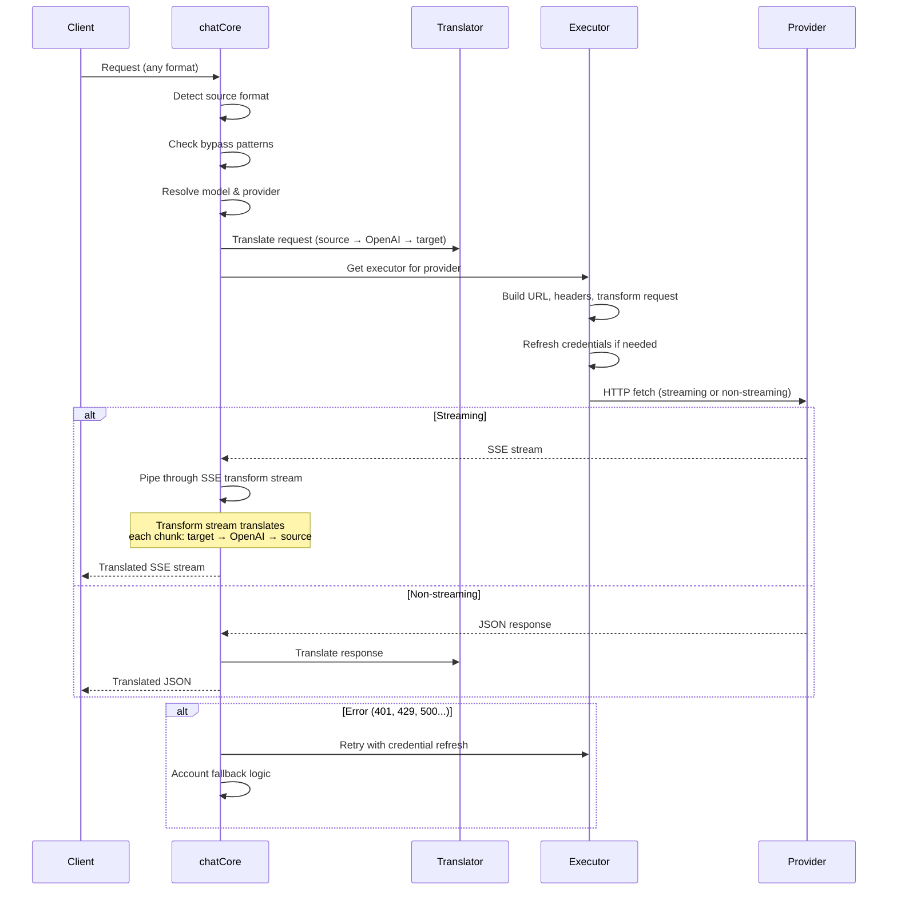

---

### 4.4 서비스 (`open-sse/services/`)

처리기와 실행기를 지원하는 비즈니스 논리입니다.

| 파일                 | 목적                                                                                                                                                                                                                                                                            |
| -------------------- | ------------------------------------------------------------------------------------------------------------------------------------------------------------------------------------------------------------------------------------------------------------------------------- |
| `provider.ts`        | **형식 감지**(`detectFormat`): 요청 본문 구조를 분석하여 Claude/OpenAI/Gemini/반중력/응답 형식을 식별합니다(Claude에 대한 `max_tokens` 휴리스틱 포함). 또한: URL 구축, 헤더 구축, 구성 정규화 사고. `openai-compatible-*` 및 `anthropic-compatible-*` 동적 공급자를 지원합니다. |
| `model.ts`           | 모델 문자열 구문 분석(`claude/model-name` → `{provider: "claude", model: "model-name"}`), 충돌 감지를 통한 별칭 해결, 입력 삭제(경로 순회/제어 문자 거부), 비동기 별칭 getter 지원을 통한 모델 정보 확인.                                                                       |
| `accountFallback.ts` | 속도 제한 처리: 지수 백오프(1초 → 2초 → 4초 → 최대 2분), 계정 휴지 관리, 오류 분류(오류가 대체를 트리거하는지 여부).                                                                                                                                                            |
| `tokenRefresh.ts`    | **모든 공급자**에 대한 OAuth 토큰 새로 고침: Google(Gemini, Antigravity), Claude, Codex, Qwen, iFlow, GitHub(OAuth + Copilot 이중 토큰), Kiro(AWS SSO OIDC + Social Auth). 진행 중인 약속 중복 제거 캐시 및 지수 백오프를 통한 재시도가 포함됩니다.                             |
| `combo.ts`           | **콤보 모델**: 대체 모델 체인입니다. 모델 A가 대체 가능 오류로 인해 실패하는 경우 모델 B를 시도한 다음 C를 시도합니다. 실제 업스트림 상태 코드를 반환합니다.                                                                                                                    |
| `usage.ts`           | 공급자 API(GitHub Copilot 할당량, 반중력 모델 할당량, Codex 속도 제한, Kiro 사용량 분석, Claude 설정)에서 할당량/사용 데이터를 가져옵니다.                                                                                                                                      |
| `accountSelector.ts` | 채점 알고리즘을 사용한 스마트 계정 선택: 우선순위, 상태, 라운드 로빈 위치 및 쿨다운 상태를 고려하여 각 요청에 대한 최적의 계정을 선택합니다.                                                                                                                                    |
| `contextManager.ts`  | 요청 컨텍스트 수명 주기 관리: 디버깅 및 로깅을 위한 메타데이터(요청 ID, 타임스탬프, 공급자 정보)가 포함된 요청별 컨텍스트 개체를 생성하고 추적합니다.                                                                                                                           |
| `ipFilter.ts`        | IP 기반 액세스 제어: 허용 목록 및 차단 목록 모드를 지원합니다. API 요청을 처리하기 전에 구성된 규칙에 따라 클라이언트 IP를 검증합니다.                                                                                                                                          |
| `sessionManager.ts`  | 클라이언트 핑거프린팅을 통한 세션 추적: 해시된 클라이언트 식별자를 사용하여 활성 세션을 추적하고, 요청 수를 모니터링하고, 세션 메트릭을 제공합니다.                                                                                                                             |
| `signatureCache.ts`  | 요청 서명 기반 중복 제거 캐시: 최근 요청 서명을 캐시하고 일정 기간 내에 동일한 요청에 대해 캐시된 응답을 반환하여 중복 요청을 방지합니다.                                                                                                                                       |
| `systemPrompt.ts`    | 글로벌 시스템 프롬프트 삽입: 제공자별 호환성 처리를 통해 모든 요청에 ​​구성 가능한 시스템 프롬프트를 추가하거나 추가합니다.                                                                                                                                                     |
| `thinkingBudget.ts`  | 추론 토큰 예산 관리: 사고/추론 토큰 제어를 위한 패스스루, 자동(스트립 사고 구성), 사용자 정의(고정 예산) 및 적응형(복잡성 확장) 모드를 지원합니다.                                                                                                                              |
| `wildcardRouter.ts`  | 와일드카드 모델 패턴 라우팅: 가용성 및 우선순위에 따라 와일드카드 패턴(예: `*/claude-*`)을 구체적인 공급자/모델 쌍으로 확인합니다.                                                                                                                                              |

#### 토큰 새로 고침 중복 제거

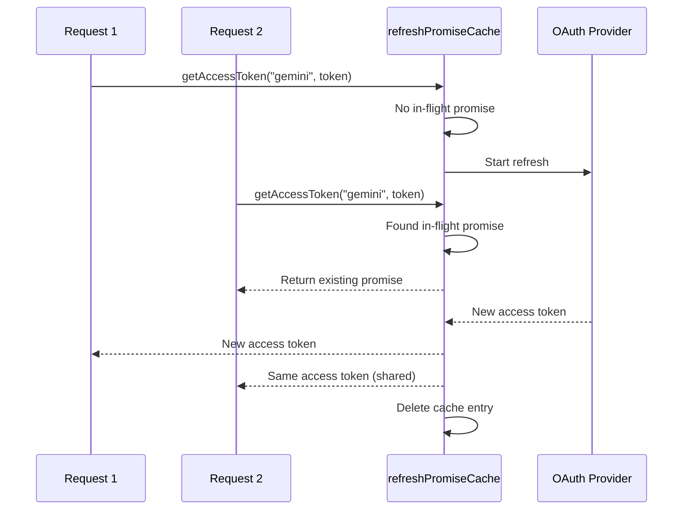

#### 계정 대체 상태 머신

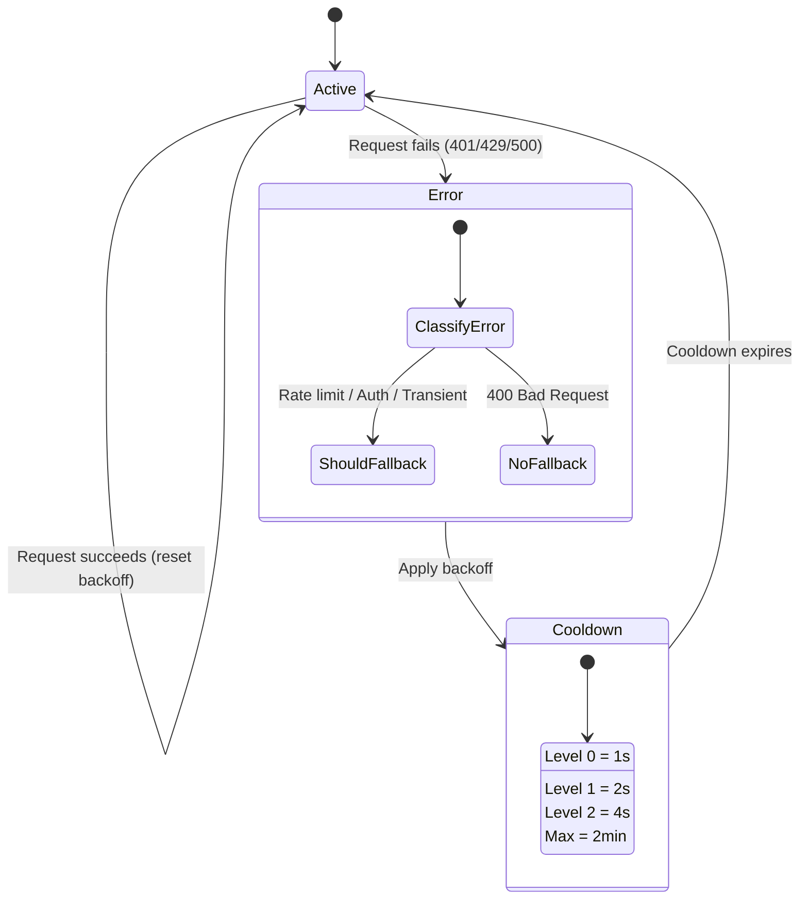

#### 콤보 모델 체인

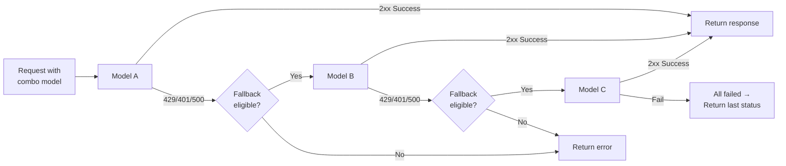

---

### 4.5 번역기(`open-sse/translator/`)

자체 등록 플러그인 시스템을 사용하는 **형식 번역 엔진**.

#### 아키텍처

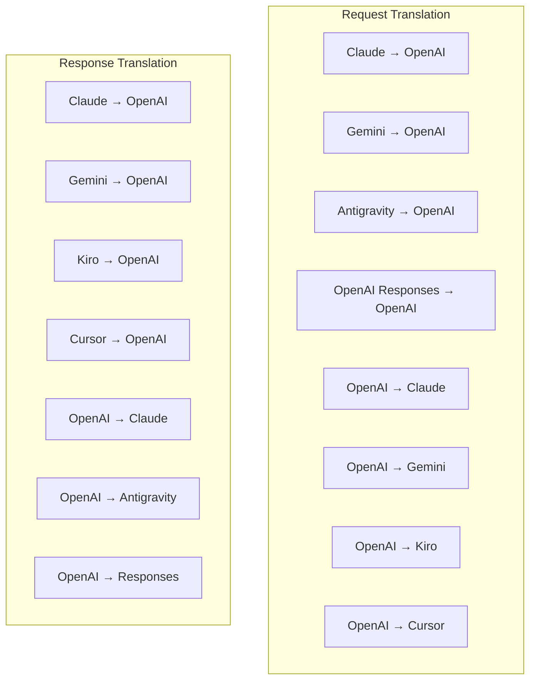

| 디렉토리     | 파일         | 설명                                                                                                                                                                                                                 |
| ------------ | ------------ | -------------------------------------------------------------------------------------------------------------------------------------------------------------------------------------------------------------------- |
| `request/`   | 8명의 번역가 | 형식 간에 요청 본문을 변환합니다. 각 파일은 가져올 때 `register(from, to, fn)`을 통해 자체 등록됩니다.                                                                                                               |
| `response/`  | 7명의 번역자 | 형식 간에 스트리밍 응답 청크를 변환합니다. SSE 이벤트 유형, 사고 블록, 도구 호출을 처리합니다.                                                                                                                       |
| `helpers/`   | 도우미 6명   | 공유 유틸리티: `claudeHelper`(시스템 프롬프트 추출, 사고 구성), `geminiHelper`(부분/콘텐츠 매핑), `openaiHelper`(형식 필터링), `toolCallHelper`(ID 생성, 누락된 응답 주입), `maxTokensHelper`, `responsesApiHelper`. |
| `index.ts`   | —            | 번역 엔진: `translateRequest()`, `translateResponse()`, 상태 관리, 레지스트리.                                                                                                                                       |
| `formats.ts` | —            | 형식 상수: `OPENAI`, `CLAUDE`, `GEMINI`, `ANTIGRAVITY`, `KIRO`, `CURSOR`, `OPENAI_RESPONSES`.                                                                                                                        |

#### 주요 디자인: 자동 등록 플러그인

```javascript
// Each translator file calls register() on import:
import { register } from "../index.js";
register("claude", "openai", translateClaudeToOpenAI);

// The index.js imports all translator files, triggering registration:
import "./request/claude-to-openai.js"; // ← self-registers
```

---

### 4.6 유틸리티(`open-sse/utils/`)

| 파일               | 목적                                                                                                                                                                                                                                                       |
| ------------------ | ---------------------------------------------------------------------------------------------------------------------------------------------------------------------------------------------------------------------------------------------------------- |
| `error.ts`         | 오류 응답 구축(OpenAI 호환 형식), 업스트림 오류 구문 분석, 오류 메시지에서 반중력 재시도 시간 추출, SSE 오류 스트리밍.                                                                                                                                     |
| `stream.ts`        | **SSE 변환 스트림** — 핵심 스트리밍 파이프라인입니다. 두 가지 모드: `TRANSLATE`(전체 형식 번역) 및 `PASSTHROUGH`(정규화 + 사용량 추출). 청크 버퍼링, 사용량 추정, 콘텐츠 길이 추적을 처리합니다. 스트림별 인코더/디코더 인스턴스는 공유 상태를 방지합니다. |
| `streamHelpers.ts` | 하위 수준 SSE 유틸리티: `parseSSELine`(공백 허용), `hasValuableContent`(OpenAI/Claude/Gemini의 빈 청크 필터링), `fixInvalidId`, `formatSSE`(`perf_metrics` 정리를 통한 형식 인식 SSE 직렬화).                                                              |
| `usageTracking.ts` | 모든 형식(Claude/OpenAI/Gemini/Responses)에서 토큰 사용량 추출, 별도 도구/토큰당 메시지 문자 비율을 사용한 추정, 버퍼 추가(2000 토큰 안전 마진), 형식별 필드 필터링, ANSI 색상을 사용한 콘솔 로깅.                                                         |
| `requestLogger.ts` | 파일 기반 요청 로깅(`ENABLE_REQUEST_LOGS=true`을 통한 선택). 번호가 매겨진 파일(`1_req_client.json` → `7_res_client.txt`)로 세션 폴더를 생성합니다. 모든 I/O는 비동기식입니다(fire-and-forget). 민감한 헤더를 마스킹합니다.                                |
| `bypassHandler.ts` | Claude CLI(제목 추출, 워밍업, 카운트)의 특정 패턴을 가로채고 공급자를 호출하지 않고 가짜 응답을 반환합니다. 스트리밍과 비스트리밍을 모두 지원합니다. 의도적으로 Claude CLI 범위로 제한되었습니다.                                                          |
| `networkProxy.ts`  | 공급자별 구성 → 전역 구성 → 환경 변수(`HTTPS_PROXY`/`HTTP_PROXY`/`ALL_PROXY`) 우선 순위에 따라 지정된 공급자에 대한 아웃바운드 프록시 URL을 확인합니다. `NO_PROXY` 제외를 지원합니다. 30초 동안 캐시 구성.                                                 |

#### SSE 스트리밍 파이프라인

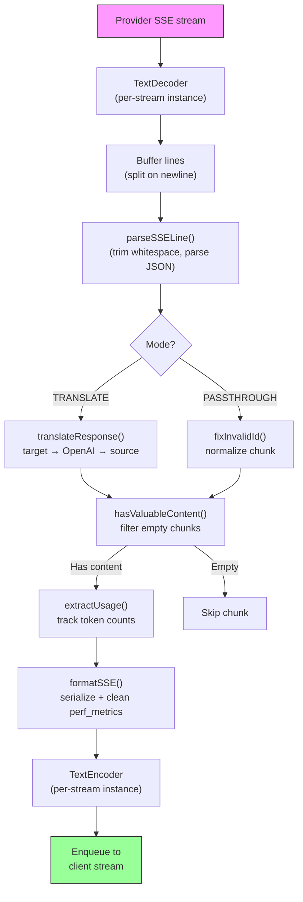

#### 요청 로거 세션 구조

```
logs/
└── claude_gemini_claude-sonnet_20260208_143045/
    ├── 1_req_client.json      ← Raw client request
    ├── 2_req_source.json      ← After initial conversion
    ├── 3_req_openai.json      ← OpenAI intermediate format
    ├── 4_req_target.json      ← Final target format
    ├── 5_res_provider.txt     ← Provider SSE chunks (streaming)
    ├── 5_res_provider.json    ← Provider response (non-streaming)
    ├── 6_res_openai.txt       ← OpenAI intermediate chunks
    ├── 7_res_client.txt       ← Client-facing SSE chunks
    └── 6_error.json           ← Error details (if any)
```

---

### 4.7 애플리케이션 계층(`src/`)

| 디렉토리      | 목적                                                                |
| ------------- | ------------------------------------------------------------------- |
| `src/app/`    | 웹 UI, API 경로, Express 미들웨어, OAuth 콜백 핸들러                |
| `src/lib/`    | 데이터베이스 액세스(`localDb.ts`, `usageDb.ts`), 인증, 공유         |
| `src/mitm/`   | 공급자 트래픽을 가로채기 위한 중간자 프록시 유틸리티                |
| `src/models/` | 데이터베이스 모델 정의                                              |
| `src/shared/` | open-sse 함수에 대한 래퍼(공급자, 스트림, 오류 등)                  |
| `src/sse/`    | open-sse 라이브러리를 Express 경로에 연결하는 SSE 엔드포인트 핸들러 |
| `src/store/`  | 애플리케이션 상태 관리                                              |

#### 주목할만한 API 경로

| 경로                                          | 방법               | 목적                                                                             |
| --------------------------------------------- | ------------------ | -------------------------------------------------------------------------------- |
| `/api/provider-models`                        | 가져오기/게시/삭제 | 공급자별 사용자 정의 모델을 위한 CRUD                                            |
| `/api/models/catalog`                         | 받기               | 공급자별로 그룹화된 모든 모델(채팅, 임베딩, 이미지, 사용자 정의)의 집계 카탈로그 |
| `/api/settings/proxy`                         | 가져오기/넣기/삭제 | 계층적 아웃바운드 프록시 구성(`global/providers/combos/keys`)                    |
| `/api/settings/proxy/test`                    | 포스트             | 프록시 연결을 확인하고 공용 IP/지연 시간을 반환합니다.                           |
| `/v1/providers/[provider]/chat/completions`   | 포스트             | 모델 검증을 통한 제공업체별 전용 채팅 완료                                       |
| `/v1/providers/[provider]/embeddings`         | 포스트             | 모델 검증을 통한 제공자별 전용 임베딩                                            |
| `/v1/providers/[provider]/images/generations` | 포스트             | 모델 검증을 통한 제공자별 전용 이미지 생성                                       |
| `/api/settings/ip-filter`                     | 가져오기/넣기      | IP 허용 목록/차단 목록 관리                                                      |
| `/api/settings/thinking-budget`               | 가져오기/넣기      | 토큰 예산 구성 추론(통과/자동/맞춤/적응)                                         |
| `/api/settings/system-prompt`                 | 가져오기/넣기      | 모든 요청에 ​​대해 글로벌 시스템 프롬프트 주입                                   |
| `/api/sessions`                               | 받기               | 활성 세션 추적 및 측정항목                                                       |
| `/api/rate-limits`                            | 받기               | 계정별 비율한도 현황                                                             |

---

## 5. 주요 디자인 패턴

### 5.1 허브 앤 스포크 번역

모든 형식은 **OpenAI 형식을 허브**로 통해 변환됩니다. 새 공급자를 추가하려면 N 쌍이 아닌 **한 쌍**의 번역기(OpenAI 간)만 작성하면 됩니다.

### 5.2 실행자 전략 패턴

각 공급자에는 `BaseExecutor`에서 상속되는 전용 실행자 클래스가 있습니다. `executors/index.ts`의 팩토리는 런타임 시 올바른 팩토리를 선택합니다.

### 5.3 자체 등록 플러그인 시스템

번역기 모듈은 `register()`을 통해 가져올 때 자체적으로 등록됩니다. 새로운 번역자를 추가하는 것은 파일을 생성하고 가져오는 것뿐입니다.

### 5.4 지수 백오프를 사용한 계정 대체

공급자가 429/401/500을 반환하면 시스템은 지수 쿨다운(1초 → 2초 → 4초 → 최대 2분)을 적용하여 다음 계정으로 전환할 수 있습니다.

### 5.5 콤보 모델 체인

"콤보"는 여러 `provider/model` 문자열을 그룹화합니다. 첫 번째 작업이 실패하면 자동으로 다음 작업으로 대체됩니다.

### 5.6 상태 저장 스트리밍 변환

응답 변환은 `initState()` 메커니즘을 통해 SSE 청크(사고 블록 추적, 도구 호출 축적, 콘텐츠 블록 인덱싱) 전체에서 상태를 유지합니다.

### 5.7 사용 안전 버퍼

클라이언트가 시스템 프롬프트 및 형식 변환의 오버헤드로 인해 컨텍스트 창 제한에 도달하는 것을 방지하기 위해 보고된 사용량에 2000토큰 버퍼가 추가되었습니다.

---

## 6. 지원되는 형식

| 형식             | 방향        | 식별자             |
| ---------------- | ----------- | ------------------ |
| OpenAI 채팅 완료 | 소스 + 타겟 | `openai`           |
| OpenAI 응답 API  | 소스 + 타겟 | `openai-responses` |
| 인류학 클로드    | 소스 + 타겟 | `claude`           |
| 구글 제미니      | 소스 + 타겟 | `gemini`           |
| 구글 제미니 CLI  | 대상만      | `gemini-cli`       |
| 반중력           | 소스 + 타겟 | `antigravity`      |
| AWS 키로         | 대상만      | `kiro`             |
| 커서             | 대상만      | `cursor`           |

---

## 7. 지원되는 공급자

| 공급자                   | 인증 방법              | 집행자    | 주요 내용                                   |
| ------------------------ | ---------------------- | --------- | ------------------------------------------- |
| 인류학 클로드            | API 키 또는 OAuth      | 기본값    | `x-api-key` 헤더 사용                       |
| 구글 제미니              | API 키 또는 OAuth      | 기본값    | `x-goog-api-key` 헤더 사용                  |
| 구글 제미니 CLI          | OAuth                  | 쌍둥이CLI | `streamGenerateContent` 엔드포인트 사용     |
| 반중력                   | OAuth                  | 반중력    | 다중 URL 대체, 사용자 정의 재시도 구문 분석 |
| 오픈AI                   | API 키                 | 기본값    | 표준 무기명 인증                            |
| 코덱스                   | OAuth                  | 코덱스    | 시스템 지침 주입, ​​사고 관리               |
| GitHub 부조종사          | OAuth + Copilot 토큰   | 깃허브    | 듀얼 토큰, VSCode 헤더 모방                 |
| 키로(AWS)                | AWS SSO OIDC 또는 소셜 | 키로      | 바이너리 EventStream 구문 분석              |
| 커서 IDE                 | 체크섬 인증            | 커서      | Protobuf 인코딩, SHA-256 체크섬             |
| 퀀                       | OAuth                  | 기본값    | 표준 인증                                   |
| 아이플로우               | OAuth(기본 + 전달자)   | 기본값    | 이중 인증 헤더                              |
| 오픈라우터               | API 키                 | 기본값    | 표준 무기명 인증                            |
| GLM, 키미, 미니맥스      | API 키                 | 기본값    | Claude 호환, `x-api-key` 사용               |
| `openai-compatible-*`    | API 키                 | 기본값    | 동적: 모든 OpenAI 호환 엔드포인트           |
| `anthropic-compatible-*` | API 키                 | 기본값    | 동적: Claude와 호환되는 모든 엔드포인트     |

---

## 8. 데이터 흐름 요약

### 스트리밍 요청

```mermaid
flowchart LR
    A["Client"] --> B["detectFormat()"]
    B --> C["translateRequest()\nsource → OpenAI → target"]
    C --> D["Executor\nbuildUrl + buildHeaders"]
    D --> E["fetch(providerURL)"]
    E --> F["createSSEStream()\nTRANSLATE mode"]
    F --> G["parseSSELine()"]
    G --> H["translateResponse()\ntarget → OpenAI → source"]
    H --> I["extractUsage()\n+ addBuffer"]
    I --> J["formatSSE()"]
    J --> K["Client receives\ntranslated SSE"]
    K --> L["logUsage()\nsaveRequestUsage()"]
```

### 비스트리밍 요청

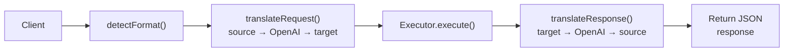

### 우회 흐름(Claude CLI)

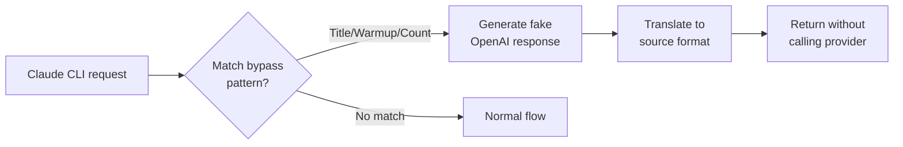
