# omniroute — Dokumentasi Pangkalan Kod

🌐 **Languages:** 🇺🇸 [English](../../CODEBASE_DOCUMENTATION.md) | 🇧🇷 [Português (Brasil)](../pt-BR/CODEBASE_DOCUMENTATION.md) | 🇪🇸 [Español](../es/CODEBASE_DOCUMENTATION.md) | 🇫🇷 [Français](../fr/CODEBASE_DOCUMENTATION.md) | 🇮🇹 [Italiano](../it/CODEBASE_DOCUMENTATION.md) | 🇷🇺 [Русский](../ru/CODEBASE_DOCUMENTATION.md) | 🇨🇳 [中文 (简体)](../zh-CN/CODEBASE_DOCUMENTATION.md) | 🇩🇪 [Deutsch](../de/CODEBASE_DOCUMENTATION.md) | 🇮🇳 [हिन्दी](../in/CODEBASE_DOCUMENTATION.md) | 🇹🇭 [ไทย](../th/CODEBASE_DOCUMENTATION.md) | 🇺🇦 [Українська](../uk-UA/CODEBASE_DOCUMENTATION.md) | 🇸🇦 [العربية](../ar/CODEBASE_DOCUMENTATION.md) | 🇯🇵 [日本語](../ja/CODEBASE_DOCUMENTATION.md) | 🇻🇳 [Tiếng Việt](../vi/CODEBASE_DOCUMENTATION.md) | 🇧🇬 [Български](../bg/CODEBASE_DOCUMENTATION.md) | 🇩🇰 [Dansk](../da/CODEBASE_DOCUMENTATION.md) | 🇫🇮 [Suomi](../fi/CODEBASE_DOCUMENTATION.md) | 🇮🇱 [עברית](../he/CODEBASE_DOCUMENTATION.md) | 🇭🇺 [Magyar](../hu/CODEBASE_DOCUMENTATION.md) | 🇮🇩 [Bahasa Indonesia](../id/CODEBASE_DOCUMENTATION.md) | 🇰🇷 [한국어](../ko/CODEBASE_DOCUMENTATION.md) | 🇲🇾 [Bahasa Melayu](../ms/CODEBASE_DOCUMENTATION.md) | 🇳🇱 [Nederlands](../nl/CODEBASE_DOCUMENTATION.md) | 🇳🇴 [Norsk](../no/CODEBASE_DOCUMENTATION.md) | 🇵🇹 [Português (Portugal)](../pt/CODEBASE_DOCUMENTATION.md) | 🇷🇴 [Română](../ro/CODEBASE_DOCUMENTATION.md) | 🇵🇱 [Polski](../pl/CODEBASE_DOCUMENTATION.md) | 🇸🇰 [Slovenčina](../sk/CODEBASE_DOCUMENTATION.md) | 🇸🇪 [Svenska](../sv/CODEBASE_DOCUMENTATION.md) | 🇵🇭 [Filipino](../phi/CODEBASE_DOCUMENTATION.md)

> Panduan komprehensif dan mesra pemula kepada penghala proksi AI **omniroute** berbilang pembekal.

---

## 1. Apakah itu omniroute?

omniroute ialah **penghala proksi** yang terletak di antara klien AI (Claude CLI, Codex, Cursor IDE, dll.) dan penyedia AI (Anthropic, Google, OpenAI, AWS, GitHub, dsb.). Ia menyelesaikan satu masalah besar:

> **Pelanggan AI yang berbeza bercakap "bahasa" yang berbeza (format API), dan pembekal AI yang berbeza juga mengharapkan "bahasa" yang berbeza.** omniroute menterjemah antara mereka secara automatik.

Anggaplah ia seperti penterjemah universal di Pertubuhan Bangsa-Bangsa Bersatu — mana-mana perwakilan boleh bercakap apa-apa bahasa, dan penterjemah menukarnya untuk mana-mana perwakilan lain.

---

## 2. Gambaran Keseluruhan Seni Bina

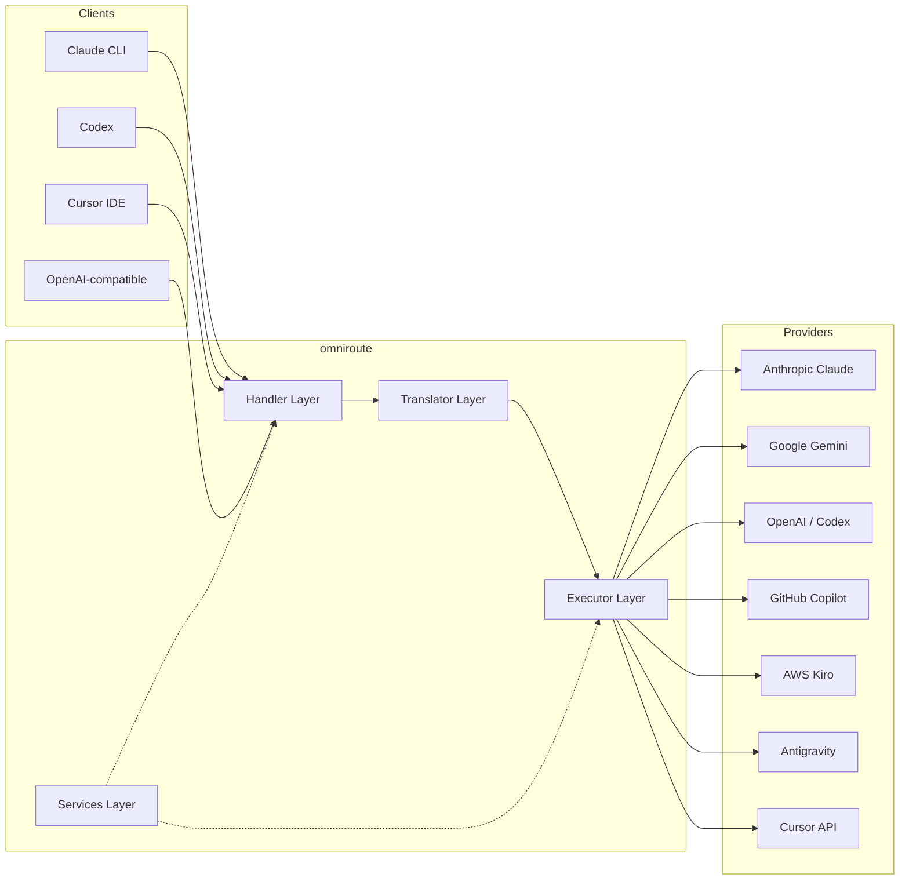

### Prinsip Teras: Terjemahan Hub-and-Spoke

Semua terjemahan format melalui **format OpenAI sebagai hab**:

```
Client Format → [OpenAI Hub] → Provider Format    (request)
Provider Format → [OpenAI Hub] → Client Format    (response)
```

Ini bermakna anda hanya memerlukan **N penterjemah** (satu setiap format) dan bukannya **N²** (setiap pasangan).

---

## 3. Struktur Projek

```
omniroute/
├── open-sse/                  ← Core proxy library (portable, framework-agnostic)
│   ├── index.js               ← Main entry point, exports everything
│   ├── config/                ← Configuration & constants
│   ├── executors/             ← Provider-specific request execution
│   ├── handlers/              ← Request handling orchestration
│   ├── services/              ← Business logic (auth, models, fallback, usage)
│   ├── translator/            ← Format translation engine
│   │   ├── request/           ← Request translators (8 files)
│   │   ├── response/          ← Response translators (7 files)
│   │   └── helpers/           ← Shared translation utilities (6 files)
│   └── utils/                 ← Utility functions
├── src/                       ← Application layer (Express/Worker runtime)
│   ├── app/                   ← Web UI, API routes, middleware
│   ├── lib/                   ← Database, auth, and shared library code
│   ├── mitm/                  ← Man-in-the-middle proxy utilities
│   ├── models/                ← Database models
│   ├── shared/                ← Shared utilities (wrappers around open-sse)
│   ├── sse/                   ← SSE endpoint handlers
│   └── store/                 ← State management
├── data/                      ← Runtime data (credentials, logs)
│   └── provider-credentials.json   (external credentials override, gitignored)
└── tester/                    ← Test utilities
```

---

## 4. Pecahan Modul demi Modul

### 4.1 Konfigurasi (`open-sse/config/`)

**Sumber tunggal kebenaran** untuk semua konfigurasi pembekal.

| Fail                          | Tujuan                                                                                                                                                                                                                          |
| ----------------------------- | ------------------------------------------------------------------------------------------------------------------------------------------------------------------------------------------------------------------------------- |
| `constants.ts`                | `PROVIDERS` objek dengan URL asas, bukti kelayakan OAuth (lalai), pengepala dan gesaan sistem lalai untuk setiap pembekal. Juga mentakrifkan `HTTP_STATUS`, `ERROR_TYPES`, `COOLDOWN_MS`, `BACKOFF_CONFIG` dan `SKIP_PATTERNS`. |
| `credentialLoader.ts`         | Memuatkan bukti kelayakan luaran daripada `data/provider-credentials.json` dan menggabungkannya pada lalai berkod keras dalam `PROVIDERS`. Menyimpan rahsia di luar kawalan sumber sambil mengekalkan keserasian ke belakang.   |
| `providerModels.ts`           | Pendaftaran model pusat: alias penyedia peta → ID model. Berfungsi seperti `getModels()`, `getProviderByAlias()`.                                                                                                               |
| `codexInstructions.ts`        | Arahan sistem disuntik ke dalam permintaan Codex (kekangan pengeditan, peraturan kotak pasir, dasar kelulusan).                                                                                                                 |
| `defaultThinkingSignature.ts` | Tanda tangan "berfikir" lalai untuk model Claude dan Gemini.                                                                                                                                                                    |
| `ollamaModels.ts`             | Takrif skema untuk model Ollama tempatan (nama, saiz, keluarga, pengkuantitian).                                                                                                                                                |

#### Aliran Pemuatan Kredensial

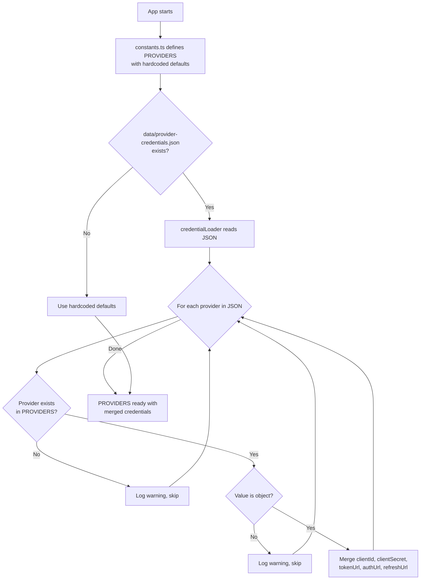

---

### 4.2 Pelaksana (`open-sse/executors/`)

Pelaksana merangkum **logik khusus pembekal** menggunakan **Corak Strategi**. Setiap pelaksana mengatasi kaedah asas seperti yang diperlukan.

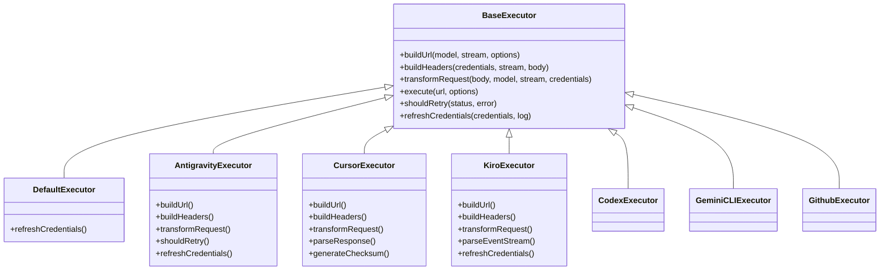

| Pelaksana        | Pembekal                                   | Pengkhususan Utama                                                                                                                     |
| ---------------- | ------------------------------------------ | -------------------------------------------------------------------------------------------------------------------------------------- |
| `base.ts`        | —                                          | Asas abstrak: Pembinaan URL, pengepala, cuba semula logik, penyegaran semula kelayakan                                                 |
| `default.ts`     | Claude, Gemini, OpenAI, GLM, Kimi, MiniMax | Muat semula token OAuth generik untuk pembekal standard                                                                                |
| `antigravity.ts` | Kod Awan Google                            | Penjanaan ID projek/sesi, sandaran berbilang URL, cuba semula tersuai menghuraikan daripada mesej ralat ("set semula selepas 2h7m23s") |
| `cursor.ts`      | IDE kursor                                 | **Paling kompleks**: Pengesahan checksum SHA-256, pengekodan permintaan Protobuf, Perduaan EventStream → Penghuraian respons SSE       |
| `codex.ts`       | OpenAI Codex                               | Menyuntik arahan sistem, mengurus tahap pemikiran, mengalih keluar parameter yang tidak disokong                                       |
| `gemini-cli.ts`  | Google Gemini CLI                          | Pembinaan URL tersuai (`streamGenerateContent`), muat semula token Google OAuth                                                        |
| `github.ts`      | GitHub Copilot                             | Sistem token dwi (GitHub OAuth + Copilot token), pengepala VSCode meniru                                                               |
| `kiro.ts`        | AWS CodeWhisperer                          | Penghuraian binari AWS EventStream, bingkai acara AMZN, anggaran token                                                                 |
| `index.ts`       | —                                          | Kilang: nama pembekal peta → kelas pelaksana, dengan sandaran lalai                                                                    |

---

### 4.3 Pengendali (`open-sse/handlers/`)

**Lapisan orkestrasi** — menyelaras terjemahan, pelaksanaan, penstriman dan pengendalian ralat.

| Fail                  | Tujuan                                                                                                                                                                                                                                               |
| --------------------- | ---------------------------------------------------------------------------------------------------------------------------------------------------------------------------------------------------------------------------------------------------- |
| `chatCore.ts`         | **Orkestra pusat** (~600 baris). Mengendalikan kitaran hayat permintaan yang lengkap: pengesanan format → terjemahan → penghantaran pelaksana → respons penstriman/bukan penstriman → penyegaran token → pengendalian ralat → pengelogan penggunaan. |
| `responsesHandler.ts` | Penyesuai untuk API Respons OpenAI: menukar format Respons → Selesai Sembang → menghantar kepada `chatCore` → menukar SSE kembali kepada format Respons.                                                                                             |
| `embeddings.ts`       | Pengendali penjanaan benam: menyelesaikan model pembenaman → pembekal, menghantar kepada API pembekal, mengembalikan respons pembenaman serasi OpenAI. Menyokong 6+ pembekal.                                                                        |
| `imageGeneration.ts`  | Pengendali penjanaan imej: menyelesaikan model imej → pembekal, menyokong mod serasi OpenAI, imej Gemini (Antigraviti) dan sandaran (Nebius). Mengembalikan imej base64 atau URL.                                                                    |

#### Minta Kitaran Hayat (chatCore.ts)

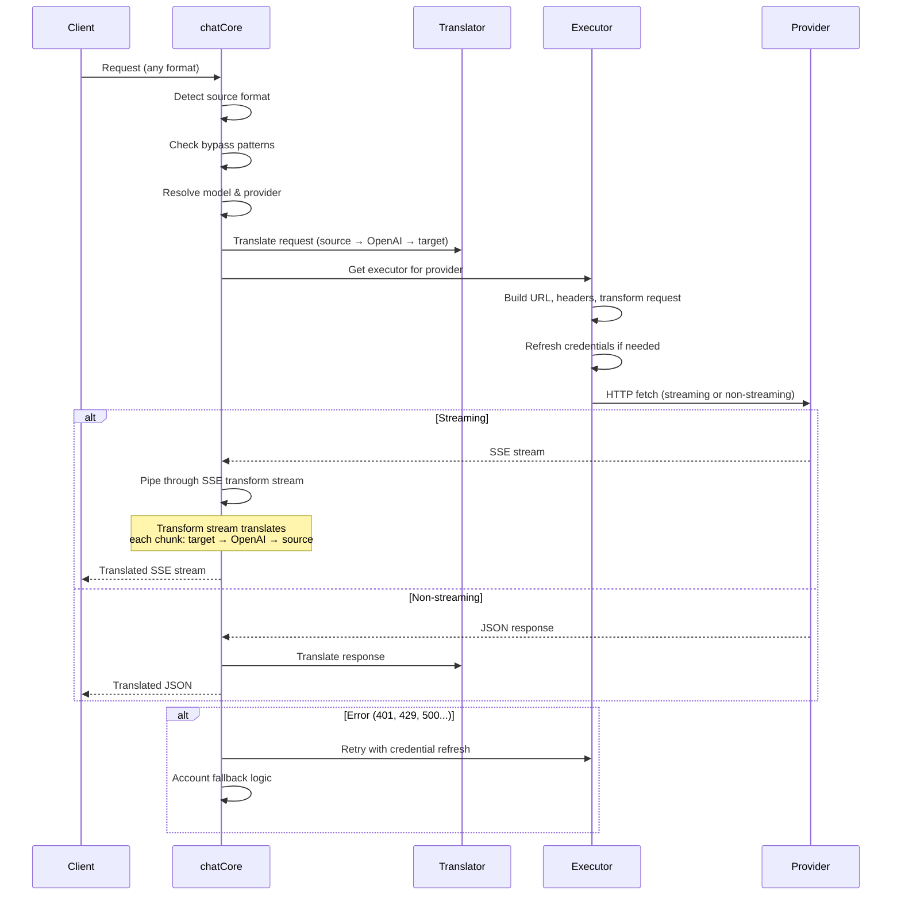

---

### 4.4 Perkhidmatan (`open-sse/services/`)

Logik perniagaan yang menyokong pengendali dan pelaksana.

| Fail                 | Tujuan                                                                                                                                                                                                                                                                                                                                                         |
| -------------------- | -------------------------------------------------------------------------------------------------------------------------------------------------------------------------------------------------------------------------------------------------------------------------------------------------------------------------------------------------------------- |
| `provider.ts`        | **Pengesanan format** (`detectFormat`): menganalisis struktur badan permintaan untuk mengenal pasti format Claude/OpenAI/Gemini/Antigravity/Respons (termasuk `max_tokens` heuristik untuk Claude). Juga: Pembinaan URL, pembinaan pengepala, penormalan konfigurasi pemikiran. Menyokong `openai-compatible-*` dan `anthropic-compatible-*` pembekal dinamik. |
| `model.ts`           | Penghuraian rentetan model (`claude/model-name` → `{provider: "claude", model: "model-name"}`), resolusi alias dengan pengesanan perlanggaran, pembersihan input (menolak aksara traversal/kawalan laluan) dan resolusi maklumat model dengan sokongan alias getter async.                                                                                     |
| `accountFallback.ts` | Pengendalian had kadar: pengunduran eksponen (1s → 2s → 4s → maks 2minit), pengurusan cooldown akaun, klasifikasi ralat (ralat yang mencetuskan sandaran berbanding tidak).                                                                                                                                                                                    |
| `tokenRefresh.ts`    | Muat semula token OAuth untuk **setiap pembekal**: Google (Gemini, Antigravity), Claude, Codex, Qwen, iFlow, GitHub (OAuth + Copilot dwi-token), Kiro (AWS SSO OIDC + Social Auth). Termasuk cache penyahduplikasi janji dalam penerbangan dan cuba semula dengan pengunduran eksponen.                                                                        |
| `combo.ts`           | **Model kombo**: rangkaian model sandaran. Jika model A gagal dengan ralat layak sandar, cuba model B, kemudian C, dsb. Mengembalikan kod status huluan sebenar.                                                                                                                                                                                               |
| `usage.ts`           | Mengambil data kuota/penggunaan daripada API pembekal (kuota Copilot GitHub, kuota model Antigraviti, had kadar Codex, pecahan penggunaan Kiro, tetapan Claude).                                                                                                                                                                                               |
| `accountSelector.ts` | Pemilihan akaun pintar dengan algoritma pemarkahan: mempertimbangkan keutamaan, status kesihatan, kedudukan round-robin dan keadaan cooldown untuk memilih akaun yang optimum bagi setiap permintaan.                                                                                                                                                          |
| `contextManager.ts`  | Meminta pengurusan kitaran hayat konteks: mencipta dan menjejak objek konteks setiap permintaan dengan metadata (ID permintaan, cap masa, maklumat pembekal) untuk penyahpepijatan dan pengelogan.                                                                                                                                                             |
| `ipFilter.ts`        | Kawalan capaian berasaskan IP: menyokong mod senarai dibenarkan dan senarai sekat. Mengesahkan IP klien terhadap peraturan yang dikonfigurasikan sebelum memproses permintaan API.                                                                                                                                                                             |
| `sessionManager.ts`  | Penjejakan sesi dengan cap jari pelanggan: menjejaki sesi aktif menggunakan pengecam pelanggan dicincang, memantau kiraan permintaan dan menyediakan metrik sesi.                                                                                                                                                                                              |
| `signatureCache.ts`  | Minta cache penyahduplikasian berasaskan tandatangan: menghalang permintaan pendua dengan menyimpan cache tandatangan permintaan terkini dan mengembalikan respons cache untuk permintaan yang sama dalam tetingkap masa.                                                                                                                                      |
| `systemPrompt.ts`    | Suntikan gesaan sistem global: menambah atau menambahkan gesaan sistem yang boleh dikonfigurasikan kepada semua permintaan, dengan pengendalian keserasian setiap pembekal.                                                                                                                                                                                    |
| `thinkingBudget.ts`  | Pengurusan belanjawan token penaakulan: menyokong mod laluan lalu, auto (konfigurasi pemikiran jalur), tersuai (belanjawan tetap) dan mod penyesuaian (berskala kerumitan) untuk mengawal token pemikiran/penaakulan.                                                                                                                                          |
| `wildcardRouter.ts`  | Penghalaan corak model kad liar: menyelesaikan corak kad bebas (cth., `*/claude-*`) kepada pasangan pembekal/model konkrit berdasarkan ketersediaan dan keutamaan.                                                                                                                                                                                             |

#### Deduplikasi Token Refresh

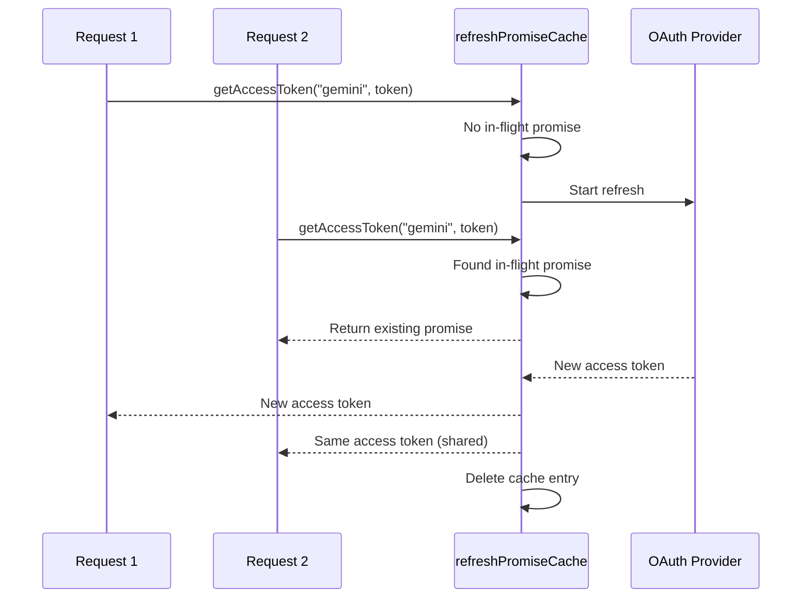

#### Mesin Keadaan Fallback Akaun

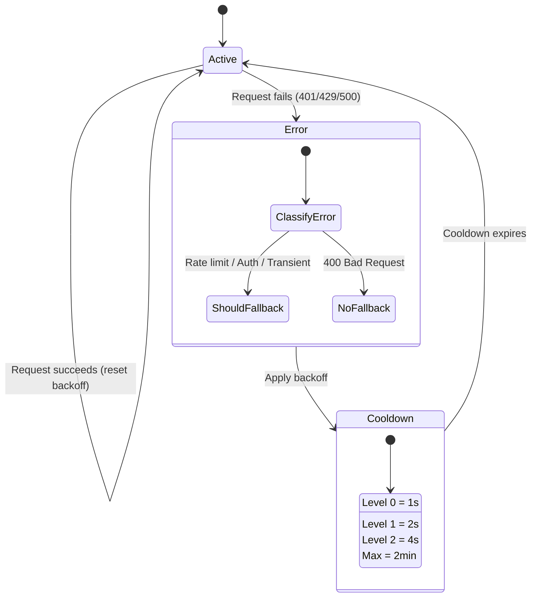

#### Rantai Model Kombo

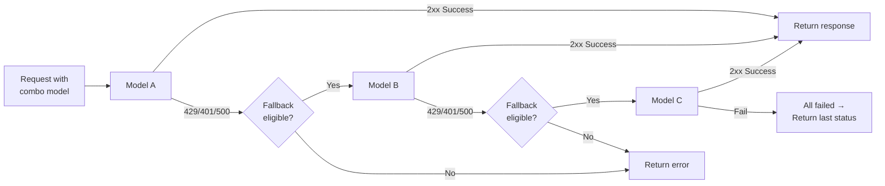

---

### 4.5 Penterjemah (`open-sse/translator/`)

**enjin terjemahan format** menggunakan sistem pemalam pendaftaran sendiri.

#### Seni bina

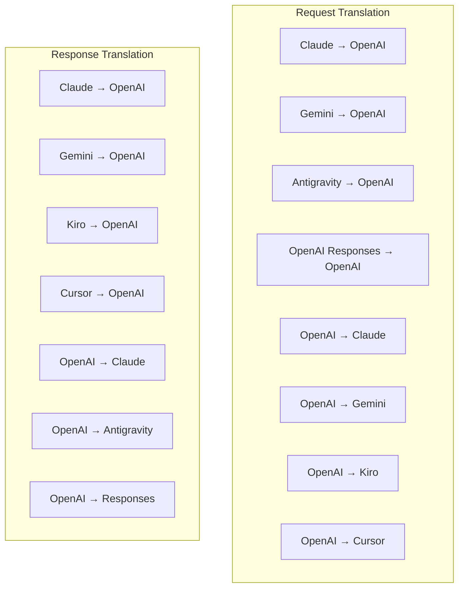

| Direktori    | Fail          | Penerangan                                                                                                                                                                                                                                                             |
| ------------ | ------------- | ---------------------------------------------------------------------------------------------------------------------------------------------------------------------------------------------------------------------------------------------------------------------- |
| `request/`   | 8 penterjemah | Tukar badan permintaan antara format. Setiap fail mendaftar sendiri melalui `register(from, to, fn)` semasa diimport.                                                                                                                                                  |
| `response/`  | 7 penterjemah | Tukar ketulan respons penstriman antara format. Mengendalikan jenis acara SSE, blok pemikiran, panggilan alat.                                                                                                                                                         |
| `helpers/`   | 6 pembantu    | Utiliti dikongsi: `claudeHelper` (pengekstrak segera sistem, konfigurasi pemikiran), `geminiHelper` (pemetaan bahagian/kandungan), `openaiHelper` (penapisan format), `toolCallHelper` (penjanaan ID, suntikan tindak balas tiada), `toolCallHelper`, `toolCallHelper` |
| `index.ts`   | —             | Enjin terjemahan: `translateRequest()`, `translateResponse()`, pengurusan negeri, pendaftaran.                                                                                                                                                                         |
| `formats.ts` | —             | Pemalar format: `OPENAI`, `CLAUDE`, `GEMINI`, `ANTIGRAVITY`, `KIRO`, `CURSOR`, `OPENAI_RESPONSES`.                                                                                                                                                                     |

#### Reka Bentuk Utama: Pemalam Mendaftar Sendiri

```javascript
// Each translator file calls register() on import:
import { register } from "../index.js";
register("claude", "openai", translateClaudeToOpenAI);

// The index.js imports all translator files, triggering registration:
import "./request/claude-to-openai.js"; // ← self-registers
```

---

### 4.6 Util (`open-sse/utils/`)

| Fail               | Tujuan                                                                                                                                                                                                                                                                                                                    |
| ------------------ | ------------------------------------------------------------------------------------------------------------------------------------------------------------------------------------------------------------------------------------------------------------------------------------------------------------------------- |
| `error.ts`         | Pembinaan tindak balas ralat (format serasi OpenAI), penghuraian ralat huluan, Pengekstrakan masa percubaan semula Antigraviti daripada mesej ralat, penstriman ralat SSE.                                                                                                                                                |
| `stream.ts`        | **SSE Transform Stream** — saluran paip penstriman teras. Dua mod: `TRANSLATE` (terjemahan format penuh) dan `PASSTHROUGH` (normalkan + penggunaan ekstrak). Mengendalikan penimbalan bongkah, anggaran penggunaan, penjejakan panjang kandungan. Kejadian pengekod/penyahkod setiap aliran mengelakkan keadaan dikongsi. |
| `streamHelpers.ts` | Utiliti SSE peringkat rendah: `parseSSELine` (bertoleransi ruang putih), `hasValuableContent` (menapis ketulan kosong untuk OpenAI/Claude/Gemini), `fixInvalidId`, `formatSSE` (pembersihan SSE_OMNI4K yang sedar format dengan \_\_\_OMNI_EN4K).                                                                         |
| `usageTracking.ts` | Pengekstrakan penggunaan token daripada sebarang format (Claude/OpenAI/Gemini/Responses), anggaran dengan nisbah char-per-token alat/mesej yang berasingan, penambahan penimbal (margin keselamatan 2000 token), penapisan medan khusus format, pengelogan konsol dengan warna ANSI.                                      |
| `requestLogger.ts` | Pengelogan permintaan berasaskan fail (ikut serta melalui `ENABLE_REQUEST_LOGS=true`). Mencipta folder sesi dengan fail bernombor: `1_req_client.json` → `7_res_client.txt`. Semua I/O tidak segerak (api-dan-lupa). Topeng tajuk sensitif.                                                                               |
| `bypassHandler.ts` | Memintas corak tertentu daripada Claude CLI (pengeluaran tajuk, pemanasan, kiraan) dan mengembalikan respons palsu tanpa menghubungi mana-mana pembekal. Menyokong kedua-dua penstriman dan bukan penstriman. Sengaja dihadkan kepada skop Claude CLI.                                                                    |
| `networkProxy.ts`  | Menyelesaikan URL proksi keluar untuk pembekal tertentu dengan keutamaan: konfigurasi khusus pembekal → konfigurasi global → pembolehubah persekitaran (`HTTPS_PROXY`/`HTTP_PROXY`/`ALL_PROXY`). Menyokong `NO_PROXY` pengecualian. Konfigurasi cache untuk 30s.                                                          |

#### Saluran Paip Penstriman SSE

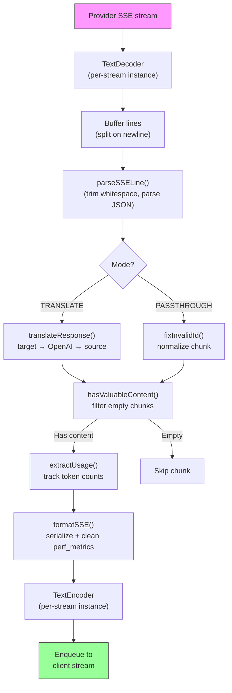

#### Permintaan Struktur Sesi Logger

```
logs/
└── claude_gemini_claude-sonnet_20260208_143045/
    ├── 1_req_client.json      ← Raw client request
    ├── 2_req_source.json      ← After initial conversion
    ├── 3_req_openai.json      ← OpenAI intermediate format
    ├── 4_req_target.json      ← Final target format
    ├── 5_res_provider.txt     ← Provider SSE chunks (streaming)
    ├── 5_res_provider.json    ← Provider response (non-streaming)
    ├── 6_res_openai.txt       ← OpenAI intermediate chunks
    ├── 7_res_client.txt       ← Client-facing SSE chunks
    └── 6_error.json           ← Error details (if any)
```

---

### 4.7 Lapisan Aplikasi (`src/`)

| Direktori     | Tujuan                                                                        |
| ------------- | ----------------------------------------------------------------------------- |
| `src/app/`    | UI Web, laluan API, perisian tengah Ekspres, pengendali panggil balik OAuth   |
| `src/lib/`    | Akses pangkalan data (`localDb.ts`, `usageDb.ts`), pengesahan, dikongsi       |
| `src/mitm/`   | Utiliti proksi man-in-the-middle untuk memintas trafik pembekal               |
| `src/models/` | Takrif model pangkalan data                                                   |
| `src/shared/` | Pembalut di sekeliling fungsi open-sse (penyedia, strim, ralat, dll.)         |
| `src/sse/`    | Pengendali titik akhir SSE yang menghantar pustaka open-sse ke laluan Express |
| `src/store/`  | Pengurusan keadaan aplikasi                                                   |

#### Laluan API Terkenal

| Laluan                                        | Kaedah               | Tujuan                                                                                    |
| --------------------------------------------- | -------------------- | ----------------------------------------------------------------------------------------- |
| `/api/provider-models`                        | DAPATKAN/POST/PADAM  | CRUD untuk model tersuai setiap pembekal                                                  |
| `/api/models/catalog`                         | DAPATKAN             | Katalog agregat semua model (sembang, benam, imej, tersuai) dikumpulkan mengikut pembekal |
| `/api/settings/proxy`                         | DAPATKAN/LETAK/PADAM | Konfigurasi proksi keluar hierarki (`global/providers/combos/keys`)                       |
| `/api/settings/proxy/test`                    | POS                  | Mengesahkan sambungan proksi dan mengembalikan IP/kependaman awam                         |
| `/v1/providers/[provider]/chat/completions`   | POS                  | Penyelesaian sembang khusus bagi setiap pembekal dengan pengesahan model                  |
| `/v1/providers/[provider]/embeddings`         | POS                  | Pembenaman khusus bagi setiap pembekal dengan pengesahan model                            |
| `/v1/providers/[provider]/images/generations` | POS                  | Penjanaan imej setiap pembekal khusus dengan pengesahan model                             |
| `/api/settings/ip-filter`                     | DAPATKAN/LETAK       | Pengurusan senarai dibenarkan/senarai sekat IP                                            |
| `/api/settings/thinking-budget`               | DAPATKAN/LETAK       | Konfigurasi belanjawan token penaakulan (laluan/auto/tersuai/suai)                        |
| `/api/settings/system-prompt`                 | DAPATKAN/LETAK       | Suntikan segera sistem global untuk semua permintaan                                      |
| `/api/sessions`                               | DAPATKAN             | Penjejakan dan metrik sesi aktif                                                          |
| `/api/rate-limits`                            | DAPATKAN             | Status had kadar setiap akaun                                                             |

---

## 5. Corak Reka Bentuk Utama

### 5.1 Terjemahan Hub-and-Spoke

Semua format diterjemahkan melalui **format OpenAI sebagai hab**. Menambah penyedia baharu hanya memerlukan penulisan **sepasang** penterjemah (ke/dari OpenAI), bukan N pasangan.

### 5.2 Corak Strategi Pelaksana

Setiap pembekal mempunyai kelas pelaksana khusus yang diwarisi daripada `BaseExecutor`. Kilang di `executors/index.ts` memilih yang betul semasa masa jalan.

### 5.3 Sistem Pemalam Mendaftar Sendiri

Modul penterjemah mendaftarkan diri mereka pada import melalui `register()`. Menambah penterjemah baharu hanyalah mencipta fail dan mengimportnya.

### 5.4 Pengunduran Akaun dengan Pengunduran Eksponen

Apabila pembekal mengembalikan 429/401/500, sistem boleh bertukar ke akaun seterusnya, menggunakan tempoh bertenang eksponen (1s → 2s → 4s → maks 2min).

### 5.5 Rantai Model Kombo

"Kombo" mengumpulkan berbilang rentetan `provider/model`. Jika yang pertama gagal, sandarkan kepada yang seterusnya secara automatik.

### 5.6 Terjemahan Penstriman Stateful

Terjemahan respons mengekalkan keadaan merentas bahagian SSE (penjejakan blok pemikiran, pengumpulan panggilan alat, pengindeksan blok kandungan) melalui mekanisme `initState()`.

### 5.7 Penimbal Keselamatan Penggunaan

Penampan 2000-token ditambahkan pada penggunaan yang dilaporkan untuk menghalang pelanggan daripada mencapai had tetingkap konteks kerana overhed daripada gesaan sistem dan terjemahan format.

---

## 6. Format yang Disokong

| Format                 | Arah             | Pengecam           |
| ---------------------- | ---------------- | ------------------ |
| Selesai Sembang OpenAI | sumber + sasaran | `openai`           |
| API Respons OpenAI     | sumber + sasaran | `openai-responses` |
| Claude Anthropic       | sumber + sasaran | `claude`           |
| Google Gemini          | sumber + sasaran | `gemini`           |
| Google Gemini CLI      | sasaran sahaja   | `gemini-cli`       |
| Antigraviti            | sumber + sasaran | `antigravity`      |
| AWS Kiro               | sasaran sahaja   | `kiro`             |
| Kursor                 | sasaran sahaja   | `cursor`           |

---

## 7. Pembekal yang Disokong

| Pembekal                 | Kaedah Pengesahan        | Pelaksana   | Nota Utama                                               |
| ------------------------ | ------------------------ | ----------- | -------------------------------------------------------- |
| Claude Anthropic         | Kunci API atau OAuth     | Lalai       | Menggunakan pengepala `x-api-key`                        |
| Google Gemini            | Kunci API atau OAuth     | Lalai       | Menggunakan pengepala `x-goog-api-key`                   |
| Google Gemini CLI        | OAuth                    | GeminiCLI   | Menggunakan `streamGenerateContent` titik akhir          |
| Antigraviti              | OAuth                    | Antigraviti | Undur berbilang URL, penghuraian cuba semula tersuai     |
| OpenAI                   | Kunci API                | Lalai       | Pengesahan Pembawa Standard                              |
| Codex                    | OAuth                    | Codex       | Menyuntik arahan sistem, mengurus pemikiran              |
| GitHub Copilot           | Token OAuth + Copilot    | Github      | Token dwi, ​​pengepala VSCode meniru                     |
| Kiro (AWS)               | AWS SSO OIDC atau Sosial | Kiro        | Perduaan EventStream parsing                             |
| IDE kursor               | Pengesahan semak         | Kursor      | Pengekodan Protobuf, jumlah semak SHA-256                |
| Qwen                     | OAuth                    | Lalai       | Pengesahan standard                                      |
| iFlow                    | OAuth (Asas + Pembawa)   | Lalai       | Pengepala dwi pengesahan                                 |
| OpenRouter               | Kunci API                | Lalai       | Pengesahan Pembawa Standard                              |
| GLM, Kimi, MiniMax       | Kunci API                | Lalai       | Serasi Claude, gunakan `x-api-key`                       |
| `openai-compatible-*`    | Kunci API                | Lalai       | Dinamik: mana-mana titik akhir serasi OpenAI             |
| `anthropic-compatible-*` | Kunci API                | Lalai       | Dinamik: mana-mana titik akhir yang serasi dengan Claude |

---

## 8. Ringkasan Aliran Data

### Permintaan Penstriman

```mermaid
flowchart LR
    A["Client"] --> B["detectFormat()"]
    B --> C["translateRequest()\nsource → OpenAI → target"]
    C --> D["Executor\nbuildUrl + buildHeaders"]
    D --> E["fetch(providerURL)"]
    E --> F["createSSEStream()\nTRANSLATE mode"]
    F --> G["parseSSELine()"]
    G --> H["translateResponse()\ntarget → OpenAI → source"]
    H --> I["extractUsage()\n+ addBuffer"]
    I --> J["formatSSE()"]
    J --> K["Client receives\ntranslated SSE"]
    K --> L["logUsage()\nsaveRequestUsage()"]
```

### Permintaan Bukan Penstriman

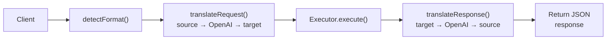

### Aliran Pintasan (Claude CLI)

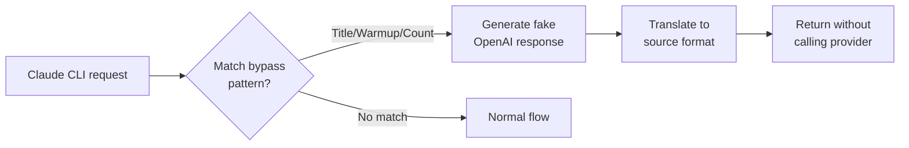
