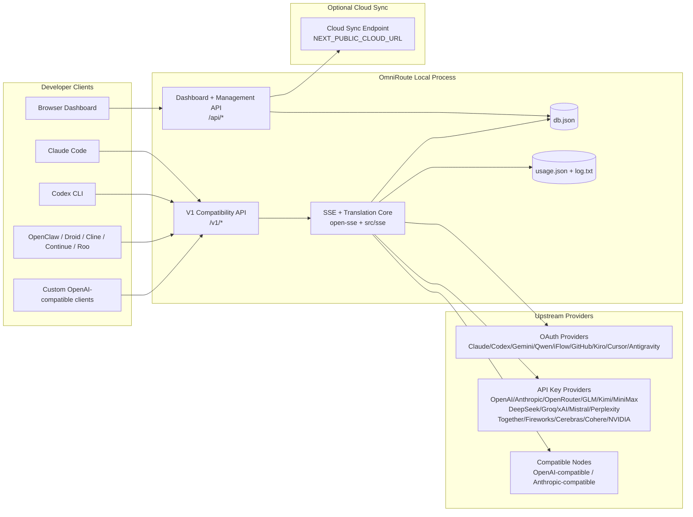
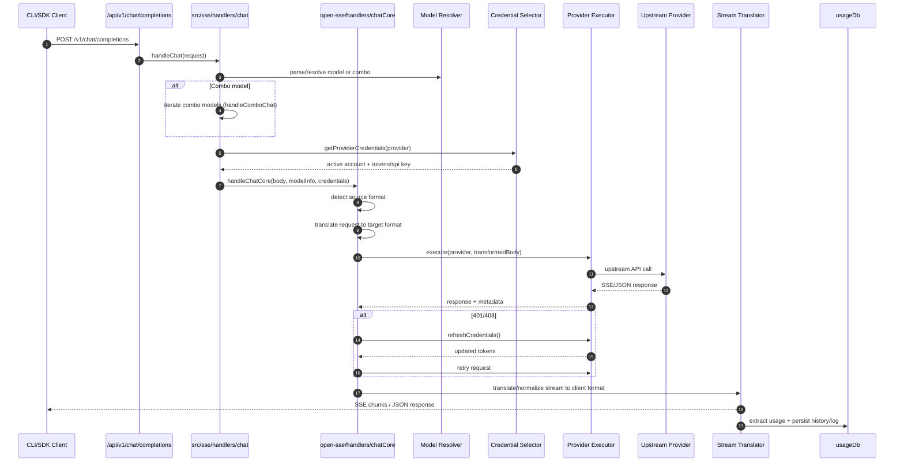
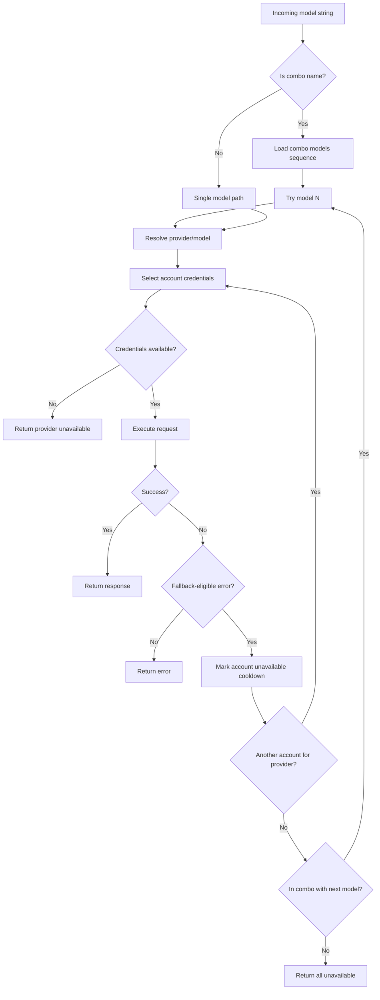
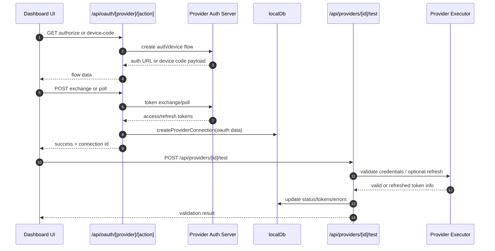
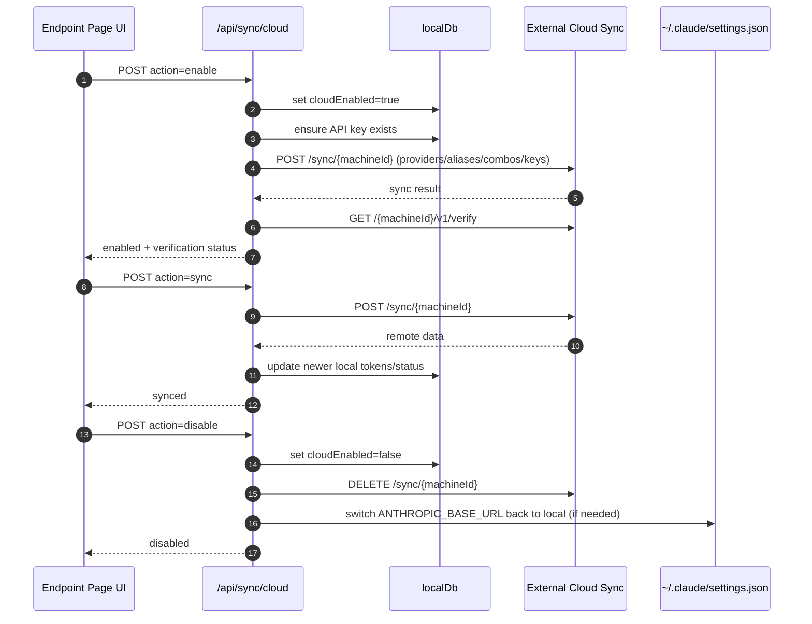
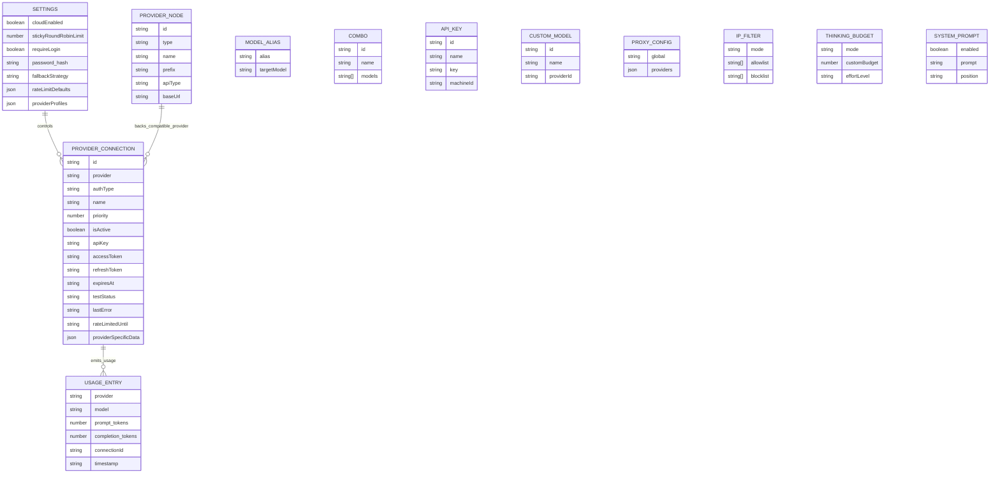
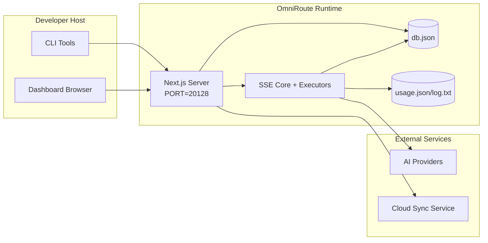

# OmniRoute-arkitektur

🌐 **Languages:** 🇺🇸 [English](../../ARCHITECTURE.md) | 🇧🇷 [Português (Brasil)](../pt-BR/ARCHITECTURE.md) | 🇪🇸 [Español](../es/ARCHITECTURE.md) | 🇫🇷 [Français](../fr/ARCHITECTURE.md) | 🇮🇹 [Italiano](../it/ARCHITECTURE.md) | 🇷🇺 [Русский](../ru/ARCHITECTURE.md) | 🇨🇳 [中文 (简体)](../zh-CN/ARCHITECTURE.md) | 🇩🇪 [Deutsch](../de/ARCHITECTURE.md) | 🇮🇳 [हिन्दी](../in/ARCHITECTURE.md) | 🇹🇭 [ไทย](../th/ARCHITECTURE.md) | 🇺🇦 [Українська](../uk-UA/ARCHITECTURE.md) | 🇸🇦 [العربية](../ar/ARCHITECTURE.md) | 🇯🇵 [日本語](../ja/ARCHITECTURE.md) | 🇻🇳 [Tiếng Việt](../vi/ARCHITECTURE.md) | 🇧🇬 [Български](../bg/ARCHITECTURE.md) | 🇩🇰 [Dansk](../da/ARCHITECTURE.md) | 🇫🇮 [Suomi](../fi/ARCHITECTURE.md) | 🇮🇱 [עברית](../he/ARCHITECTURE.md) | 🇭🇺 [Magyar](../hu/ARCHITECTURE.md) | 🇮🇩 [Bahasa Indonesia](../id/ARCHITECTURE.md) | 🇰🇷 [한국어](../ko/ARCHITECTURE.md) | 🇲🇾 [Bahasa Melayu](../ms/ARCHITECTURE.md) | 🇳🇱 [Nederlands](../nl/ARCHITECTURE.md) | 🇳🇴 [Norsk](../no/ARCHITECTURE.md) | 🇵🇹 [Português (Portugal)](../pt/ARCHITECTURE.md) | 🇷🇴 [Română](../ro/ARCHITECTURE.md) | 🇵🇱 [Polski](../pl/ARCHITECTURE.md) | 🇸🇰 [Slovenčina](../sk/ARCHITECTURE.md) | 🇸🇪 [Svenska](../sv/ARCHITECTURE.md) | 🇵🇭 [Filipino](../phi/ARCHITECTURE.md)

_Sist oppdatert: 2026-02-18_

## Sammendrag

OmniRoute er en lokal AI-rutinggateway og dashbord bygget på Next.js.
Den gir et enkelt OpenAI-kompatibelt endepunkt (`/v1/*`) og ruter trafikk på tvers av flere oppstrømsleverandører med oversettelse, reserve, token-oppdatering og brukssporing.

Kjernefunksjoner:

- OpenAI-kompatibel API-overflate for CLI/verktøy (28 leverandører)
- Forespørsel/svar oversettelse på tvers av leverandørformater
- Modellkombinasjonsfallback (multimodellsekvens)
- Reserveback på kontonivå (multikonto per leverandør)
- OAuth + API-nøkkelleverandør tilkoblingsadministrasjon
- Innbyggingsgenerering via `/v1/embeddings` (6 leverandører, 9 modeller)
- Bildegenerering via `/v1/images/generations` (4 leverandører, 9 modeller)
- Tenk tag-parsing (`<think>...</think>`) for resonneringsmodeller
- Respons sanitization for streng OpenAI SDK-kompatibilitet
- Rollenormalisering (utvikler→system, system→bruker) for kompatibilitet på tvers av leverandører
- Konvertering av strukturert utdata (json_schema → Gemini responseSchema)
- Lokal utholdenhet for leverandører, nøkler, aliaser, kombinasjoner, innstillinger, priser
- Bruks-/kostnadssporing og forespørselslogging
- Valgfri skysynkronisering for synkronisering av flere enheter/tilstander
- IP-godkjenningsliste/blokkeringsliste for API-tilgangskontroll
- Tenker budsjettstyring (gjennomgang/auto/tilpasset/tilpasset)
- Injeksjon av et globalt system
- Sesjonssporing og fingeravtrykk
- Forbedret prisbegrensning per konto med leverandørspesifikke profiler
- Strømbrytermønster for leverandørens motstandskraft
- Anti-tordenbeskyttelse med mutex-låsing
- Signaturbasert forespørselsdedupliseringsbuffer
- Domenelag: modelltilgjengelighet, kostnadsregler, reservepolicy, lockoutpolicy
- Vedvarende domenetilstand (SQLite-gjennomskrivingsbuffer for reserver, budsjetter, lockouts, strømbrytere)
- Policymotor for sentralisert forespørselsevaluering (lockout → budsjett → reserve)
- Be om telemetri med p50/p95/p99 latensaggregering
- Korrelasjons-ID (X-Request-Id) for ende-til-ende-sporing
- Overholdelsesrevisjonslogging med opt-out per API-nøkkel
- Eval rammeverk for LLM kvalitetssikring
- Resilience UI-dashbord med sanntids strømbryterstatus
- Modulære OAuth-leverandører (12 individuelle moduler under `src/lib/oauth/providers/`)

Primær kjøretidsmodell:

– Next.js app-ruter under `src/app/api/*` implementerer både dashbord-APIer og kompatibilitets-APIer

- En delt SSE/rutingkjerne i `src/sse/*` + `open-sse/*` håndterer leverandørutførelse, oversettelse, strømming, fallback og bruk

## Omfang og grenser

### I omfang

- Lokal gateway kjøretid
- Dashboard management APIer
- Leverandørautentisering og tokenoppdatering
- Be om oversettelse og SSE-streaming
- Lokal stat + bruksutholdenhet
- Valgfri skysynkroniseringsorkestrering

### Utenfor omfang

- Implementering av skytjenester bak `NEXT_PUBLIC_CLOUD_URL`
- Leverandør SLA/kontrollplan utenfor lokal prosess
- Eksterne CLI-binærfiler i seg selv (Claude CLI, Codex CLI, etc.)

## Systemkontekst på høyt nivå



## Kjernekjøringskomponenter

## 1) API og rutinglag (Next.js App Routes)

Hovedkataloger:

- `src/app/api/v1/*` og `src/app/api/v1beta/*` for kompatibilitets-APIer
- `src/app/api/*` for administrasjons-/konfigurasjons-APIer
- Neste omskrivninger i `next.config.mjs` kart `/v1/*` til `/api/v1/*`

Viktige kompatibilitetsruter:

- `src/app/api/v1/chat/completions/route.ts`
- `src/app/api/v1/messages/route.ts`
- `src/app/api/v1/responses/route.ts`
- `src/app/api/v1/models/route.ts` — inkluderer tilpassede modeller med `custom: true`
- `src/app/api/v1/embeddings/route.ts` — innebyggingsgenerering (6 leverandører)
- `src/app/api/v1/images/generations/route.ts` — bildegenerering (4+ leverandører inkl. Antigravity/Nebius)
- `src/app/api/v1/messages/count_tokens/route.ts`
- `src/app/api/v1/providers/[provider]/chat/completions/route.ts` — dedikert chat per leverandør
- `src/app/api/v1/providers/[provider]/embeddings/route.ts` — dedikerte innbygginger per leverandør
- `src/app/api/v1/providers/[provider]/images/generations/route.ts` — dedikerte bilder per leverandør
- `src/app/api/v1beta/models/route.ts`
- `src/app/api/v1beta/models/[...path]/route.ts`

Administrasjonsdomener:

- Auth/innstillinger: `src/app/api/auth/*`, `src/app/api/settings/*`
- Leverandører/tilkoblinger: `src/app/api/providers*`
- Leverandørnoder: `src/app/api/provider-nodes*`
- Egendefinerte modeller: `src/app/api/provider-models` (GET/POST/DELETE)
- Modellkatalog: `src/app/api/models/catalog` (GET)
- Proxy-konfigurasjon: `src/app/api/settings/proxy` (GET/PUT/DELETE) + `src/app/api/settings/proxy/test` (POST)
- OAuth: `src/app/api/oauth/*`
- Nøkler/aliaser/kombinasjoner/priser: `src/app/api/keys*`, `src/app/api/models/alias`, `src/app/api/combos*`, `src/app/api/pricing`
- Bruk: `src/app/api/usage/*`
- Synkronisering/sky: `src/app/api/sync/*`, `src/app/api/cloud/*`
- CLI-verktøyhjelpere: `src/app/api/cli-tools/*`
- IP-filter: `src/app/api/settings/ip-filter` (GET/PUT)
- Tenkebudsjett: `src/app/api/settings/thinking-budget` (GET/PUT)
- Systemmelding: `src/app/api/settings/system-prompt` (GET/PUT)
- Økter: `src/app/api/sessions` (GET)
- Satsgrenser: `src/app/api/rate-limits` (GET)
- Motstandsdyktighet: `src/app/api/resilience` (GET/PATCH) — leverandørprofiler, strømbryter, rategrensetilstand
- Resiliens tilbakestilling: `src/app/api/resilience/reset` (POST) — tilbakestill brytere + nedkjøling
- Bufferstatistikk: `src/app/api/cache/stats` (GET/DELETE)
- Modelltilgjengelighet: `src/app/api/models/availability` (GET/POST)
- Telemetri: `src/app/api/telemetry/summary` (GET)
  – Budsjett: `src/app/api/usage/budget` (GET/POST)
- Reservekjeder: `src/app/api/fallback/chains` (GET/POST/DELETE)
- Overholdelsesrevisjon: `src/app/api/compliance/audit-log` (GET)
- Evaler: `src/app/api/evals` (GET/POST), `src/app/api/evals/[suiteId]` (GET)
- Retningslinjer: `src/app/api/policies` (GET/POST)

## 2) SSE + Translation Core

Hovedstrømningsmoduler:

- Inngang: `src/sse/handlers/chat.ts`
- Kjerneorkestrering: `open-sse/handlers/chatCore.ts`
- Leverandørutførelsesadaptere: `open-sse/executors/*`
- Formatdeteksjon/leverandørkonfigurasjon: `open-sse/services/provider.ts`
- Modellanalyse/oppløsning: `src/sse/services/model.ts`, `open-sse/services/model.ts`
- Kontoreservelogikk: `open-sse/services/accountFallback.ts`
- Oversettelsesregister: `open-sse/translator/index.ts`
- Strømtransformasjoner: `open-sse/utils/stream.ts`, `open-sse/utils/streamHandler.ts`
- Bruksutvinning/normalisering: `open-sse/utils/usageTracking.ts`
- Think tag-parser: `open-sse/utils/thinkTagParser.ts`
- Innebyggingsbehandler: `open-sse/handlers/embeddings.ts`
- Innebyggingsleverandørregister: `open-sse/config/embeddingRegistry.ts`
- Bildegenereringsbehandler: `open-sse/handlers/imageGeneration.ts`
- Bildeleverandørs register: `open-sse/config/imageRegistry.ts`
- Response sanitization: `open-sse/handlers/responseSanitizer.ts`
- Rollenormalisering: `open-sse/services/roleNormalizer.ts`

Tjenester (forretningslogikk):

- Kontovalg/score: `open-sse/services/accountSelector.ts`
- Kontekstlivssyklusadministrasjon: `open-sse/services/contextManager.ts`
- IP-filterhåndhevelse: `open-sse/services/ipFilter.ts`
- Øktsporing: `open-sse/services/sessionManager.ts`
- Be om deduplisering: `open-sse/services/signatureCache.ts`
- Systemprompt-injeksjon: `open-sse/services/systemPrompt.ts`
- Tenkende budsjettstyring: `open-sse/services/thinkingBudget.ts`
- Jokertegn modellruting: `open-sse/services/wildcardRouter.ts`
- Satsgrenseadministrasjon: `open-sse/services/rateLimitManager.ts`
- Strømbryter: `open-sse/services/circuitBreaker.ts`

Domenelagsmoduler:

- Modelltilgjengelighet: `src/lib/domain/modelAvailability.ts`
- Kostnadsregler/budsjetter: `src/lib/domain/costRules.ts`
  – Reservepolicy: `src/lib/domain/fallbackPolicy.ts`
- Kombinasjonsløser: `src/lib/domain/comboResolver.ts`
  – Utelukkingspolicy: `src/lib/domain/lockoutPolicy.ts`
- Policymotor: `src/domain/policyEngine.ts` — sentralisert lockout → budsjett → reserveevaluering
- Feilkodekatalog: `src/lib/domain/errorCodes.ts`
- Forespørsels-ID: `src/lib/domain/requestId.ts`
- Tidsavbrudd for henting: `src/lib/domain/fetchTimeout.ts`
- Be om telemetri: `src/lib/domain/requestTelemetry.ts`
- Samsvar/revisjon: `src/lib/domain/compliance/index.ts`
- Evalløper: `src/lib/domain/evalRunner.ts`
- Vedvarende domenetilstand: `src/lib/db/domainState.ts` — SQLite CRUD for reservekjeder, budsjetter, kostnadshistorikk, lockouttilstand, strømbrytere

OAuth-leverandørmoduler (12 individuelle filer under `src/lib/oauth/providers/`):

- Registerindeks: `src/lib/oauth/providers/index.ts`
  – Individuelle leverandører: `claude.ts`, `codex.ts`, `gemini.ts`, `antigravity.ts`, `iflow.ts`, `qwen.ts`, `<think>...</think>`TO, **OMNI*TOKEN ***119\_\_, `kiro.ts`, `cursor.ts`, `kilocode.ts`, `cline.ts`
- Tynn innpakning: `src/lib/oauth/providers.ts` — re-eksport fra individuelle moduler

## 3) Utholdenhetslag

Primær tilstand DB:

- `src/lib/localDb.ts`
- fil: `${DATA_DIR}/db.json` (eller `$XDG_CONFIG_HOME/omniroute/db.json` når angitt, ellers `~/.omniroute/db.json`)
- enheter: providerConnections, providerNodes, modelAliases, combos, apiKeys, settings, pricing, **customModels**, **proxyConfig**, **ipFilter**, **thinkingBudget**, **systemPrompt**

Bruk DB:

- `src/lib/usageDb.ts`
- filer: `${DATA_DIR}/usage.json`, `${DATA_DIR}/log.txt`, `${DATA_DIR}/call_logs/`
- følger samme grunnleggende katalogpolicy som `localDb` (`DATA_DIR`, deretter `XDG_CONFIG_HOME/omniroute` når angitt)
- dekomponert i fokuserte undermoduler: `migrations.ts`, `usageHistory.ts`, `costCalculator.ts`, `usageStats.ts`, `callLogs.ts`

Domenetilstand DB (SQLite):

- `src/lib/db/domainState.ts` — CRUD-operasjoner for domenetilstand
- Tabeller (opprettet i `src/lib/db/core.ts`): `domain_fallback_chains`, `domain_budgets`, `domain_cost_history`, `domain_lockout_state`, `domain_circuit_breakers`
- Gjennomskrivingsbuffermønster: kart i minnet er autoritative under kjøring; mutasjoner skrives synkront til SQLite; tilstand gjenopprettes fra DB ved kaldstart

## 4) Auth + Security Surfaces

- Dashboard-informasjonskapselautentisering: `src/proxy.ts`, `src/app/api/auth/login/route.ts`
- Generering/verifisering av API-nøkler: `src/shared/utils/apiKey.ts`
- Leverandørhemmeligheter vedvarte i `providerConnections`-oppføringer
- Utgående proxy-støtte via `open-sse/utils/proxyFetch.ts` (env vars) og `open-sse/utils/networkProxy.ts` (konfigurerbar per leverandør eller global)

## 5) Cloud Sync

- Planlegger init: `src/lib/initCloudSync.ts`, `src/shared/services/initializeCloudSync.ts`
- Periodisk oppgave: `src/shared/services/cloudSyncScheduler.ts`
- Kontrollrute: `src/app/api/sync/cloud/route.ts`

## Forespørselslivssyklus (`/v1/chat/completions`)



## Combo + Account Reserve Flow



Reservebeslutninger er drevet av `open-sse/services/accountFallback.ts` ved hjelp av statuskoder og feilmeldingsheuristikk.

## OAuth Onboarding og Token Refresh Lifecycle



Oppdatering under levende trafikk utføres inne i `open-sse/handlers/chatCore.ts` via eksekveren `refreshCredentials()`.

## Cloud Sync Lifecycle (Aktiver / Synkroniser / Deaktiver)



Periodisk synkronisering utløses av `CloudSyncScheduler` når skyen er aktivert.

## Datamodell og lagringskart



Fysiske lagringsfiler:

- hovedtilstand: `${DATA_DIR}/db.json` (eller `$XDG_CONFIG_HOME/omniroute/db.json` når angitt, ellers `~/.omniroute/db.json`)
- bruksstatistikk: `${DATA_DIR}/usage.json`
- be om logglinjer: `${DATA_DIR}/log.txt`
- valgfrie oversetter/forespørsler om feilsøkingsøkter: `<repo>/logs/...`

## Utrullingstopologi



## Modulmapping (beslutningskritisk)

### Rute- og API-moduler

- `src/app/api/v1/*`, `src/app/api/v1beta/*`: kompatibilitets-APIer
- `src/app/api/v1/providers/[provider]/*`: dedikerte ruter per leverandør (chat, innebygging, bilder)
- `src/app/api/providers*`: leverandør CRUD, validering, testing
- `src/app/api/provider-nodes*`: tilpasset kompatibel nodeadministrasjon
- `src/app/api/provider-models`: tilpasset modelladministrasjon (CRUD)
- `src/app/api/models/catalog`: full modellkatalog API (alle typer gruppert etter leverandør)
- `src/app/api/oauth/*`: OAuth/enhetskode flyter
- `src/app/api/keys*`: lokal API-nøkkellivssyklus
- `src/app/api/models/alias`: aliasadministrasjon
- `src/app/api/combos*`: reservekombinasjonsadministrasjon
- `src/app/api/pricing`: prisoverstyringer for kostnadsberegning
- `src/app/api/settings/proxy`: proxy-konfigurasjon (GET/PUT/DELETE)
- `src/app/api/settings/proxy/test`: utgående proxy-tilkoblingstest (POST)
- `src/app/api/usage/*`: APIer for bruk og logger
- `src/app/api/sync/*` + `src/app/api/cloud/*`: skysynkronisering og skyvendte hjelpere
- `src/app/api/cli-tools/*`: lokale CLI-konfigurasjonsforfattere/kontrollere
- `src/app/api/settings/ip-filter`: IP-godkjenningsliste/blokkeringsliste (GET/PUT)
- `src/app/api/settings/thinking-budget`: budsjettkonfigurasjon for tenketoken (GET/PUT)
- `src/app/api/settings/system-prompt`: global systemmelding (GET/PUT)
- `src/app/api/sessions`: aktiv øktoppføring (GET)
- `src/app/api/rate-limits`: satsgrensestatus per konto (GET)

### Kjerne for ruting og utførelse

- `src/sse/handlers/chat.ts`: forespørsel om parse, kombinasjonshåndtering, kontovalgsløyfe
- `open-sse/handlers/chatCore.ts`: oversettelse, eksekutorutsendelse, prøv på nytt/oppdateringshåndtering, strømoppsett
- `open-sse/executors/*`: leverandørspesifikk nettverks- og formatatferd

### Oversettelsesregister og formatkonverterere

- `open-sse/translator/index.ts`: oversetterregister og orkestrering
- Be om oversettere: `open-sse/translator/request/*`
- Svaroversettere: `open-sse/translator/response/*`
- Formatkonstanter: `open-sse/translator/formats.ts`

### Utholdenhet

- `src/lib/localDb.ts`: vedvarende konfig/tilstand
- `src/lib/usageDb.ts`: brukshistorikk og rullende forespørselslogger

## Leverandørdekning (strategimønster)

Hver leverandør har en spesialisert eksekutør som utvider `BaseExecutor` (i `open-sse/executors/base.ts`), som gir URL-bygging, headerkonstruksjon, forsøk på nytt med eksponentiell backoff, legitimasjonsoppdateringskroker og `execute()` orkestreringsmetoden.

| Utfører               | Leverandør(er)                                                                                                                                               | Spesiell håndtering                                                          |
| --------------------- | ------------------------------------------------------------------------------------------------------------------------------------------------------------ | ---------------------------------------------------------------------------- |
| `DefaultExecutor`     | OpenAI, Claude, Gemini, Qwen, iFlow, OpenRouter, GLM, Kimi, MiniMax, DeepSeek, Groq, xAI, Mistral, Perplexity, Together, Fireworks, Cerebras, Cohere, NVIDIA | Dynamisk URL/header-konfigurasjon per leverandør                             |
| `AntigravityExecutor` | Google Antigravity                                                                                                                                           | Egendefinerte prosjekt-/sesjons-ID-er, Prøv på nytt etter parsing            |
| `CodexExecutor`       | OpenAI Codex                                                                                                                                                 | Injiserer systeminstruksjoner, tvinger resonnementinnsats                    |
| `CursorExecutor`      | Markør IDE                                                                                                                                                   | ConnectRPC-protokoll, Protobuf-koding, forespørsel om signering via sjekksum |
| `GithubExecutor`      | GitHub Copilot                                                                                                                                               | Copilot token oppdatering, VSCode-lignende overskrifter                      |
| `KiroExecutor`        | AWS CodeWhisperer/Kiro                                                                                                                                       | AWS EventStream binært format → SSE-konvertering                             |
| `GeminiCLIExecutor`   | Gemini CLI                                                                                                                                                   | Oppdateringssyklus for Google OAuth-token                                    |

Alle andre leverandører (inkludert tilpassede kompatible noder) bruker `DefaultExecutor`.

## Leverandørkompatibilitetsmatrise

| Leverandør       | Format          | Auth                  | Stream           | Ikke-stream | Token oppdatering | Bruks-API                |
| ---------------- | --------------- | --------------------- | ---------------- | ----------- | ----------------- | ------------------------ |
| Claude           | claude          | API-nøkkel / OAuth    | ✅               | ✅          | ✅                | ⚠️ Kun administrator     |
| Tvillingene      | Gemini          | API-nøkkel / OAuth    | ✅               | ✅          | ✅                | ⚠️ Cloud Console         |
| Gemini CLI       | gemini-cli      | OAuth                 | ✅               | ✅          | ✅                | ⚠️ Cloud Console         |
| Antigravitasjon  | antigravitasjon | OAuth                 | ✅               | ✅          | ✅                | ✅ Full kvote API        |
| OpenAI           | openai          | API-nøkkel            | ✅               | ✅          | ❌                | ❌                       |
| Codex            | openai-svar     | OAuth                 | ✅ tvunget       | ❌          | ✅                | ✅ Satsgrenser           |
| GitHub Copilot   | openai          | OAuth + Copilot Token | ✅               | ✅          | ✅                | ✅ Kvote øyeblikksbilder |
| Markør           | markør          | Egendefinert sjekksum | ✅               | ✅          | ❌                | ❌                       |
| Kiro             | kiro            | AWS SSO OIDC          | ✅ (EventStream) | ❌          | ✅                | ✅ Bruksgrenser          |
| Qwen             | openai          | OAuth                 | ✅               | ✅          | ✅                | ⚠️ Per forespørsel       |
| iFlow            | openai          | OAuth (Grunnleggende) | ✅               | ✅          | ✅                | ⚠️ Per forespørsel       |
| OpenRouter       | openai          | API-nøkkel            | ✅               | ✅          | ❌                | ❌                       |
| GLM/Kimi/MiniMax | claude          | API-nøkkel            | ✅               | ✅          | ❌                | ❌                       |
| DeepSeek         | openai          | API-nøkkel            | ✅               | ✅          | ❌                | ❌                       |
| Groq             | openai          | API-nøkkel            | ✅               | ✅          | ❌                | ❌                       |
| xAI (Grok)       | openai          | API-nøkkel            | ✅               | ✅          | ❌                | ❌                       |
| Mistral          | openai          | API-nøkkel            | ✅               | ✅          | ❌                | ❌                       |
| Forvirring       | openai          | API-nøkkel            | ✅               | ✅          | ❌                | ❌                       |
| Sammen AI        | openai          | API-nøkkel            | ✅               | ✅          | ❌                | ❌                       |
| Fyrverkeri AI    | openai          | API-nøkkel            | ✅               | ✅          | ❌                | ❌                       |
| Cerebras         | openai          | API-nøkkel            | ✅               | ✅          | ❌                | ❌                       |
| Sammenheng       | openai          | API-nøkkel            | ✅               | ✅          | ❌                | ❌                       |
| NVIDIA NIM       | openai          | API-nøkkel            | ✅               | ✅          | ❌                | ❌                       |

## Formatoversettelsesdekning

Oppdagede kildeformater inkluderer:

- `openai`
- `openai-responses`
- `claude`
- `gemini`

Målformater inkluderer:

- OpenAI chat/svar
- Claude
- Gemini/Gemini-CLI/Antigravity konvolutt
- Kiro
- Markør

Oversettelser bruker **OpenAI som hub-format** – alle konverteringer går gjennom OpenAI som mellomliggende:

```
Source Format → OpenAI (hub) → Target Format
```

Oversettelser velges dynamisk basert på kildens nyttelastform og leverandørens målformat.

Ytterligere behandlingslag i oversettelsespipelinen:

- **Responssanering** - Fjerner ikke-standardiserte felt fra OpenAI-formatsvar (både streaming og ikke-streaming) for å sikre streng SDK-overholdelse
- **Rollenormalisering** — Konverterer `developer` → `system` for ikke-OpenAI-mål; slår sammen `system` → `user` for modeller som avviser systemrollen (GLM, ERNIE)
- **Tenk tag-utvinning** — analyserer `<think>...</think>` blokker fra innhold til feltet `reasoning_content`
- **Structured output** — Konverterer OpenAI `response_format.json_schema` til Gemini's `responseMimeType` + `responseSchema`

## Støttede API-endepunkter

| Endepunkt                                          | Format                 | Handler                                                     |
| -------------------------------------------------- | ---------------------- | ----------------------------------------------------------- |
| `POST /v1/chat/completions`                        | OpenAI Chat            | `src/sse/handlers/chat.ts`                                  |
| `POST /v1/messages`                                | Claude Meldinger       | Samme behandler (automatisk oppdaget)                       |
| `POST /v1/responses`                               | OpenAI-svar            | `open-sse/handlers/responsesHandler.ts`                     |
| `POST /v1/embeddings`                              | OpenAI Embeddings      | `open-sse/handlers/embeddings.ts`                           |
| `GET /v1/embeddings`                               | Modellliste            | API-rute                                                    |
| `POST /v1/images/generations`                      | OpenAI-bilder          | `open-sse/handlers/imageGeneration.ts`                      |
| `GET /v1/images/generations`                       | Modellliste            | API-rute                                                    |
| `POST /v1/providers/{provider}/chat/completions`   | OpenAI Chat            | Dedikert per leverandør med modellvalidering                |
| `POST /v1/providers/{provider}/embeddings`         | OpenAI Embeddings      | Dedikert per leverandør med modellvalidering                |
| `POST /v1/providers/{provider}/images/generations` | OpenAI-bilder          | Dedikert per leverandør med modellvalidering                |
| `POST /v1/messages/count_tokens`                   | Claude Token Count     | API-rute                                                    |
| `GET /v1/models`                                   | OpenAI-modellliste     | API-rute (chat + innebygging + bilde + tilpassede modeller) |
| `GET /api/models/catalog`                          | Katalog                | Alle modeller gruppert etter leverandør + type              |
| `POST /v1beta/models/*:streamGenerateContent`      | Gemini innfødt         | API-rute                                                    |
| `GET/PUT/DELETE /api/settings/proxy`               | Proxy-konfigurasjon    | Nettverks proxy-konfigurasjon                               |
| `POST /api/settings/proxy/test`                    | Proxy-tilkobling       | Proxy-helse/tilkoblingstestendepunkt                        |
| `GET/POST/DELETE /api/provider-models`             | Egendefinerte modeller | Tilpasset modelladministrasjon per leverandør               |

## Bypass Handler

Bypass-behandleren (`open-sse/utils/bypassHandler.ts`) avskjærer kjente "kasting"-forespørsler fra Claude CLI – oppvarmingspinger, tittelutdrag og tokentellinger – og returnerer et **falsk svar** uten å forbruke oppstrømsleverandørtokens. Dette utløses bare når `User-Agent` inneholder `claude-cli`.

## Be om Logger Pipeline

Forespørselsloggeren (`open-sse/utils/requestLogger.ts`) gir en 7-trinns feilsøkingsloggingspipeline, deaktivert som standard, aktivert via `ENABLE_REQUEST_LOGS=true`:

```
1_req_client.json → 2_req_source.json → 3_req_openai.json → 4_req_target.json
→ 5_res_provider.txt → 6_res_openai.txt → 7_res_client.txt
```

Filer skrives til `<repo>/logs/<session>/` for hver forespørselsøkt.

## Feilmoduser og motstandskraft

## 1) Konto/leverandørtilgjengelighet

- Nedkjøling av leverandørens konto på forbigående/rate/auth-feil
- kontoreserve før mislykket forespørsel
- combo modell fallback når gjeldende modell/leverandørbane er oppbrukt

## 2) Token-utløp

- forhåndssjekk og oppdater med nytt forsøk for leverandører som kan oppdateres
- 401/403 prøv på nytt etter oppdateringsforsøk i kjernebanen

## 3) Strømsikkerhet

- frakoblingsbevisst strømkontroller
- oversettelsesstrøm med end-of-stream flush og `[DONE]` håndtering
  – fallback for bruksestimat når leverandørbruksmetadata mangler

## 4) Cloud Sync Degradering

- Synkroniseringsfeil dukker opp, men lokal kjøretid fortsetter
- planleggeren har logikk som kan forsøke på nytt, men periodisk kjøring kaller for øyeblikket enkeltforsøkssynkronisering som standard

## 5) Dataintegritet

- DB-formmigrering/reparasjon for manglende nøkler
- korrupte JSON-tilbakestillingstiltak for localDb og usageDb

## Observerbarhet og operasjonelle signaler

Synlighetskilder for kjøretid:

- konsolllogger fra `src/sse/utils/logger.ts`
- bruksaggregater per forespørsel i `usage.json`
- logg på status for tekstforespørsel `log.txt`
- valgfrie dype forespørsels-/oversettelseslogger under `logs/` når `ENABLE_REQUEST_LOGS=true`
- endepunkter for dashbordbruk (`/api/usage/*`) for brukergrensesnittforbruk

## Sikkerhetssensitive grenser

- JWT-hemmelighet (`JWT_SECRET`) sikrer bekreftelse/signering av informasjonskapsler for dashbordøkten
- Innledende passordreserve (`INITIAL_PASSWORD`, standard `123456`) må overstyres i reelle distribusjoner
- API-nøkkel HMAC-hemmelighet (`API_KEY_SECRET`) sikrer generert lokalt API-nøkkelformat
- Leverandørhemmeligheter (API-nøkler/-tokens) er bevart i lokal DB og bør beskyttes på filsystemnivå
- Sluttpunkter for skysynkronisering er avhengige av API-nøkkelautentisering + maskin-ID-semantikk

## Miljø- og kjøretidsmatrise

Miljøvariabler som brukes aktivt av kode:

- App/auth: `JWT_SECRET`, `INITIAL_PASSWORD`
- Lagring: `DATA_DIR`
- Kompatibel nodeoppførsel: `ALLOW_MULTI_CONNECTIONS_PER_COMPAT_NODE`
- Valgfri lagringsbaseoverstyring (Linux/macOS når `DATA_DIR` ikke er innstilt): `XDG_CONFIG_HOME`
- Sikkerhetshashing: `API_KEY_SECRET`, `MACHINE_ID_SALT`
- Logging: `ENABLE_REQUEST_LOGS`
- Synkronisering/nettadresser i nettskyen: `NEXT_PUBLIC_BASE_URL`, `NEXT_PUBLIC_CLOUD_URL`
- Utgående proxy: `HTTP_PROXY`, `HTTPS_PROXY`, `ALL_PROXY`, `NO_PROXY` og varianter med små bokstaver
- SOCKS5-funksjonsflagg: `ENABLE_SOCKS5_PROXY`, `NEXT_PUBLIC_ENABLE_SOCKS5_PROXY`
  – Plattform-/kjøretidshjelpere (ikke appspesifikk konfigurasjon): `APPDATA`, `NODE_ENV`, `PORT`, `HOSTNAME`

## Kjente arkitektoniske notater

1. `usageDb` og `localDb` deler nå samme grunnkatalogpolicy (`DATA_DIR` -> `XDG_CONFIG_HOME/omniroute` -> `~/.omniroute`) med eldre filmigrering.
2. `/api/v1/route.ts` returnerer en statisk modellliste og er ikke hovedmodellkilden som brukes av `/v1/models`.
3. Forespørselslogger skriver fullstendige overskrifter/tekst når den er aktivert; behandle loggkatalogen som sensitiv.
4. Skyadferd avhenger av korrekt `NEXT_PUBLIC_BASE_URL` og skyendepunkts tilgjengelighet.
5. `open-sse/`-katalogen er publisert som `@omniroute/open-sse` **npm-arbeidsområdepakken**. Kildekoden importerer den via `@omniroute/open-sse/...` (løst av Next.js `transpilePackages`). Filbaner i dette dokumentet bruker fortsatt katalognavnet `open-sse/` for konsistens.
6. Diagrammer i dashbordet bruker **Recharts** (SVG-basert) for tilgjengelige, interaktive analysevisualiseringer (stolpediagram for modellbruk, leverandøroversiktstabeller med suksessrater).
7. E2E-tester bruker **Playwright** (`tests/e2e/`), kjøres via `npm run test:e2e`. Enhetstester bruker **Node.js testløper** (`tests/unit/`), kjøres via `npm run test:plan3`. Kildekoden under `src/` er **TypeScript** (`.ts`/`.tsx`); arbeidsområdet `open-sse/` forblir JavaScript (`.js`).
8. Innstillinger-siden er organisert i 5 faner: Sikkerhet, Ruting (6 globale strategier: fill-first, round-robin, p2c, random, minst brukt, kostnadsoptimalisert), Resiliens (redigerbare hastighetsgrenser, strømbryter, policyer), AI (tenkebudsjett, systemprompt, promptbuffer), Advanced (proxy).

## Kontrolliste for operasjonell verifisering

- Bygg fra kilde: `npm run build`
- Bygg Docker-bilde: `docker build -t omniroute .`
- Start tjenesten og bekreft:
- `GET /api/settings`
- `GET /api/v1/models`
- CLI-målgrunnadressen skal være `http://<host>:20128/v1` når `PORT=20128`
