# omniroute — Kodebasedokumentasjon

🌐 **Languages:** 🇺🇸 [English](../../CODEBASE_DOCUMENTATION.md) | 🇧🇷 [Português (Brasil)](../pt-BR/CODEBASE_DOCUMENTATION.md) | 🇪🇸 [Español](../es/CODEBASE_DOCUMENTATION.md) | 🇫🇷 [Français](../fr/CODEBASE_DOCUMENTATION.md) | 🇮🇹 [Italiano](../it/CODEBASE_DOCUMENTATION.md) | 🇷🇺 [Русский](../ru/CODEBASE_DOCUMENTATION.md) | 🇨🇳 [中文 (简体)](../zh-CN/CODEBASE_DOCUMENTATION.md) | 🇩🇪 [Deutsch](../de/CODEBASE_DOCUMENTATION.md) | 🇮🇳 [हिन्दी](../in/CODEBASE_DOCUMENTATION.md) | 🇹🇭 [ไทย](../th/CODEBASE_DOCUMENTATION.md) | 🇺🇦 [Українська](../uk-UA/CODEBASE_DOCUMENTATION.md) | 🇸🇦 [العربية](../ar/CODEBASE_DOCUMENTATION.md) | 🇯🇵 [日本語](../ja/CODEBASE_DOCUMENTATION.md) | 🇻🇳 [Tiếng Việt](../vi/CODEBASE_DOCUMENTATION.md) | 🇧🇬 [Български](../bg/CODEBASE_DOCUMENTATION.md) | 🇩🇰 [Dansk](../da/CODEBASE_DOCUMENTATION.md) | 🇫🇮 [Suomi](../fi/CODEBASE_DOCUMENTATION.md) | 🇮🇱 [עברית](../he/CODEBASE_DOCUMENTATION.md) | 🇭🇺 [Magyar](../hu/CODEBASE_DOCUMENTATION.md) | 🇮🇩 [Bahasa Indonesia](../id/CODEBASE_DOCUMENTATION.md) | 🇰🇷 [한국어](../ko/CODEBASE_DOCUMENTATION.md) | 🇲🇾 [Bahasa Melayu](../ms/CODEBASE_DOCUMENTATION.md) | 🇳🇱 [Nederlands](../nl/CODEBASE_DOCUMENTATION.md) | 🇳🇴 [Norsk](../no/CODEBASE_DOCUMENTATION.md) | 🇵🇹 [Português (Portugal)](../pt/CODEBASE_DOCUMENTATION.md) | 🇷🇴 [Română](../ro/CODEBASE_DOCUMENTATION.md) | 🇵🇱 [Polski](../pl/CODEBASE_DOCUMENTATION.md) | 🇸🇰 [Slovenčina](../sk/CODEBASE_DOCUMENTATION.md) | 🇸🇪 [Svenska](../sv/CODEBASE_DOCUMENTATION.md) | 🇵🇭 [Filipino](../phi/CODEBASE_DOCUMENTATION.md)

> En omfattende, nybegynnervennlig guide til **omniroute** multi-leverandør AI proxy-ruter.

---

## 1. Hva er omniroute?

omniroute er en **proxy-ruter** som sitter mellom AI-klienter (Claude CLI, Codex, Cursor IDE, etc.) og AI-leverandører (Anthropic, Google, OpenAI, AWS, GitHub, etc.). Det løser ett stort problem:

> **Ulike AI-klienter snakker forskjellige "språk" (API-formater), og forskjellige AI-leverandører forventer også forskjellige "språk".** omniroute oversetter mellom dem automatisk.

Tenk på det som en universell oversetter i FN - enhver delegat kan snakke hvilket som helst språk, og oversetteren konverterer det til en hvilken som helst annen delegat.

---

## 2. Arkitekturoversikt

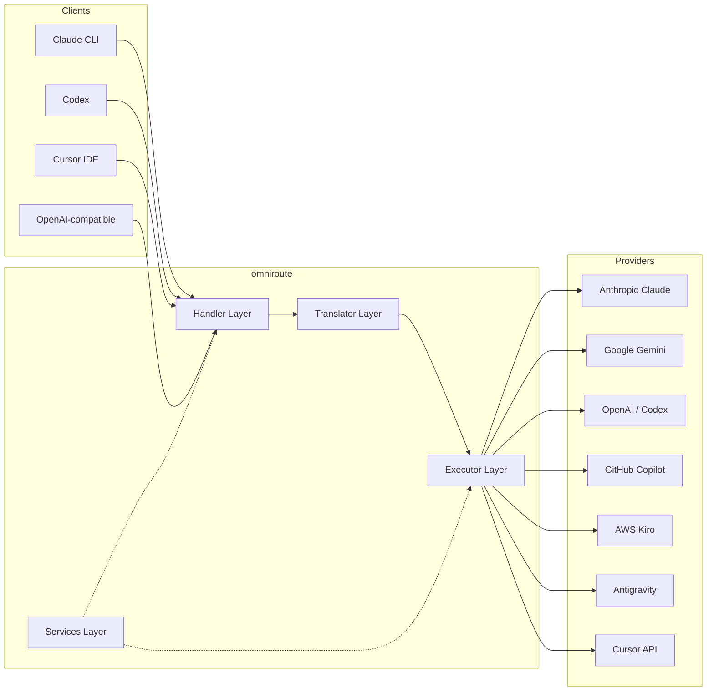

### Kjerneprinsipp: Hub-and-Speake-oversettelse

All formatoversettelse går gjennom **OpenAI-formatet som navet**:

```
Client Format → [OpenAI Hub] → Provider Format    (request)
Provider Format → [OpenAI Hub] → Client Format    (response)
```

Dette betyr at du bare trenger **N oversettere** (én per format) i stedet for **N²** (hvert par).

---

## 3. Prosjektstruktur

```
omniroute/
├── open-sse/                  ← Core proxy library (portable, framework-agnostic)
│   ├── index.js               ← Main entry point, exports everything
│   ├── config/                ← Configuration & constants
│   ├── executors/             ← Provider-specific request execution
│   ├── handlers/              ← Request handling orchestration
│   ├── services/              ← Business logic (auth, models, fallback, usage)
│   ├── translator/            ← Format translation engine
│   │   ├── request/           ← Request translators (8 files)
│   │   ├── response/          ← Response translators (7 files)
│   │   └── helpers/           ← Shared translation utilities (6 files)
│   └── utils/                 ← Utility functions
├── src/                       ← Application layer (Express/Worker runtime)
│   ├── app/                   ← Web UI, API routes, middleware
│   ├── lib/                   ← Database, auth, and shared library code
│   ├── mitm/                  ← Man-in-the-middle proxy utilities
│   ├── models/                ← Database models
│   ├── shared/                ← Shared utilities (wrappers around open-sse)
│   ├── sse/                   ← SSE endpoint handlers
│   └── store/                 ← State management
├── data/                      ← Runtime data (credentials, logs)
│   └── provider-credentials.json   (external credentials override, gitignored)
└── tester/                    ← Test utilities
```

---

## 4. Modul-for-modul-oversikt

### 4.1 Config (`open-sse/config/`)

**enkelt kilde til sannhet** for alle leverandørkonfigurasjoner.

| Fil                           | Formål                                                                                                                                                                                                                                          |
| ----------------------------- | ----------------------------------------------------------------------------------------------------------------------------------------------------------------------------------------------------------------------------------------------- |
| `constants.ts`                | `PROVIDERS` objekt med grunnleggende URL-er, OAuth-legitimasjon (standard), overskrifter og standard systemmeldinger for hver leverandør. Definerer også `HTTP_STATUS`, `ERROR_TYPES`, `COOLDOWN_MS`, `BACKOFF_CONFIG` og `SKIP_PATTERNS`.      |
| `credentialLoader.ts`         | Laster inn ekstern legitimasjon fra `data/provider-credentials.json` og slår dem sammen over de hardkodede standardinnstillingene i `PROVIDERS`. Holder hemmeligheter utenfor kildekontroll samtidig som bakoverkompatibiliteten opprettholdes. |
| `providerModels.ts`           | Sentralt modellregister: kartleverandøraliaser → modell-ID-er. Funksjoner som `getModels()`, `getProviderByAlias()`.                                                                                                                            |
| `codexInstructions.ts`        | Systeminstruksjoner injisert i Codex-forespørsler (redigeringsbegrensninger, sandkasseregler, godkjenningspolicyer).                                                                                                                            |
| `defaultThinkingSignature.ts` | Standard "tenkende" signaturer for Claude og Gemini-modeller.                                                                                                                                                                                   |
| `ollamaModels.ts`             | Skjemadefinisjon for lokale Ollama-modeller (navn, størrelse, familie, kvantisering).                                                                                                                                                           |

#### Innlastingsflyt for legitimasjon

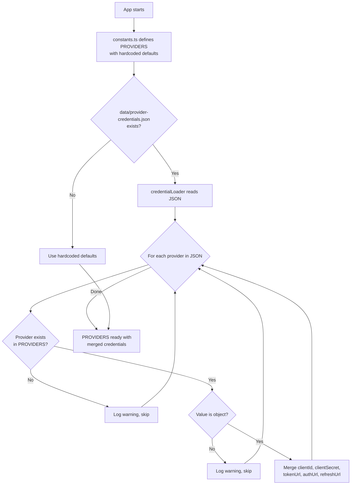

---

### 4.2 Eksekutører (`open-sse/executors/`)

Eksekutører kapsler inn **leverandørspesifikk logikk** ved å bruke **strategimønsteret**. Hver eksekutør overstyrer basismetoder etter behov.

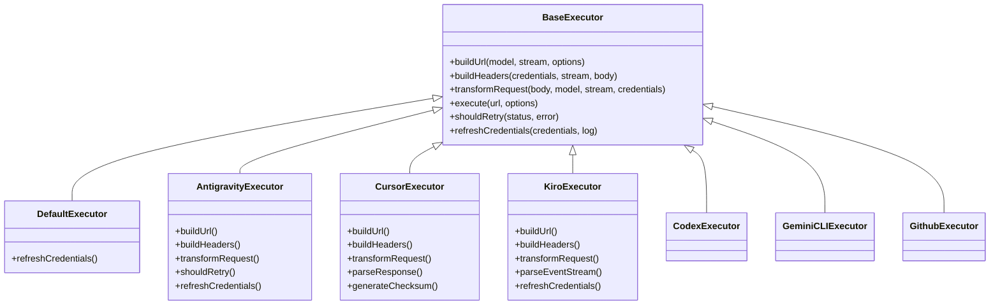

| Utfører          | Leverandør                                 | Nøkkelspesialiseringer                                                                                                                |
| ---------------- | ------------------------------------------ | ------------------------------------------------------------------------------------------------------------------------------------- |
| `base.ts`        | —                                          | Abstrakt base: URL-bygging, overskrifter, logikk på nytt, oppdatering av legitimasjon                                                 |
| `default.ts`     | Claude, Gemini, OpenAI, GLM, Kimi, MiniMax | Generisk OAuth-tokenoppdatering for standardleverandører                                                                              |
| `antigravity.ts` | Google Cloud Code                          | Prosjekt-/sesjons-ID generering, multi-URL fallback, tilpasset gjenforsøk på parsing fra feilmeldinger ("tilbakestill etter 2t7m23s") |
| `cursor.ts`      | Markør IDE                                 | **Mest kompliserte**: SHA-256 kontrollsum-authorisont, Protobuf-forespørselskoding, binær EventStream → SSE-svarparsing               |
| `codex.ts`       | OpenAI Codex                               | Injiserer systeminstruksjoner, administrerer tenkenivåer, fjerner ustøttede parametere                                                |
| `gemini-cli.ts`  | Google Gemini CLI                          | Egendefinert URL-bygging (`streamGenerateContent`), Google OAuth-tokenoppdatering                                                     |
| `github.ts`      | GitHub Copilot                             | Dobbelt token-system (GitHub OAuth + Copilot-token), VSCode-header-etterligning                                                       |
| `kiro.ts`        | AWS CodeWhisperer                          | AWS EventStream binær parsing, AMZN hendelsesrammer, token estimering                                                                 |
| `index.ts`       | —                                          | Fabrikk: navn på kartleverandør → eksekveringsklasse, med standard reserve                                                            |

---

### 4.3 Behandlere (`open-sse/handlers/`)

**Orkestreringslaget** — koordinerer oversettelse, utførelse, strømming og feilhåndtering.

| Fil                   | Formål                                                                                                                                                                                                                 |
| --------------------- | ---------------------------------------------------------------------------------------------------------------------------------------------------------------------------------------------------------------------- |
| `chatCore.ts`         | **Sentralorkester** (~600 linjer). Håndterer hele forespørselens livssyklus: formatdeteksjon → oversettelse → eksekveringssending → streaming/ikke-streaming-svar → token-oppdatering → feilhåndtering → brukslogging. |
| `responsesHandler.ts` | Adapter for OpenAIs Responses API: konverterer svarformat → Chatfullføringer → sender til `chatCore` → konverterer SSE tilbake til svarformat.                                                                         |
| `embeddings.ts`       | Innebyggingsgenereringshåndterer: løser innbyggingsmodell → leverandør, sender til leverandør-API, returnerer OpenAI-kompatibel innbyggingssvar. Støtter 6+ leverandører.                                              |
| `imageGeneration.ts`  | Bildegenereringshåndterer: løser bildemodell → leverandør, støtter OpenAI-kompatibel, Gemini-image (Antigravity) og fallback (Nebius) moduser. Returnerer base64- eller URL-bilder.                                    |

#### Be om livssyklus (chatCore.ts)

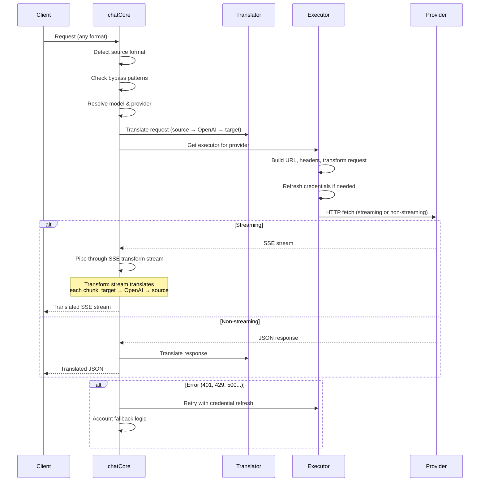

---

### 4.4 Tjenester (`open-sse/services/`)

Forretningslogikk som støtter behandlerne og utførerne.

| Fil                  | Formål                                                                                                                                                                                                                                                                                                                                                             |
| -------------------- | ------------------------------------------------------------------------------------------------------------------------------------------------------------------------------------------------------------------------------------------------------------------------------------------------------------------------------------------------------------------ |
| `provider.ts`        | **Formatgjenkjenning** (`detectFormat`): analyser forespørsler om kroppsstruktur for å identifisere Claude/OpenAI/Gemini/Antigravity/Responses-formater (inkluderer `max_tokens` heuristikk for Claude). Også: URL-bygging, header-bygging, normalisering av tenkekonfigurasjon. Støtter `openai-compatible-*` og `anthropic-compatible-*` dynamiske leverandører. |
| `model.ts`           | Parsing av modellstreng (`claude/model-name` → `{provider: "claude", model: "model-name"}`), aliasoppløsning med kollisjonsdeteksjon, inngangssanering (avviser banegjennomgang/kontrolltegn) og modellinformasjonsoppløsning med støtte for asynkron alias-getter.                                                                                                |
| `accountFallback.ts` | Hastighetsgrensehåndtering: eksponentiell backoff (1s → 2s → 4s → maks 2min), kontonedkjølingsadministrasjon, feilklassifisering (hvilke feil utløser fallback kontra ikke).                                                                                                                                                                                       |
| `tokenRefresh.ts`    | OAuth-tokenoppdatering for **alle leverandører**: Google (Gemini, Antigravity), Claude, Codex, Qwen, iFlow, GitHub (OAuth + Copilot dual-token), Kiro (AWS SSO OIDC + Social Auth). Inkluderer under flyging løftededupliseringsbuffer og forsøk på nytt med eksponentiell backoff.                                                                                |
| `combo.ts`           | **Kombomodeller**: kjeder av reservemodeller. Hvis modell A mislykkes med en fallback-kvalifisert feil, prøv modell B, deretter C osv. Returnerer faktiske oppstrømsstatuskoder.                                                                                                                                                                                   |
| `usage.ts`           | Henter kvote-/bruksdata fra leverandør-API-er (GitHub Copilot-kvoter, Antigravity-modellkvoter, Codex-hastighetsgrenser, Kiro-brukssammenbrudd, Claude-innstillinger).                                                                                                                                                                                             |
| `accountSelector.ts` | Smart kontovalg med scoringsalgoritme: vurderer prioritet, helsestatus, round-robin-posisjon og nedkjølingstilstand for å velge den optimale kontoen for hver forespørsel.                                                                                                                                                                                         |
| `contextManager.ts`  | Be om kontekstlivssyklusadministrasjon: oppretter og sporer kontekstobjekter per forespørsel med metadata (forespørsels-ID, tidsstempler, leverandørinformasjon) for feilsøking og logging.                                                                                                                                                                        |
| `ipFilter.ts`        | IP-basert tilgangskontroll: støtter tillatelsesliste- og blokkeringsmodus. Validerer klient-IP mot konfigurerte regler før API-forespørsler behandles.                                                                                                                                                                                                             |
| `sessionManager.ts`  | Sesjonssporing med klientfingeravtrykk: sporer aktive økter ved å bruke hashed klientidentifikatorer, overvåker antall forespørsler og gir øktberegninger.                                                                                                                                                                                                         |
| `signatureCache.ts`  | Forespørselssignaturbasert dedupliseringsbuffer: forhindrer dupliserte forespørsler ved å bufre nylige forespørselssignaturer og returnere bufrede svar for identiske forespørsler innen et tidsvindu.                                                                                                                                                             |
| `systemPrompt.ts`    | Global systemmeldingsinjeksjon: legger til eller legger til en konfigurerbar systemmelding til alle forespørsler, med kompatibilitetshåndtering per leverandør.                                                                                                                                                                                                    |
| `thinkingBudget.ts`  | Reasoning token budsjettadministrasjon: støtter passthrough, auto (strip thinking config), tilpasset (fast budsjett) og adaptive (kompleksitetsskalert) moduser for å kontrollere tenkning/resonnering tokens.                                                                                                                                                     |
| `wildcardRouter.ts`  | Ruting av jokertegnmodellmønster: løser jokertegnmønstre (f.eks. `*/claude-*`) til konkrete leverandør/modellpar basert på tilgjengelighet og prioritet.                                                                                                                                                                                                           |

#### Token Refresh Deduplisering

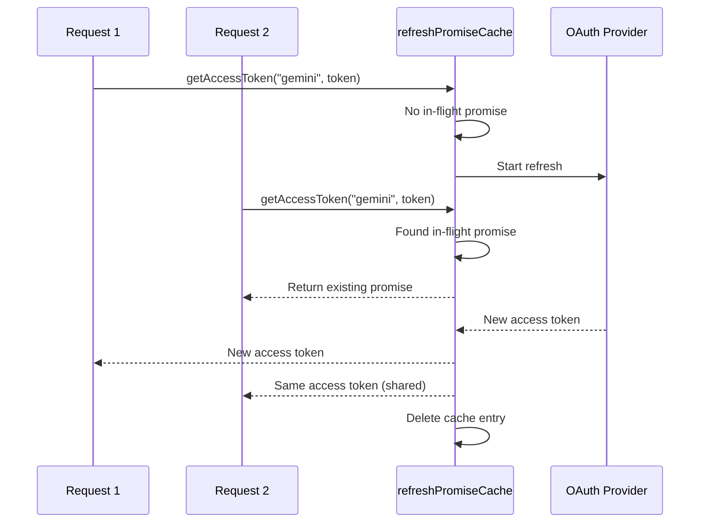

#### Account Reserve State Machine

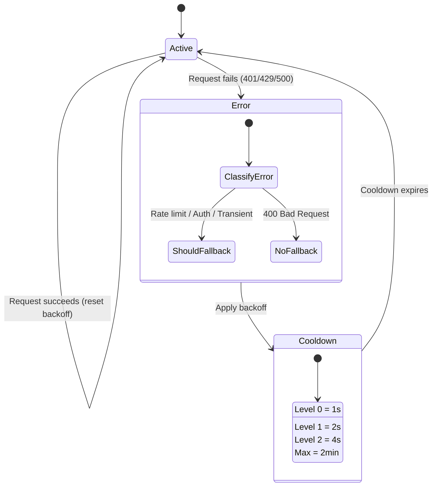

#### Kombimodellkjede

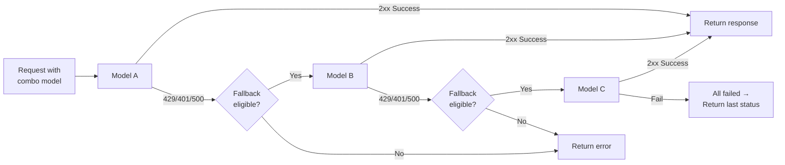

---

### 4.5 Oversetter (`open-sse/translator/`)

**formatoversettelsesmotoren** bruker et selvregistrerende plugin-system.

#### Arkitektur

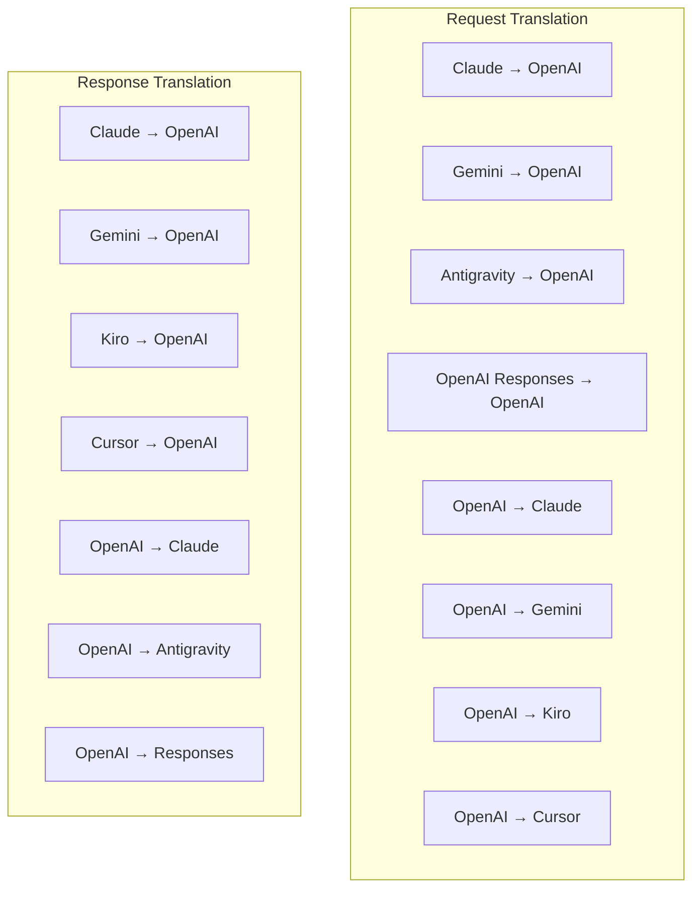

| Katalog      | Filer         | Beskrivelse                                                                                                                                                                                                                                         |
| ------------ | ------------- | --------------------------------------------------------------------------------------------------------------------------------------------------------------------------------------------------------------------------------------------------- |
| `request/`   | 8 oversettere | Konverter forespørselstekster mellom formater. Hver fil registreres selv via `register(from, to, fn)` ved import.                                                                                                                                   |
| `response/`  | 7 oversettere | Konverter strømmeresponsbiter mellom formater. Håndterer SSE-hendelsestyper, tenkeblokker, verktøykall.                                                                                                                                             |
| `helpers/`   | 6 hjelpere    | Delte verktøy: `claudeHelper` (uttrekking av systemprompt, tenkekonfigurasjon), `geminiHelper` (deler-/innholdskartlegging), `openaiHelper` (formatfiltrering), `toolCallHelper` (ID-generering, manglende responsinjeksjon), \_***OMNI***TO.\_\_2. |
| `index.ts`   | —             | Oversettelsesmotor: `translateRequest()`, `translateResponse()`, statlig ledelse, register.                                                                                                                                                         |
| `formats.ts` | —             | Formatkonstanter: `OPENAI`, `CLAUDE`, `GEMINI`, `ANTIGRAVITY`, `KIRO`, `CURSOR`, `OPENAI_RESPONSES`.                                                                                                                                                |

#### Nøkkeldesign: Selvregistrerende plugins

```javascript
// Each translator file calls register() on import:
import { register } from "../index.js";
register("claude", "openai", translateClaudeToOpenAI);

// The index.js imports all translator files, triggering registration:
import "./request/claude-to-openai.js"; // ← self-registers
```

---

### 4.6 Utils (`open-sse/utils/`)

| Fil                | Formål                                                                                                                                                                                                                                                                                    |
| ------------------ | ----------------------------------------------------------------------------------------------------------------------------------------------------------------------------------------------------------------------------------------------------------------------------------------- |
| `error.ts`         | Bygging av feilrespons (OpenAI-kompatibelt format), oppstrøms feilparsing, Antigravity-utvinning på nytt fra feilmeldinger, SSE-feilstrømming.                                                                                                                                            |
| `stream.ts`        | **SSE Transform Stream** — kjernestrømmingsrørledningen. To moduser: `TRANSLATE` (fullformatoversettelse) og `PASSTHROUGH` (normalisere + ekstraksjonsbruk). Håndterer chunk-buffring, bruksestimat, sporing av innholdslengde. Per-stream koder/dekoderforekomster unngår delt tilstand. |
| `streamHelpers.ts` | SSE-verktøy på lavt nivå: `parseSSELine` (tomromtolerant), `hasValuableContent` (filtrerer tomme deler for OpenAI/Claude/Gemini), `fixInvalidId`, `formatSSE` (formatbevisst SSETOKEN*101*-opprydding med **1OMNI\_-opprydding med **1OMNI\_-opprydding).                                 |
| `usageTracking.ts` | Uttrekk av tokenbruk fra ethvert format (Claude/OpenAI/Gemini/Responses), estimering med separate verktøy/melding-char-per-token-forhold, buffertillegg (sikkerhetsmargin for 2000 tokens), formatspesifikk feltfiltrering, konsolllogging med ANSI-farger.                               |
| `requestLogger.ts` | Filbasert forespørselslogging (opt-in via `ENABLE_REQUEST_LOGS=true`). Oppretter øktmapper med nummererte filer: `1_req_client.json` → `7_res_client.txt`. All I/O er asynkron (fire-and-forget). Maskerer sensitive overskrifter.                                                        |
| `bypassHandler.ts` | Avskjærer spesifikke mønstre fra Claude CLI (tittelutvinning, oppvarming, telling) og returnerer falske svar uten å ringe noen leverandør. Støtter både streaming og ikke-streaming. Med vilje begrenset til Claude CLI-omfang.                                                           |
| `networkProxy.ts`  | Løser utgående proxy-URL for en gitt leverandør med prioritet: leverandørspesifikk konfig → global konfig → miljøvariabler (`HTTPS_PROXY`/`HTTP_PROXY`/`ALL_PROXY`). Støtter `NO_PROXY` ekskluderinger. Cacher konfigurasjon for 30s.                                                     |

#### SSE Streaming Pipeline

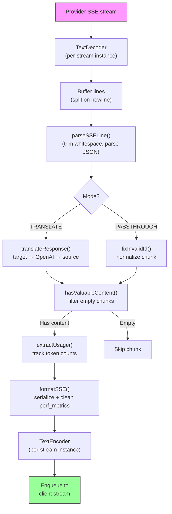

#### Request Logger Session Struktur

```
logs/
└── claude_gemini_claude-sonnet_20260208_143045/
    ├── 1_req_client.json      ← Raw client request
    ├── 2_req_source.json      ← After initial conversion
    ├── 3_req_openai.json      ← OpenAI intermediate format
    ├── 4_req_target.json      ← Final target format
    ├── 5_res_provider.txt     ← Provider SSE chunks (streaming)
    ├── 5_res_provider.json    ← Provider response (non-streaming)
    ├── 6_res_openai.txt       ← OpenAI intermediate chunks
    ├── 7_res_client.txt       ← Client-facing SSE chunks
    └── 6_error.json           ← Error details (if any)
```

---

### 4.7 applikasjonslag (`src/`)

| Katalog       | Formål                                                                    |
| ------------- | ------------------------------------------------------------------------- |
| `src/app/`    | Web-UI, API-ruter, Express-mellomvare, OAuth-tilbakeringsbehandlere       |
| `src/lib/`    | Databasetilgang (`localDb.ts`, `usageDb.ts`), autentisering, delt         |
| `src/mitm/`   | Man-in-the-midten proxy-verktøy for å avskjære leverandørtrafikk          |
| `src/models/` | Databasemodelldefinisjoner                                                |
| `src/shared/` | Omslag rundt åpne-sse-funksjoner (leverandør, strøm, feil osv.)           |
| `src/sse/`    | SSE-endepunktbehandlere som kobler open-sse-biblioteket til Express-ruter |
| `src/store/`  | Søknadstilstandsadministrasjon                                            |

#### Bemerkelsesverdige API-ruter

| Rute                                          | Metoder        | Formål                                                                                            |
| --------------------------------------------- | -------------- | ------------------------------------------------------------------------------------------------- |
| `/api/provider-models`                        | GET/POST/SLETT | CRUD for tilpassede modeller per leverandør                                                       |
| `/api/models/catalog`                         | FÅ             | Samlet katalog over alle modeller (chat, innebygging, bilde, tilpasset) gruppert etter leverandør |
| `/api/settings/proxy`                         | GET/SETT/SLETT | Hierarkisk utgående proxy-konfigurasjon (`global/providers/combos/keys`)                          |
| `/api/settings/proxy/test`                    | INNLEGG        | Validerer proxy-tilkobling og returnerer offentlig IP/latency                                     |
| `/v1/providers/[provider]/chat/completions`   | INNLEGG        | Dedikerte chatfullføringer per leverandør med modellvalidering                                    |
| `/v1/providers/[provider]/embeddings`         | INNLEGG        | Dedikerte innbygginger per leverandør med modellvalidering                                        |
| `/v1/providers/[provider]/images/generations` | INNLEGG        | Dedikert bildegenerering per leverandør med modellvalidering                                      |
| `/api/settings/ip-filter`                     | GET/SETT       | IP-godkjenningsliste/blokkeringslisteadministrasjon                                               |
| `/api/settings/thinking-budget`               | GET/SETT       | Begrunnelse token budsjettkonfigurasjon (passthrough/auto/custom/adaptive)                        |
| `/api/settings/system-prompt`                 | GET/SETT       | Global systemprompt injeksjon for alle forespørsler                                               |
| `/api/sessions`                               | FÅ             | Aktiv øktsporing og beregninger                                                                   |
| `/api/rate-limits`                            | FÅ             | Satsgrensestatus per konto                                                                        |

---

## 5. Nøkkeldesignmønstre

### 5.1 Hub-and-Speake-oversettelse

Alle formater oversettes gjennom **OpenAI-formatet som navet**. Å legge til en ny leverandør krever bare å skrive **ett par** med oversettere (til/fra OpenAI), ikke N par.

### 5.2 Eksekutørstrategimønster

Hver leverandør har en dedikert eksekutørklasse som arver fra `BaseExecutor`. Fabrikken i `executors/index.ts` velger den riktige ved kjøring.

### 5.3 Selvregistrerende pluginsystem

Oversettermoduler registrerer seg ved import via `register()`. Å legge til en ny oversetter er bare å lage en fil og importere den.

### 5.4 Kontotilbakeslag med eksponentiell backoff

Når en leverandør returnerer 429/401/500, kan systemet bytte til neste konto ved å bruke eksponentielle nedkjølinger (1s → 2s → 4s → maks 2min).

### 5.5 Combo modellkjeder

En "combo" grupperer flere `provider/model` strenger. Hvis den første mislykkes, fall tilbake til den neste automatisk.

### 5.6 Stateful streaming-oversettelse

Responsoversettelse opprettholder tilstanden på tvers av SSE-biter (tenkeblokksporing, akkumulering av verktøykall, indeksering av innholdsblokker) via `initState()`-mekanismen.

### 5.7 Brukssikkerhetsbuffer

En buffer på 2000 tokener legges til rapportert bruk for å hindre klienter i å nå grensene for kontekstvindu på grunn av overhead fra systemforespørsler og formatoversettelse.

---

## 6. Støttede formater

| Format                   | Retning     | Identifikator      |
| ------------------------ | ----------- | ------------------ |
| OpenAI Chat-fullføringer | kilde + mål | `openai`           |
| OpenAI Responses API     | kilde + mål | `openai-responses` |
| Antropiske Claude        | kilde + mål | `claude`           |
| Google Gemini            | kilde + mål | `gemini`           |
| Google Gemini CLI        | kun mål     | `gemini-cli`       |
| Antigravitasjon          | kilde + mål | `antigravity`      |
| AWS Kiro                 | kun mål     | `kiro`             |
| Markør                   | kun mål     | `cursor`           |

---

## 7. Støttede leverandører

| Leverandør               | Auth metode               | Utfører         | Nøkkelnotater                                                                |
| ------------------------ | ------------------------- | --------------- | ---------------------------------------------------------------------------- |
| Antropiske Claude        | API-nøkkel eller OAuth    | Standard        | Bruker `x-api-key` header                                                    |
| Google Gemini            | API-nøkkel eller OAuth    | Standard        | Bruker `x-goog-api-key` header                                               |
| Google Gemini CLI        | OAuth                     | GeminiCLI       | Bruker `streamGenerateContent` endepunkt                                     |
| Antigravitasjon          | OAuth                     | Antigravitasjon | Tilbakestilling av flere nettadresser, egendefinert prøv å analysere på nytt |
| OpenAI                   | API-nøkkel                | Standard        | Standard bærer auth                                                          |
| Codex                    | OAuth                     | Codex           | Injiserer systeminstruksjoner, styrer tenkning                               |
| GitHub Copilot           | OAuth + Copilot-token     | Github          | Dobbelt token, VSCode header-etterligning                                    |
| Kiro (AWS)               | AWS SSO OIDC eller Social | Kiro            | Binær EventStream-parsing                                                    |
| Markør IDE               | Sjekksum auth             | Markør          | Protobuf-koding, SHA-256 kontrollsummer                                      |
| Qwen                     | OAuth                     | Standard        | Standard auth                                                                |
| iFlow                    | OAuth (Basic + Bearer)    | Standard        | Dobbel autentiseringshode                                                    |
| OpenRouter               | API-nøkkel                | Standard        | Standard bærer auth                                                          |
| GLM, Kimi, MiniMax       | API-nøkkel                | Standard        | Claude-kompatibel, bruk `x-api-key`                                          |
| `openai-compatible-*`    | API-nøkkel                | Standard        | Dynamisk: ethvert OpenAI-kompatibelt endepunkt                               |
| `anthropic-compatible-*` | API-nøkkel                | Standard        | Dynamisk: ethvert Claude-kompatibelt endepunkt                               |

---

## 8. Dataflytsammendrag

### Strømmeforespørsel

```mermaid
flowchart LR
    A["Client"] --> B["detectFormat()"]
    B --> C["translateRequest()\nsource → OpenAI → target"]
    C --> D["Executor\nbuildUrl + buildHeaders"]
    D --> E["fetch(providerURL)"]
    E --> F["createSSEStream()\nTRANSLATE mode"]
    F --> G["parseSSELine()"]
    G --> H["translateResponse()\ntarget → OpenAI → source"]
    H --> I["extractUsage()\n+ addBuffer"]
    I --> J["formatSSE()"]
    J --> K["Client receives\ntranslated SSE"]
    K --> L["logUsage()\nsaveRequestUsage()"]
```

### Ikke-streamende forespørsel

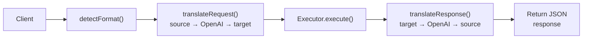

### Bypass Flow (Claude CLI)

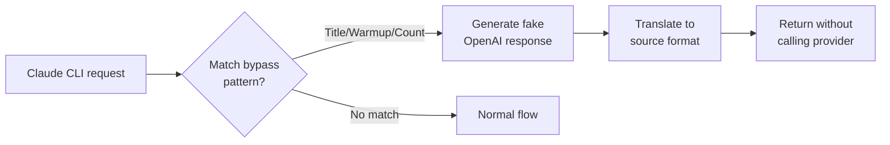
