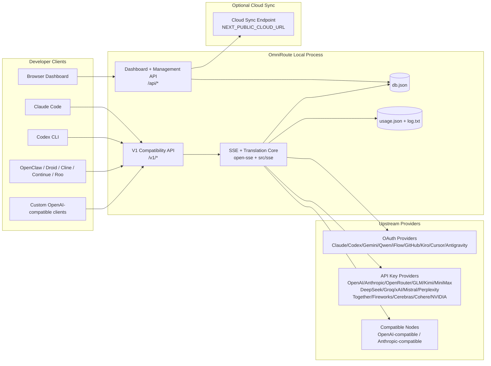
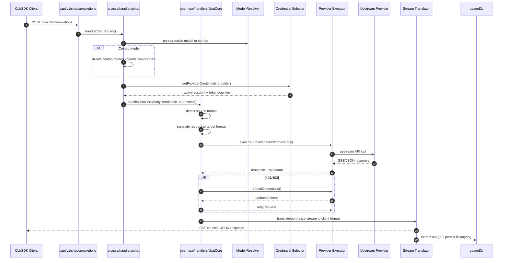
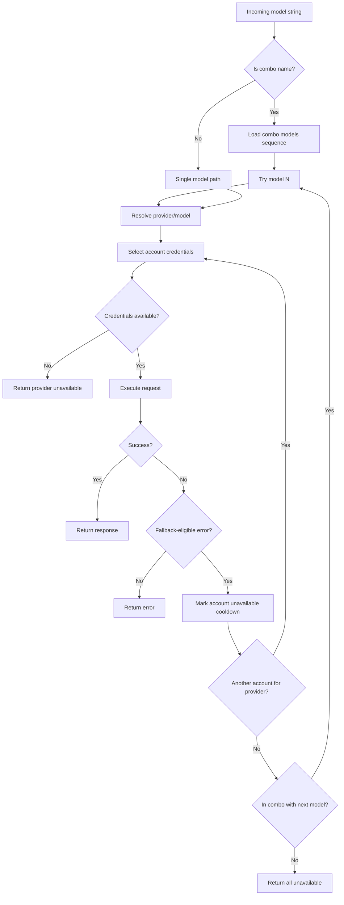
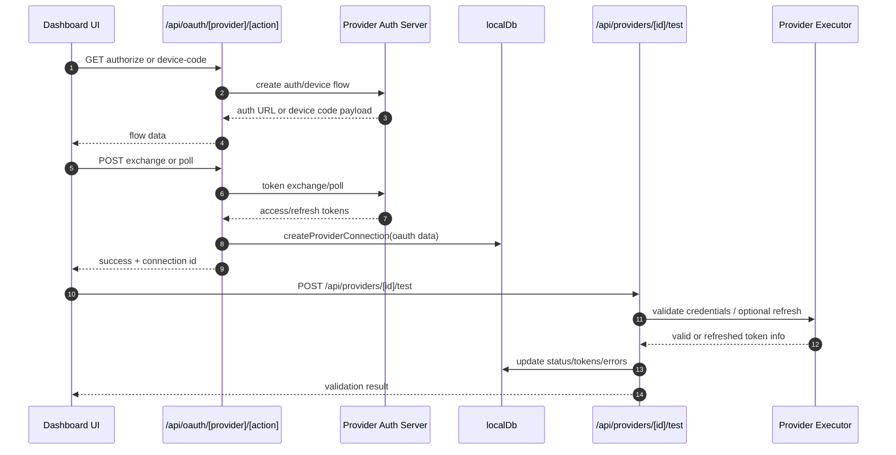
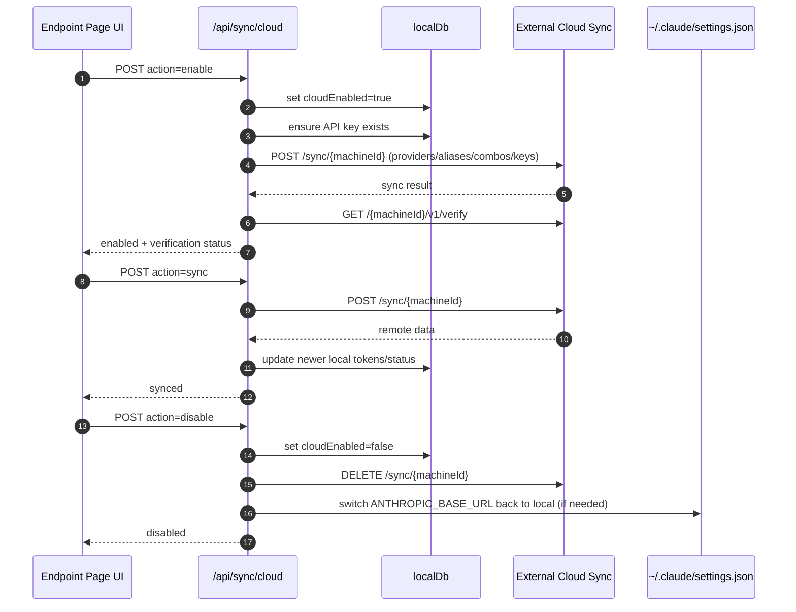
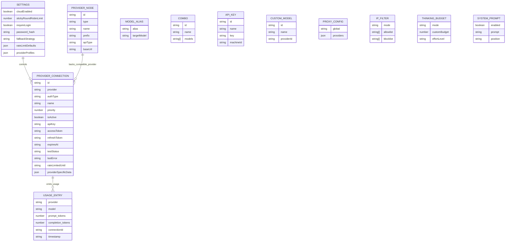
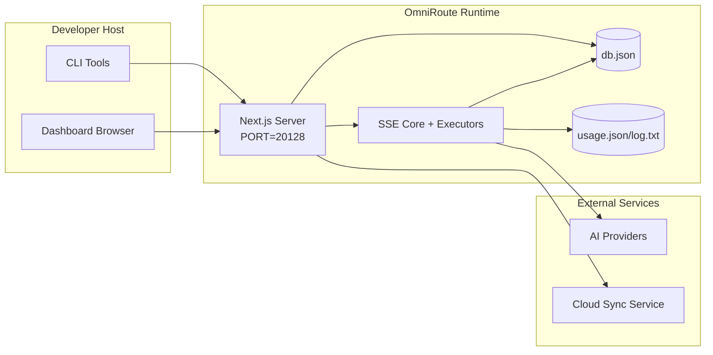

# Architektura OmniRoute

🌐 **Languages:** 🇺🇸 [English](../../ARCHITECTURE.md) | 🇧🇷 [Português (Brasil)](../pt-BR/ARCHITECTURE.md) | 🇪🇸 [Español](../es/ARCHITECTURE.md) | 🇫🇷 [Français](../fr/ARCHITECTURE.md) | 🇮🇹 [Italiano](../it/ARCHITECTURE.md) | 🇷🇺 [Русский](../ru/ARCHITECTURE.md) | 🇨🇳 [中文 (简体)](../zh-CN/ARCHITECTURE.md) | 🇩🇪 [Deutsch](../de/ARCHITECTURE.md) | 🇮🇳 [हिन्दी](../in/ARCHITECTURE.md) | 🇹🇭 [ไทย](../th/ARCHITECTURE.md) | 🇺🇦 [Українська](../uk-UA/ARCHITECTURE.md) | 🇸🇦 [العربية](../ar/ARCHITECTURE.md) | 🇯🇵 [日本語](../ja/ARCHITECTURE.md) | 🇻🇳 [Tiếng Việt](../vi/ARCHITECTURE.md) | 🇧🇬 [Български](../bg/ARCHITECTURE.md) | 🇩🇰 [Dansk](../da/ARCHITECTURE.md) | 🇫🇮 [Suomi](../fi/ARCHITECTURE.md) | 🇮🇱 [עברית](../he/ARCHITECTURE.md) | 🇭🇺 [Magyar](../hu/ARCHITECTURE.md) | 🇮🇩 [Bahasa Indonesia](../id/ARCHITECTURE.md) | 🇰🇷 [한국어](../ko/ARCHITECTURE.md) | 🇲🇾 [Bahasa Melayu](../ms/ARCHITECTURE.md) | 🇳🇱 [Nederlands](../nl/ARCHITECTURE.md) | 🇳🇴 [Norsk](../no/ARCHITECTURE.md) | 🇵🇹 [Português (Portugal)](../pt/ARCHITECTURE.md) | 🇷🇴 [Română](../ro/ARCHITECTURE.md) | 🇵🇱 [Polski](../pl/ARCHITECTURE.md) | 🇸🇰 [Slovenčina](../sk/ARCHITECTURE.md) | 🇸🇪 [Svenska](../sv/ARCHITECTURE.md) | 🇵🇭 [Filipino](../phi/ARCHITECTURE.md)

_Ostatnia aktualizacja: 2026-02-18_

## Podsumowanie wykonawcze

OmniRoute to lokalna brama routingu AI i pulpit nawigacyjny zbudowany w oparciu o Next.js.
Zapewnia pojedynczy punkt końcowy zgodny z OpenAI (`/v1/*`) i kieruje ruch do wielu dostawców nadrzędnych z tłumaczeniem, rezerwą, odświeżaniem tokenów i śledzeniem użycia.

Podstawowe możliwości:

- Powierzchnia API kompatybilna z OpenAI dla CLI/narzędzi (28 dostawców)
- Tłumaczenie żądań/odpowiedzi w różnych formatach dostawców
- Awaryjna kombinacja modeli (sekwencja wielu modeli)
- Rezerwa awaryjna na poziomie konta (wiele kont na dostawcę)
- Zarządzanie połączeniem dostawcy klucza OAuth + API
- Generowanie osadzania poprzez `/v1/embeddings` (6 dostawców, 9 modeli)
- Generowanie obrazu poprzez `/v1/images/generations` (4 dostawców, 9 modeli)
- Pomyśl o analizie tagów (`<think>...</think>`) pod kątem modeli wnioskowania
- Oczyszczanie odpowiedzi w celu zapewnienia ścisłej zgodności z OpenAI SDK
- Normalizacja ról (programista → system, system → użytkownik) w celu zapewnienia zgodności między dostawcami
- Strukturalna konwersja danych wyjściowych (json_schema → Gemini respondSchema)
- Lokalna trwałość dostawców, kluczy, aliasów, kombinacji, ustawień, cen
- Śledzenie wykorzystania/kosztów i rejestrowanie żądań
- Opcjonalna synchronizacja w chmurze dla synchronizacji wielu urządzeń/stanów
- Lista dozwolonych/blokowanych adresów IP do kontroli dostępu do API
- Myślenie o zarządzaniu budżetem (przejściowe/automatyczne/niestandardowe/adaptacyjne)
- Globalny system natychmiastowego wstrzyknięcia
- Śledzenie sesji i pobieranie odcisków palców
- Ulepszone ograniczenie stawek dla konta z profilami specyficznymi dla dostawcy
- Wzór wyłącznika zapewniający odporność dostawcy
- Ochrona stada przed piorunami z blokadą mutex
- Pamięć podręczna deduplikacji żądań oparta na sygnaturach
- Warstwa domeny: dostępność modelu, zasady kosztów, polityka awaryjna, polityka blokad
- Trwałość stanu domeny (pamięć podręczna zapisu SQLite dla błędów awaryjnych, budżetów, blokad, wyłączników automatycznych)
- Silnik polityki do scentralizowanej oceny wniosków (blokada → budżet → rezerwa)
  — Żądaj telemetrii z agregacją opóźnień p50/p95/p99
- Identyfikator korelacji (X-Request-Id) do śledzenia od końca do końca
- Rejestrowanie audytu zgodności z możliwością rezygnacji dla każdego klucza API
- Ramy ewaluacyjne dla zapewnienia jakości LLM
- Pulpit nawigacyjny interfejsu użytkownika Resilience ze statusem wyłącznika automatycznego w czasie rzeczywistym
- Modułowi dostawcy OAuth (12 indywidualnych modułów pod `src/lib/oauth/providers/`)

Podstawowy model środowiska wykonawczego:

- Trasy aplikacji Next.js w `src/app/api/*` implementują zarówno interfejsy API pulpitu nawigacyjnego, jak i interfejsy API zgodności
- Wspólny rdzeń SSE/routingu w `src/sse/*` + `open-sse/*` obsługuje wykonywanie dostawcy, tłumaczenie, przesyłanie strumieniowe, rezerwę i wykorzystanie

## Zakres i granice

### W zakresie

- Środowisko wykonawcze bramy lokalnej
- Interfejsy API zarządzania pulpitem nawigacyjnym
- Uwierzytelnianie dostawcy i odświeżanie tokena
- Poproś o tłumaczenie i przesyłanie strumieniowe SSE
- Stan lokalny + trwałość użytkowania
- Opcjonalna orkiestracja synchronizacji w chmurze

### Poza zakresem

- Wdrożenie usługi w chmurze za `NEXT_PUBLIC_CLOUD_URL`
- Umowa SLA dostawcy/płaszczyzna kontroli poza procesem lokalnym
- Same zewnętrzne pliki binarne CLI (Claude CLI, Codex CLI itp.)

## Kontekst systemu wysokiego poziomu



## Podstawowe komponenty wykonawcze

## 1) API i warstwa routingu (trasy aplikacji Next.js)

Główne katalogi:

- `src/app/api/v1/*` i `src/app/api/v1beta/*` dla interfejsów API zgodności
- `src/app/api/*` dla interfejsów API zarządzania/konfiguracji
- Następne przepisanie w `next.config.mjs` mapie `/v1/*` na `/api/v1/*`

Ważne ścieżki kompatybilności:

- `src/app/api/v1/chat/completions/route.ts`
- `src/app/api/v1/messages/route.ts`
- `src/app/api/v1/responses/route.ts`
- `src/app/api/v1/models/route.ts` — zawiera niestandardowe modele z `custom: true`
- `src/app/api/v1/embeddings/route.ts` — generacja osadzania (6 dostawców)
- `src/app/api/v1/images/generations/route.ts` — generowanie obrazu (4+ dostawców, w tym Antigravity/Nebius)
- `src/app/api/v1/messages/count_tokens/route.ts`
- `src/app/api/v1/providers/[provider]/chat/completions/route.ts` — dedykowany czat dla każdego dostawcy
- `src/app/api/v1/providers/[provider]/embeddings/route.ts` — dedykowane osadzanie dla poszczególnych dostawców
- `src/app/api/v1/providers/[provider]/images/generations/route.ts` — obrazy dedykowane dla poszczególnych dostawców
- `src/app/api/v1beta/models/route.ts`
- `src/app/api/v1beta/models/[...path]/route.ts`

Domeny zarządzania:

- Autoryzacja/ustawienia: `src/app/api/auth/*`, `src/app/api/settings/*`
- Dostawcy/połączenia: `src/app/api/providers*`
- Węzły dostawcy: `src/app/api/provider-nodes*`
- Modele niestandardowe: `src/app/api/provider-models` (GET/POST/DELETE)
- Katalog modeli: `src/app/api/models/catalog` (GET)
- Konfiguracja proxy: `src/app/api/settings/proxy` (GET/PUT/DELETE) + `src/app/api/settings/proxy/test` (POST)
- OAuth: `src/app/api/oauth/*`
- Klucze/aliasy/kombinacje/ceny: `src/app/api/keys*`, `src/app/api/models/alias`, `src/app/api/combos*`, `src/app/api/pricing`
- Użycie: `src/app/api/usage/*`
- Synchronizacja/chmura: `src/app/api/sync/*`, `src/app/api/cloud/*`
- Pomocnicy narzędzi CLI: `src/app/api/cli-tools/*`
- Filtr IP: `src/app/api/settings/ip-filter` (GET/PUT)
- Przemyślany budżet: `src/app/api/settings/thinking-budget` (GET/PUT)
- Podpowiedź systemowa: `src/app/api/settings/system-prompt` (GET/PUT)
- Sesje: `src/app/api/sessions` (GET)
- Limity stawek: `src/app/api/rate-limits` (GET)
- Odporność: `src/app/api/resilience` (GET/PATCH) — profile dostawców, wyłącznik automatyczny, stan limitu szybkości
- Reset odporności: `src/app/api/resilience/reset` (POST) - resetuje wyłączniki + czasy odnowienia
- Statystyki pamięci podręcznej: `src/app/api/cache/stats` (GET/DELETE)
- Dostępność modelu: `src/app/api/models/availability` (GET/POST)
- Telemetria: `src/app/api/telemetry/summary` (GET)
- Budżet: `src/app/api/usage/budget` (GET/POST)
- Łańcuchy awaryjne: `src/app/api/fallback/chains` (GET/POST/DELETE)
- Audyt zgodności: `src/app/api/compliance/audit-log` (GET)
- Wartości: `src/app/api/evals` (GET/POST), `src/app/api/evals/[suiteId]` (GET)
- Zasady: `src/app/api/policies` (GET/POST)

## 2) SSE + rdzeń tłumaczeniowy

Główne moduły przepływowe:

- Wpis: `src/sse/handlers/chat.ts`
- Podstawowa orkiestracja: `open-sse/handlers/chatCore.ts`
- Adaptery wykonawcze dostawcy: `open-sse/executors/*`
- Wykrywanie formatu/konfiguracja dostawcy: `open-sse/services/provider.ts`
- Analiza/rozwiązanie modelu: `src/sse/services/model.ts`, `open-sse/services/model.ts`
- Logika zastępcza konta: `open-sse/services/accountFallback.ts`
- Rejestr tłumaczeń: `open-sse/translator/index.ts`
- Transformacje strumieniowe: `open-sse/utils/stream.ts`, `open-sse/utils/streamHandler.ts`
- Ekstrakcja/normalizacja użycia: `open-sse/utils/usageTracking.ts`
- Pomyśl o parserze tagów: `open-sse/utils/thinkTagParser.ts`
- Obsługa osadzania: `open-sse/handlers/embeddings.ts`
- Rejestr dostawców osadzania: `open-sse/config/embeddingRegistry.ts`
- Obsługa generowania obrazu: `open-sse/handlers/imageGeneration.ts`
- Rejestr dostawców obrazu: `open-sse/config/imageRegistry.ts`
- Odkażanie odpowiedzi: `open-sse/handlers/responseSanitizer.ts`
- Normalizacja ról: `open-sse/services/roleNormalizer.ts`

Usługi (logika biznesowa):

- Wybór konta/punktacja: `open-sse/services/accountSelector.ts`
- Zarządzanie cyklem życia kontekstu: `open-sse/services/contextManager.ts`
- Wymuszanie filtra IP: `open-sse/services/ipFilter.ts`
- Śledzenie sesji: `open-sse/services/sessionManager.ts`
- Poproś o deduplikację: `open-sse/services/signatureCache.ts`
- Wstrzyknięcie monitu systemowego: `open-sse/services/systemPrompt.ts`
- Myślenie o zarządzaniu budżetem: `open-sse/services/thinkingBudget.ts`
- Routing modelu wieloznacznego: `open-sse/services/wildcardRouter.ts`
- Zarządzanie limitami stawek: `open-sse/services/rateLimitManager.ts`
- Bezpiecznik: `open-sse/services/circuitBreaker.ts`

Moduły warstwy domeny:

- Dostępność modelu: `src/lib/domain/modelAvailability.ts`
- Reguły kosztów/budżety: `src/lib/domain/costRules.ts`
- Polityka awaryjna: `src/lib/domain/fallbackPolicy.ts`
- Rozwiązanie kombinacji: `src/lib/domain/comboResolver.ts`
- Polityka blokowania: `src/lib/domain/lockoutPolicy.ts`
- Silnik polityki: `src/domain/policyEngine.ts` — scentralizowana blokada → budżet → ocena rezerwowa
- Katalog kodów błędów: `src/lib/domain/errorCodes.ts`
- Identyfikator żądania: `src/lib/domain/requestId.ts`
- Limit czasu pobierania: `src/lib/domain/fetchTimeout.ts`
- Poproś o telemetrię: `src/lib/domain/requestTelemetry.ts`
- Zgodność/audyt: `src/lib/domain/compliance/index.ts`
- Ewaluacyjny biegacz: `src/lib/domain/evalRunner.ts`
- Trwałość stanu domeny: `src/lib/db/domainState.ts` — SQLite CRUD dla łańcuchów awaryjnych, budżetów, historii kosztów, stanu blokady, wyłączników automatycznych

Moduły dostawcy OAuth (12 pojedynczych plików pod `src/lib/oauth/providers/`):

- Indeks rejestru: `src/lib/oauth/providers/index.ts`
- Dostawcy indywidualni: `claude.ts`, `codex.ts`, `gemini.ts`, `antigravity.ts`, `iflow.ts`, `qwen.ts`, `kimi-coding.ts`, `github.ts`, `kiro.ts`, `cursor.ts`, `kilocode.ts`, `cline.ts`
- Cienkie opakowanie: `src/lib/oauth/providers.ts` — reeksport z poszczególnych modułów

## 3) Warstwa trwałości

Stan podstawowy DB:

- `src/lib/localDb.ts`
- plik: `${DATA_DIR}/db.json` (lub `$XDG_CONFIG_HOME/omniroute/db.json`, gdy jest ustawiony, w przeciwnym razie `~/.omniroute/db.json`)
- encje: dostawcaConnections, ProvideNodes, modelAliases, combo, apiKeys, ustawienia, ceny, **customModels**, **proxyConfig**, **ipFilter**, **thinkingBudget**, **systemPrompt**

Wykorzystanie bazy danych:

- `src/lib/usageDb.ts`
- pliki: `${DATA_DIR}/usage.json`, `${DATA_DIR}/log.txt`, `${DATA_DIR}/call_logs/`
- stosuje się do tej samej zasady katalogu podstawowego, co `localDb` (`DATA_DIR`, następnie `XDG_CONFIG_HOME/omniroute`, gdy jest ustawiony)
- rozłożone na skupione podmoduły: `migrations.ts`, `usageHistory.ts`, `costCalculator.ts`, `usageStats.ts`, `callLogs.ts`

Baza danych stanu domeny (SQLite):

- `src/lib/db/domainState.ts` — Operacje CRUD dla stanu domeny
- Tabele (utworzone w `src/lib/db/core.ts`): `domain_fallback_chains`, `domain_budgets`, `domain_cost_history`, `domain_lockout_state`, `domain_circuit_breakers`
- Wzór pamięci podręcznej zapisu: mapy w pamięci są wiarygodne w czasie wykonywania; mutacje są zapisywane synchronicznie do SQLite; stan jest przywracany z bazy danych przy zimnym starcie

## 4) Powierzchnie uwierzytelniające + zabezpieczające

- Autoryzacja plików cookie w panelu kontrolnym: `src/proxy.ts`, `src/app/api/auth/login/route.ts`
- Generowanie/weryfikacja klucza API: `src/shared/utils/apiKey.ts`
  — Wpisy tajne dostawcy zachowały się we wpisach `providerConnections`
- Obsługa wychodzącego serwera proxy za pośrednictwem `open-sse/utils/proxyFetch.ts` (vars env) i `open-sse/utils/networkProxy.ts` (konfigurowalne dla każdego dostawcy lub globalne)

## 5) Synchronizacja z chmurą

- Inicjacja harmonogramu: `src/lib/initCloudSync.ts`, `src/shared/services/initializeCloudSync.ts`
- Zadanie okresowe: `src/shared/services/cloudSyncScheduler.ts`
- Trasa kontrolna: `src/app/api/sync/cloud/route.ts`

## Cykl życia żądania (`/v1/chat/completions`)



## Kombinacja + przepływ awaryjny konta



Decyzje awaryjne są podejmowane przez `open-sse/services/accountFallback.ts` przy użyciu kodów stanu i heurystyki komunikatów o błędach.

## Cykl życia wdrożenia OAuth i odświeżania tokenu



Odświeżanie podczas ruchu na żywo jest wykonywane wewnątrz `open-sse/handlers/chatCore.ts` za pośrednictwem modułu wykonującego `refreshCredentials()`.

## Cykl życia synchronizacji w chmurze (włącz/synchronizuj/wyłącz)



Synchronizacja okresowa jest wyzwalana przez `CloudSyncScheduler`, gdy włączona jest chmura.

## Model danych i mapa przechowywania



Pliki pamięci fizycznej:

- stan główny: `${DATA_DIR}/db.json` (lub `$XDG_CONFIG_HOME/omniroute/db.json` gdy jest ustawiony, w przeciwnym wypadku `~/.omniroute/db.json`)
- statystyki użytkowania: `${DATA_DIR}/usage.json`
- linie dziennika żądań: `${DATA_DIR}/log.txt`
- opcjonalne sesje debugowania tłumacza/żądania: `<repo>/logs/...`

## Topologia wdrożenia



## Mapowanie modułów (decyzyjne krytyczne)

### Moduły tras i API

- `src/app/api/v1/*`, `src/app/api/v1beta/*`: interfejsy API zgodności
- `src/app/api/v1/providers/[provider]/*`: dedykowane trasy dla poszczególnych dostawców (czat, osadzanie, obrazy)
- `src/app/api/providers*`: dostawca CRUD, walidacja, testowanie
- `src/app/api/provider-nodes*`: niestandardowe zarządzanie kompatybilnymi węzłami
- `src/app/api/provider-models`: zarządzanie modelami niestandardowymi (CRUD)
- `src/app/api/models/catalog`: API pełnego katalogu modeli (wszystkie typy pogrupowane według dostawcy)
- `src/app/api/oauth/*`: Przepływy OAuth/kodu urządzenia
- `src/app/api/keys*`: cykl życia lokalnego klucza API
- `src/app/api/models/alias`: zarządzanie aliasami
- `src/app/api/combos*`: zarządzanie kombinacjami rezerwowymi
- `src/app/api/pricing`: zastąpienie cen przy kalkulacji kosztów
- `src/app/api/settings/proxy`: konfiguracja proxy (GET/PUT/DELETE)
- `src/app/api/settings/proxy/test`: test połączenia wychodzącego proxy (POST)
- `src/app/api/usage/*`: interfejsy API użycia i dzienników
- `src/app/api/sync/*` + `src/app/api/cloud/*`: synchronizacja z chmurą i pomocnicy obsługujący chmurę
- `src/app/api/cli-tools/*`: lokalni autorzy/weryfikatorzy konfiguracji CLI
- `src/app/api/settings/ip-filter`: Lista dozwolonych/blokowanych adresów IP (GET/PUT)
- `src/app/api/settings/thinking-budget`: konfiguracja budżetu tokena myślącego (GET/PUT)
- `src/app/api/settings/system-prompt`: globalny monit systemowy (GET/PUT)
- `src/app/api/sessions`: lista aktywnych sesji (GET)
- `src/app/api/rate-limits`: stan limitu stawki za konto (GET)

### Rdzeń routingu i wykonania

- `src/sse/handlers/chat.ts`: analiza żądań, obsługa kombinacji, pętla wyboru konta
- `open-sse/handlers/chatCore.ts`: tłumaczenie, wysyłanie executora, obsługa ponawiania/odświeżania, konfiguracja strumienia
- `open-sse/executors/*`: zachowanie sieci i formatu specyficzne dla dostawcy

### Rejestr tłumaczeń i konwertery formatów

- `open-sse/translator/index.ts`: rejestracja i orkiestracja tłumaczy
- Poproś o tłumaczy: `open-sse/translator/request/*`
- Tłumacze odpowiedzi: `open-sse/translator/response/*`
- Stałe formatu: `open-sse/translator/formats.ts`

### Trwałość

- `src/lib/localDb.ts`: trwała konfiguracja/stan
- `src/lib/usageDb.ts`: historia użytkowania i logi bieżących żądań

## Zasięg dostawcy-wykonawcy (wzorzec strategii)

Każdy dostawca ma wyspecjalizowany moduł wykonawczy rozszerzający `BaseExecutor` (w `open-sse/executors/base.ts`), który zapewnia tworzenie adresów URL, konstruowanie nagłówków, ponawianie prób z wykładniczym wycofywaniem, przechwytywanie odświeżania poświadczeń i metodę orkiestracji `execute()`.

| Wykonawca             | Dostawca(-y)                                                                                                                                               | Specjalna obsługa                                                                  |
| --------------------- | ---------------------------------------------------------------------------------------------------------------------------------------------------------- | ---------------------------------------------------------------------------------- |
| `DefaultExecutor`     | OpenAI, Claude, Gemini, Qwen, iFlow, OpenRouter, GLM, Kimi, MiniMax, DeepSeek, Groq, xAI, Mistral, Perplexity, Razem, Fajerwerki, Cerebras, Cohere, NVIDIA | Dynamiczna konfiguracja adresu URL/nagłówka dla każdego dostawcy                   |
| `AntigravityExecutor` | Google Antygrawitacja                                                                                                                                      | Niestandardowe identyfikatory projektów/sesji, ponowna próba po przeanalizowaniu   |
| `CodexExecutor`       | Kodeks OpenAI                                                                                                                                              | Wstrzykuje instrukcje systemowe, wymusza wysiłek rozumowania                       |
| `CursorExecutor`      | Kursor IDE                                                                                                                                                 | Protokół ConnectRPC, kodowanie Protobuf, podpisywanie żądań poprzez sumę kontrolną |
| `GithubExecutor`      | Drugi pilot GitHuba                                                                                                                                        | Odświeżanie tokenu drugiego pilota, nagłówki naśladujące VSCode                    |
| `KiroExecutor`        | Zaklinacz kodów AWS/Kiro                                                                                                                                   | Format binarny AWS EventStream → Konwersja SSE                                     |
| `GeminiCLIExecutor`   | Bliźnięta CLI                                                                                                                                              | Cykl odświeżania tokena Google OAuth                                               |

Wszyscy pozostali dostawcy (w tym niestandardowe kompatybilne węzły) używają `DefaultExecutor`.

## Matryca zgodności dostawców

| Dostawca            | Formatuj          | Autoryzacja                   | Strumień                | Non-Stream | Odświeżenie tokena | Korzystanie z interfejsu API |
| ------------------- | ----------------- | ----------------------------- | ----------------------- | ---------- | ------------------ | ---------------------------- |
| Klaudiusz           | klaudia           | Klucz API / OAuth             | ✅                      | ✅         | ✅                 | ⚠️ Tylko administrator       |
| Bliźnięta           | Bliźnięta         | Klucz API / OAuth             | ✅                      | ✅         | ✅                 | ⚠️ Konsola chmurowa          |
| Bliźnięta CLI       | bliźnięta-cli     | OAuth                         | ✅                      | ✅         | ✅                 | ⚠️ Konsola chmurowa          |
| Antygrawitacja      | antygrawitacja    | OAuth                         | ✅                      | ✅         | ✅                 | ✅ Pełny limit API           |
| OpenAI              | otwieram          | Klucz API                     | ✅                      | ✅         | ❌                 | ❌                           |
| Kodeks              | odpowiedzi openai | OAuth                         | ✅ zmuszony             | ❌         | ✅                 | ✅ Limity stawek             |
| Drugi pilot GitHuba | otwieram          | OAuth + token drugiego pilota | ✅                      | ✅         | ✅                 | ✅ Migawki kwot              |
| Kursor              | kursor            | Niestandardowa suma kontrolna | ✅                      | ✅         | ❌                 | ❌                           |
| Kiro                | Kiro              | AWS SSO OIDC                  | ✅ (Strumień zdarzenia) | ❌         | ✅                 | ✅ Limity użytkowania        |
| Qwen                | otwieram          | OAuth                         | ✅                      | ✅         | ✅                 | ⚠️ Na żądanie                |
| iFlow               | otwieram          | OAuth (podstawowy)            | ✅                      | ✅         | ✅                 | ⚠️ Na żądanie                |
| OtwórzRouter        | otwieram          | Klucz API                     | ✅                      | ✅         | ❌                 | ❌                           |
| GLM/Kimi/MiniMax    | klaudia           | Klucz API                     | ✅                      | ✅         | ❌                 | ❌                           |
| DeepSeek            | otwieram          | Klucz API                     | ✅                      | ✅         | ❌                 | ❌                           |
| Groq                | otwieram          | Klucz API                     | ✅                      | ✅         | ❌                 | ❌                           |
| xAI (Grok)          | otwieram          | Klucz API                     | ✅                      | ✅         | ❌                 | ❌                           |
| Mistral             | otwieram          | Klucz API                     | ✅                      | ✅         | ❌                 | ❌                           |
| Zakłopotanie        | otwieram          | Klucz API                     | ✅                      | ✅         | ❌                 | ❌                           |
| Razem AI            | otwieram          | Klucz API                     | ✅                      | ✅         | ❌                 | ❌                           |
| Fajerwerki AI       | otwieram          | Klucz API                     | ✅                      | ✅         | ❌                 | ❌                           |
| Cerebra             | otwieram          | Klucz API                     | ✅                      | ✅         | ❌                 | ❌                           |
| Spójne              | otwieram          | Klucz API                     | ✅                      | ✅         | ❌                 | ❌                           |
| NVIDIA NIM          | otwieram          | Klucz API                     | ✅                      | ✅         | ❌                 | ❌                           |

## Zakres tłumaczenia w formacie

Wykryte formaty źródłowe obejmują:

- `openai`
- `openai-responses`
- `claude`
- `gemini`

Formaty docelowe obejmują:

- Czat/odpowiedzi OpenAI
- Klaudiusz
- Koperta Gemini/Gemini-CLI/Antygrawitacyjna
- Kiro
- Kursor

Tłumaczenia używają **OpenAI jako formatu centralnego** — wszystkie konwersje przechodzą przez OpenAI jako pośredni:

```
Source Format → OpenAI (hub) → Target Format
```

Tłumaczenia są wybierane dynamicznie na podstawie kształtu ładunku źródłowego i formatu docelowego dostawcy.

Dodatkowe warstwy przetwarzania w potoku tłumaczenia:

- **Oczyszczanie odpowiedzi** — Usuwa niestandardowe pola z odpowiedzi w formacie OpenAI (zarówno przesyłanych strumieniowo, jak i nie przesyłanych strumieniowo), aby zapewnić ścisłą zgodność z SDK
- **Normalizacja ról** — Konwertuje `developer` → `system` dla celów innych niż OpenAI; łączy `system` → `user` dla modeli odrzucających rolę systemową (GLM, ERNIE)
- **Pomyśl o wyodrębnieniu tagów** — Analizuje bloki `<think>...</think>` z treści w polu `reasoning_content`
- **Ustrukturyzowane dane wyjściowe** — Konwertuje OpenAI `response_format.json_schema` na `responseMimeType` Gemini + `responseSchema`

## Obsługiwane punkty końcowe interfejsu API

| Punkt końcowy                                      | Formatuj              | Opiekun                                                        |
| -------------------------------------------------- | --------------------- | -------------------------------------------------------------- |
| `POST /v1/chat/completions`                        | Czat OpenAI           | `src/sse/handlers/chat.ts`                                     |
| `POST /v1/messages`                                | Wiadomości Claude'a   | Ten sam program obsługi (wykryty automatycznie)                |
| `POST /v1/responses`                               | Odpowiedzi OpenAI     | `open-sse/handlers/responsesHandler.ts`                        |
| `POST /v1/embeddings`                              | Osadzania OpenAI      | `open-sse/handlers/embeddings.ts`                              |
| `GET /v1/embeddings`                               | Lista modeli          | Trasa API                                                      |
| `POST /v1/images/generations`                      | Obrazy OpenAI         | `open-sse/handlers/imageGeneration.ts`                         |
| `GET /v1/images/generations`                       | Lista modeli          | Trasa API                                                      |
| `POST /v1/providers/{provider}/chat/completions`   | Czat OpenAI           | Dedykowany dla każdego dostawcy z walidacją modelu             |
| `POST /v1/providers/{provider}/embeddings`         | Osadzania OpenAI      | Dedykowany dla każdego dostawcy z walidacją modelu             |
| `POST /v1/providers/{provider}/images/generations` | Obrazy OpenAI         | Dedykowany dla każdego dostawcy z walidacją modelu             |
| `POST /v1/messages/count_tokens`                   | Claude Liczba żetonów | Trasa API                                                      |
| `GET /v1/models`                                   | Lista modeli OpenAI   | Ścieżka API (czat + osadzanie + obraz + modele niestandardowe) |
| `GET /api/models/catalog`                          | Katalog               | Wszystkie modele pogrupowane według dostawcy + typu            |
| `POST /v1beta/models/*:streamGenerateContent`      | Pochodzący z Bliźniąt | Trasa API                                                      |
| `GET/PUT/DELETE /api/settings/proxy`               | Konfiguracja proxy    | Konfiguracja serwera proxy sieci                               |
| `POST /api/settings/proxy/test`                    | Łączność proxy        | Punkt końcowy testu kondycji/łączności serwera proxy           |
| `GET/POST/DELETE /api/provider-models`             | Modele niestandardowe | Zarządzanie modelami niestandardowymi według dostawcy          |

## Obsługa obejścia

Procedura obsługi obejścia (`open-sse/utils/bypassHandler.ts`) przechwytuje znane żądania „wyrzucenia” z Claude CLI — pingi rozgrzewające, wyodrębnianie tytułów i zliczanie tokenów — i zwraca **fałszywą odpowiedź** bez zużywania tokenów dostawcy nadrzędnego. Jest to wyzwalane tylko wtedy, gdy `User-Agent` zawiera `claude-cli`.

## Potok żądania rejestratora

Rejestrator żądań (`open-sse/utils/requestLogger.ts`) zapewnia 7-etapowy potok rejestrowania debugowania, domyślnie wyłączony, włączony poprzez `ENABLE_REQUEST_LOGS=true`:

```
1_req_client.json → 2_req_source.json → 3_req_openai.json → 4_req_target.json
→ 5_res_provider.txt → 6_res_openai.txt → 7_res_client.txt
```

Pliki są zapisywane w `<repo>/logs/<session>/` dla każdej sesji żądań.

## Tryby awarii i odporność

## 1) Dostępność konta/dostawcy

- czas oczekiwania na konto dostawcy w przypadku błędów przejściowych/szybkości/auth
- rezerwowe konto przed nieudanym żądaniem
- powrót do modelu kombi, gdy bieżąca ścieżka modelu/dostawcy zostanie wyczerpana

## 2) Wygaśnięcie tokena

- wstępne sprawdzenie i odświeżenie z ponowną próbą dla dostawców z możliwością odświeżania
- Ponowna próba 401/403 po próbie odświeżenia w ścieżce podstawowej

## 3) Bezpieczeństwo transmisji

- kontroler strumienia obsługujący rozłączenie
- strumień tłumaczeń z opróżnianiem na końcu strumienia i obsługą `[DONE]`
- rezerwowe oszacowanie użycia w przypadku braku metadanych dotyczących użycia dostawcy

## 4) Degradacja synchronizacji w chmurze

- pojawiają się błędy synchronizacji, ale lokalne środowisko wykonawcze trwa
- harmonogram ma logikę umożliwiającą ponawianie prób, ale wykonywanie okresowe obecnie domyślnie wywołuje synchronizację przy pojedynczej próbie

## 5) Integralność danych

- Migracja/naprawa kształtu DB w przypadku brakujących kluczy
- uszkodzone zabezpieczenia resetowania JSON dla localDb i useDb

## Obserwowalność i sygnały operacyjne

Źródła widoczności w czasie wykonywania:

- logi konsoli z `src/sse/utils/logger.ts`
- agregacje użycia na żądanie w `usage.json`
- logowanie o status żądania tekstowego `log.txt`
- opcjonalne głębokie dzienniki żądań/tłumaczeń pod `logs/`, gdy `ENABLE_REQUEST_LOGS=true`
- punkty końcowe użycia panelu kontrolnego (`/api/usage/*`) do wykorzystania interfejsu użytkownika

## Granice wrażliwe na bezpieczeństwo

- Sekret JWT (`JWT_SECRET`) zabezpiecza weryfikację/podpisywanie plików cookie sesji panelu kontrolnego
  — Początkowe hasło zastępcze (`INITIAL_PASSWORD`, domyślne `123456`) musi zostać zastąpione w rzeczywistych wdrożeniach
- Klucz API Sekret HMAC (`API_KEY_SECRET`) zabezpiecza wygenerowany lokalny format klucza API
- Sekrety dostawcy (klucze/tokeny API) są zachowywane w lokalnej bazie danych i powinny być chronione na poziomie systemu plików
- Punkty końcowe synchronizacji w chmurze opierają się na uwierzytelnianiu klucza API + semantyce identyfikatora komputera

## Środowisko i macierz czasu wykonywania

Zmienne środowiskowe aktywnie używane przez kod:

- Aplikacja/autoryzacja: `JWT_SECRET`, `INITIAL_PASSWORD`
- Przechowywanie: `DATA_DIR`
- Zgodne zachowanie węzła: `ALLOW_MULTI_CONNECTIONS_PER_COMPAT_NODE`
- Opcjonalne obejście bazy pamięci (Linux/macOS, gdy `DATA_DIR` nie jest ustawione): `XDG_CONFIG_HOME`
- Haszowanie zabezpieczeń: `API_KEY_SECRET`, `MACHINE_ID_SALT`
- Logowanie: `ENABLE_REQUEST_LOGS`
- Adres URL synchronizacji/chmury: `NEXT_PUBLIC_BASE_URL`, `NEXT_PUBLIC_CLOUD_URL`
- Wychodzące proxy: `HTTP_PROXY`, `HTTPS_PROXY`, `ALL_PROXY`, `NO_PROXY` i warianty pisane małymi literami
- flagi funkcji SOCKS5: `ENABLE_SOCKS5_PROXY`, `NEXT_PUBLIC_ENABLE_SOCKS5_PROXY`
- Pomocnicy platformy/środowiska wykonawczego (konfiguracja nie specyficzna dla aplikacji): `APPDATA`, `NODE_ENV`, `PORT`, `HOSTNAME`

## Znane uwagi architektoniczne

1. `usageDb` i `localDb` mają teraz tę samą podstawową politykę katalogową (`DATA_DIR` -> `XDG_CONFIG_HOME/omniroute` -> `~/.omniroute`) z migracją starszych plików.
2. `/api/v1/route.ts` zwraca statyczną listę modeli i nie jest głównym źródłem modeli używanym przez `/v1/models`.
3. Rejestrator żądań zapisuje pełne nagłówki/treść, gdy jest włączony; traktuj katalog dzienników jako poufny.
4. Zachowanie chmury zależy od prawidłowego `NEXT_PUBLIC_BASE_URL` i osiągalności punktu końcowego chmury.
5. Katalog `open-sse/` jest publikowany jako `@omniroute/open-sse` **pakiet obszaru roboczego npm**. Kod źródłowy importuje go poprzez `@omniroute/open-sse/...` (rozwiązany przez Next.js `transpilePackages`). Aby zachować spójność, ścieżki plików w tym dokumencie nadal używają nazwy katalogu `open-sse/`.
6. Wykresy na pulpicie nawigacyjnym korzystają z **Recharts** (oparte na SVG) w celu uzyskania przystępnych, interaktywnych wizualizacji analitycznych (wykresy słupkowe wykorzystania modelu, tabele podziału dostawców ze wskaźnikami sukcesu).
7. Testy E2E wykorzystują **Playwright** (`tests/e2e/`), uruchamiają się przez `npm run test:e2e`. Testy jednostkowe korzystają z **programu uruchamiającego testy Node.js** (`tests/unit/`), uruchamianego za pośrednictwem `npm run test:plan3`. Kod źródłowy pod `src/` to **TypeScript** (`.ts`/`.tsx`); obszarem roboczym `open-sse/` pozostaje JavaScript (`.js`).
8. Strona ustawień jest podzielona na 5 zakładek: Bezpieczeństwo, Routing (6 globalnych strategii: najpierw wypełnij, okrężnie, p2c, losowa, najrzadziej używana, zoptymalizowana pod względem kosztów), Odporność (edytowalne limity szybkości, wyłącznik automatyczny, zasady), AI (przemyślany budżet, monit systemowy, pamięć podręczna podpowiedzi), Zaawansowane (proxy).

## Lista kontrolna weryfikacji operacyjnej

- Kompiluj ze źródła: `npm run build`
- Zbuduj obraz Dockera: `docker build -t omniroute .`
- Uruchom usługę i sprawdź:
- `GET /api/settings`
- `GET /api/v1/models`
- Podstawowy docelowy adres URL CLI powinien mieć postać `http://<host>:20128/v1`, gdy `PORT=20128`
