# omniroute — dokumentacja bazy kodu

🌐 **Languages:** 🇺🇸 [English](../../CODEBASE_DOCUMENTATION.md) | 🇧🇷 [Português (Brasil)](../pt-BR/CODEBASE_DOCUMENTATION.md) | 🇪🇸 [Español](../es/CODEBASE_DOCUMENTATION.md) | 🇫🇷 [Français](../fr/CODEBASE_DOCUMENTATION.md) | 🇮🇹 [Italiano](../it/CODEBASE_DOCUMENTATION.md) | 🇷🇺 [Русский](../ru/CODEBASE_DOCUMENTATION.md) | 🇨🇳 [中文 (简体)](../zh-CN/CODEBASE_DOCUMENTATION.md) | 🇩🇪 [Deutsch](../de/CODEBASE_DOCUMENTATION.md) | 🇮🇳 [हिन्दी](../in/CODEBASE_DOCUMENTATION.md) | 🇹🇭 [ไทย](../th/CODEBASE_DOCUMENTATION.md) | 🇺🇦 [Українська](../uk-UA/CODEBASE_DOCUMENTATION.md) | 🇸🇦 [العربية](../ar/CODEBASE_DOCUMENTATION.md) | 🇯🇵 [日本語](../ja/CODEBASE_DOCUMENTATION.md) | 🇻🇳 [Tiếng Việt](../vi/CODEBASE_DOCUMENTATION.md) | 🇧🇬 [Български](../bg/CODEBASE_DOCUMENTATION.md) | 🇩🇰 [Dansk](../da/CODEBASE_DOCUMENTATION.md) | 🇫🇮 [Suomi](../fi/CODEBASE_DOCUMENTATION.md) | 🇮🇱 [עברית](../he/CODEBASE_DOCUMENTATION.md) | 🇭🇺 [Magyar](../hu/CODEBASE_DOCUMENTATION.md) | 🇮🇩 [Bahasa Indonesia](../id/CODEBASE_DOCUMENTATION.md) | 🇰🇷 [한국어](../ko/CODEBASE_DOCUMENTATION.md) | 🇲🇾 [Bahasa Melayu](../ms/CODEBASE_DOCUMENTATION.md) | 🇳🇱 [Nederlands](../nl/CODEBASE_DOCUMENTATION.md) | 🇳🇴 [Norsk](../no/CODEBASE_DOCUMENTATION.md) | 🇵🇹 [Português (Portugal)](../pt/CODEBASE_DOCUMENTATION.md) | 🇷🇴 [Română](../ro/CODEBASE_DOCUMENTATION.md) | 🇵🇱 [Polski](../pl/CODEBASE_DOCUMENTATION.md) | 🇸🇰 [Slovenčina](../sk/CODEBASE_DOCUMENTATION.md) | 🇸🇪 [Svenska](../sv/CODEBASE_DOCUMENTATION.md) | 🇵🇭 [Filipino](../phi/CODEBASE_DOCUMENTATION.md)

> Obszerny, przyjazny dla początkujących przewodnik po routerze proxy AI **omniroute** obsługującym wielu dostawców.

---

## 1. Co to jest omniroute?

omniroute to **router proxy**, który znajduje się pomiędzy klientami AI (Claude CLI, Codex, Cursor IDE itp.) a dostawcami AI (Anthropic, Google, OpenAI, AWS, GitHub itp.). Rozwiązuje jeden duży problem:

> **Różni klienci AI mówią różnymi „językami” (formatami API), a różni dostawcy AI również oczekują różnych „języków”.** omniroute dokonuje automatycznego tłumaczenia między nimi.

Pomyśl o tym jak o uniwersalnym tłumaczu w Organizacji Narodów Zjednoczonych — każdy delegat może mówić w dowolnym języku, a tłumacz konwertuje go na dowolnego innego delegata.

---

## 2. Przegląd architektury

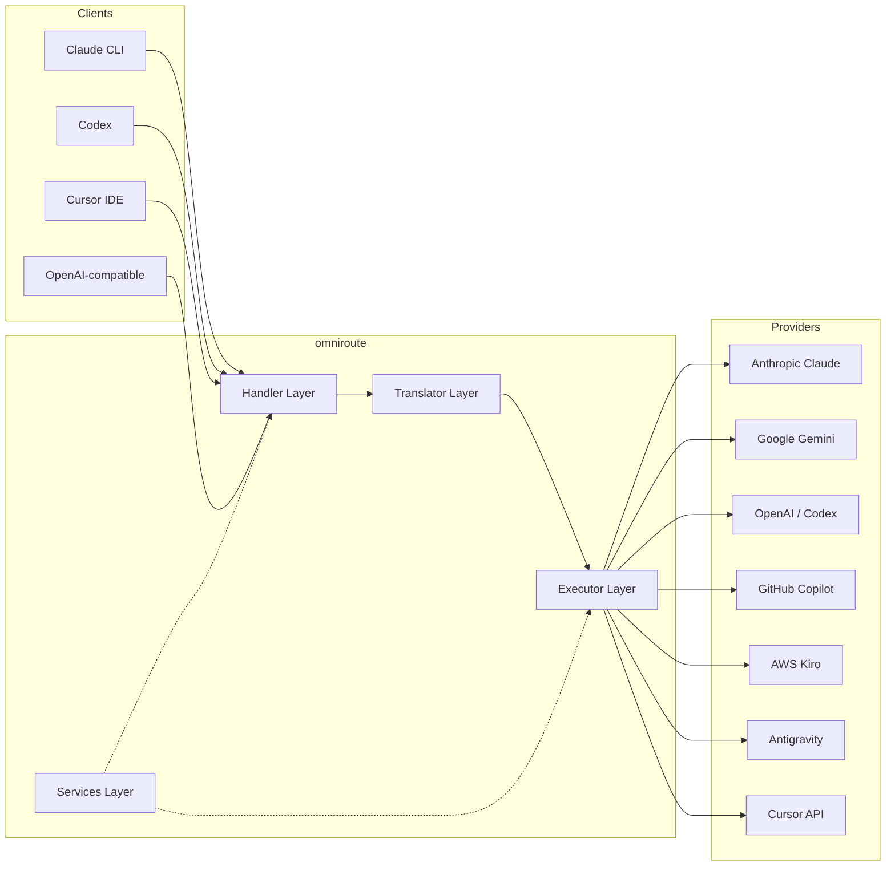

### Podstawowa zasada: tłumaczenie typu Hub-and-Spoke

Tłumaczenie wszystkich formatów przechodzi przez **format OpenAI jako centrum**:

```
Client Format → [OpenAI Hub] → Provider Format    (request)
Provider Format → [OpenAI Hub] → Client Format    (response)
```

Oznacza to, że potrzebujesz tylko **N tłumaczy** (po jednym na format) zamiast **N²** (każda para).

---

## 3. Struktura projektu

```
omniroute/
├── open-sse/                  ← Core proxy library (portable, framework-agnostic)
│   ├── index.js               ← Main entry point, exports everything
│   ├── config/                ← Configuration & constants
│   ├── executors/             ← Provider-specific request execution
│   ├── handlers/              ← Request handling orchestration
│   ├── services/              ← Business logic (auth, models, fallback, usage)
│   ├── translator/            ← Format translation engine
│   │   ├── request/           ← Request translators (8 files)
│   │   ├── response/          ← Response translators (7 files)
│   │   └── helpers/           ← Shared translation utilities (6 files)
│   └── utils/                 ← Utility functions
├── src/                       ← Application layer (Express/Worker runtime)
│   ├── app/                   ← Web UI, API routes, middleware
│   ├── lib/                   ← Database, auth, and shared library code
│   ├── mitm/                  ← Man-in-the-middle proxy utilities
│   ├── models/                ← Database models
│   ├── shared/                ← Shared utilities (wrappers around open-sse)
│   ├── sse/                   ← SSE endpoint handlers
│   └── store/                 ← State management
├── data/                      ← Runtime data (credentials, logs)
│   └── provider-credentials.json   (external credentials override, gitignored)
└── tester/                    ← Test utilities
```

---

## 4. Podział modułów na moduły

### Konfiguracja 4.1 (`open-sse/config/`)

**Pojedyncze źródło prawdy** dla wszystkich konfiguracji dostawców.

| Plik                          | Cel                                                                                                                                                                                                                                                     |
| ----------------------------- | ------------------------------------------------------------------------------------------------------------------------------------------------------------------------------------------------------------------------------------------------------- |
| `constants.ts`                | Obiekt `PROVIDERS` z podstawowymi adresami URL, poświadczeniami OAuth (domyślne), nagłówkami i domyślnymi monitami systemowymi dla każdego dostawcy. Definiuje również `HTTP_STATUS`, `ERROR_TYPES`, `COOLDOWN_MS`, `BACKOFF_CONFIG` i `SKIP_PATTERNS`. |
| `credentialLoader.ts`         | Ładuje zewnętrzne poświadczenia z `data/provider-credentials.json` i łączy je z zakodowanymi na stałe wartościami domyślnymi w `PROVIDERS`. Chroni tajemnice przed kontrolą źródła, zachowując jednocześnie kompatybilność wsteczną.                    |
| `providerModels.ts`           | Centralny rejestr modeli: aliasy dostawców map → identyfikatory modeli. Funkcje takie jak `getModels()`, `getProviderByAlias()`.                                                                                                                        |
| `codexInstructions.ts`        | Instrukcje systemowe wstrzykiwane do żądań Kodeksu (ograniczenia edycyjne, reguły piaskownicy, zasady zatwierdzania).                                                                                                                                   |
| `defaultThinkingSignature.ts` | Domyślne sygnatury „myślące” dla modeli Claude i Gemini.                                                                                                                                                                                                |
| `ollamaModels.ts`             | Definicja schematu dla lokalnych modeli Ollama (nazwa, rozmiar, rodzina, kwantyzacja).                                                                                                                                                                  |

#### Proces ładowania danych uwierzytelniających

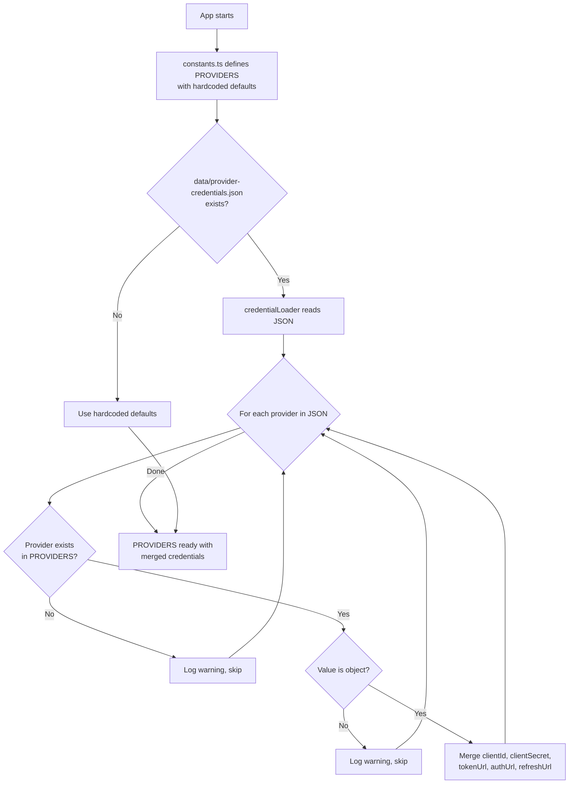

---

### 4.2 Executory (`open-sse/executors/`)

Wykonawcy hermetyzują **logikę specyficzną dla dostawcy** przy użyciu **wzorca strategii**. Każdy wykonawca w razie potrzeby zastępuje metody podstawowe.

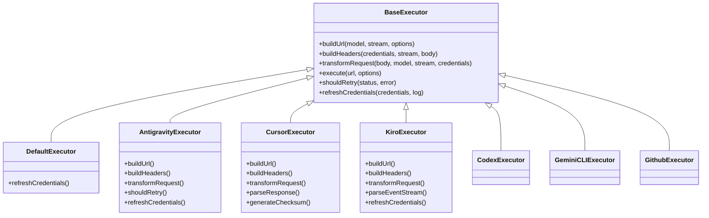

| Wykonawca        | Dostawca                                   | Kluczowe specjalizacje                                                                                                                                                      |
| ---------------- | ------------------------------------------ | --------------------------------------------------------------------------------------------------------------------------------------------------------------------------- |
| `base.ts`        | —                                          | Baza abstrakcyjna: budowanie adresów URL, nagłówki, logika ponownych prób, odświeżanie danych logowania                                                                     |
| `default.ts`     | Claude, Gemini, OpenAI, GLM, Kimi, MiniMax | Ogólne odświeżanie tokena OAuth dla standardowych dostawców                                                                                                                 |
| `antigravity.ts` | Kod Google Cloud                           | Generowanie identyfikatora projektu/sesji, rezerwowy adres wielu adresów URL, niestandardowa analiza ponownych prób na podstawie komunikatów o błędach („reset po 2h7m23s”) |
| `cursor.ts`      | Kursor IDE                                 | **Najbardziej złożone**: uwierzytelnianie sumy kontrolnej SHA-256, kodowanie żądania Protobuf, binarny EventStream → parsowanie odpowiedzi SSE                              |
| `codex.ts`       | Kodeks OpenAI                              | Wstrzykuje instrukcje systemowe, zarządza poziomami myślenia, usuwa nieobsługiwane parametry                                                                                |
| `gemini-cli.ts`  | Interfejs wiersza polecenia Google Gemini  | Tworzenie niestandardowego adresu URL (`streamGenerateContent`), odświeżanie tokena Google OAuth                                                                            |
| `github.ts`      | Drugi pilot GitHuba                        | System podwójnego tokena (GitHub OAuth + token Copilot), naśladowanie nagłówka VSCode                                                                                       |
| `kiro.ts`        | Zaklinacz kodów AWS                        | Parsowanie binarne AWS EventStream, ramki zdarzeń AMZN, szacowanie tokenów                                                                                                  |
| `index.ts`       | —                                          | Fabryka: nazwa dostawcy map → klasa wykonawcy, z domyślnym rezerwowym                                                                                                       |

---

### 4.3 Programy obsługi (`open-sse/handlers/`)

**Warstwa orkiestracji** — koordynuje tłumaczenie, wykonywanie, przesyłanie strumieniowe i obsługę błędów.

| Plik                  | Cel                                                                                                                                                                                                                                                                         |
| --------------------- | --------------------------------------------------------------------------------------------------------------------------------------------------------------------------------------------------------------------------------------------------------------------------- |
| `chatCore.ts`         | **Centralny orkiestrator** (~600 linii). Obsługuje pełny cykl życia żądania: wykrywanie formatu → tłumaczenie → wysyłanie modułu wykonawczego → odpowiedź przesyłana strumieniowo/nie przesyłana strumieniowo → odświeżanie tokena → obsługa błędów → rejestrowanie użycia. |
| `responsesHandler.ts` | Adapter dla API OpenAI Responses: konwertuje format Responses → Ukończenia czatu → wysyła do `chatCore` → konwertuje SSE z powrotem do formatu Responses.                                                                                                                   |
| `embeddings.ts`       | Procedura obsługi generowania osadzania: rozwiązuje model osadzania → dostawca, wysyła do interfejsu API dostawcy, zwraca odpowiedź na osadzanie zgodną z OpenAI. Obsługuje ponad 6 dostawców.                                                                              |
| `imageGeneration.ts`  | Moduł obsługi generowania obrazu: rozpoznaje model obrazu → dostawca, obsługuje tryby zgodne z OpenAI, obraz Gemini (antygrawitacja) i tryb awaryjny (Nebius). Zwraca obrazy base64 lub URL.                                                                                |

#### Cykl życia żądania (chatCore.ts)

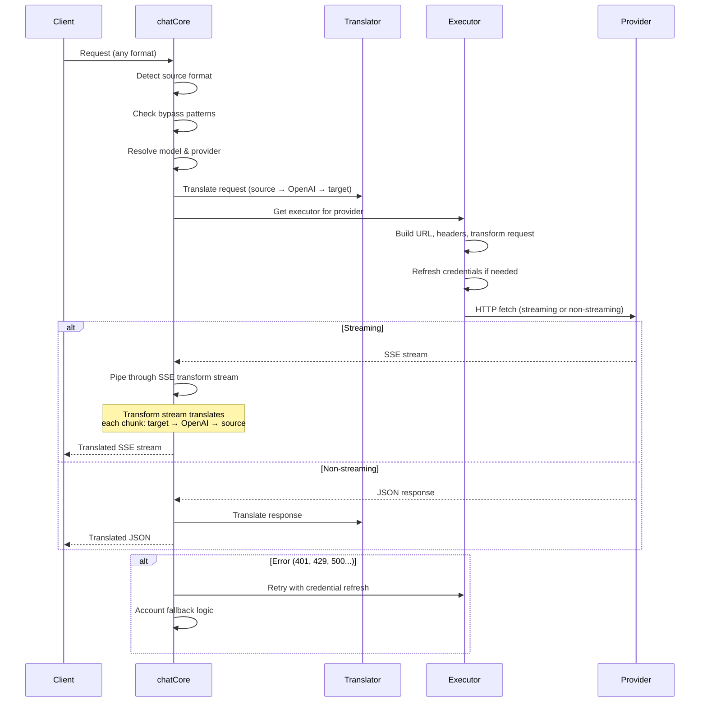

---

### 4.4 Usługi (`open-sse/services/`)

Logika biznesowa obsługująca procedury obsługi i wykonawców.

| Plik                 | Cel                                                                                                                                                                                                                                                                                                                                                                          |
| -------------------- | ---------------------------------------------------------------------------------------------------------------------------------------------------------------------------------------------------------------------------------------------------------------------------------------------------------------------------------------------------------------------------- |
| `provider.ts`        | **Wykrywanie formatu** (`detectFormat`): analizuje strukturę treści żądania w celu identyfikacji formatów Claude/OpenAI/Gemini/Antigravity/Responses (w tym heurystyka `max_tokens` dla Claude). Ponadto: budowanie adresów URL, budowanie nagłówków, normalizacja konfiguracji myślenia. Obsługuje dostawców dynamicznych `openai-compatible-*` i `anthropic-compatible-*`. |
| `model.ts`           | Analiza ciągów modelu (`claude/model-name` → `{provider: "claude", model: "model-name"}`), rozpoznawanie aliasów z wykrywaniem kolizji, oczyszczanie danych wejściowych (odrzuca przejście ścieżki/znaki sterujące) i rozpoznawanie informacji o modelu z obsługą asynchronicznego modułu pobierającego aliasy.                                                              |
| `accountFallback.ts` | Obsługa limitów szybkości: wykładniczy wycofywanie (1 s → 2 s → 4 s → maksymalnie 2 minuty), zarządzanie czasem odnowienia konta, klasyfikacja błędów (które błędy powodują awarię, a które nie).                                                                                                                                                                            |
| `tokenRefresh.ts`    | Odświeżenie tokena OAuth dla **każdego dostawcy**: Google (Gemini, Antigravity), Claude, Codex, Qwen, iFlow, GitHub (podwójny token OAuth + Copilot), Kiro (AWS SSO OIDC + Social Auth). Zawiera pamięć podręczną deduplikacji obiecującą w locie i ponawianie prób z wykładniczym wycofywaniem.                                                                             |
| `combo.ts`           | **Modele kombinowane**: łańcuchy modeli awaryjnych. Jeśli model A zawiedzie z powodu błędu kwalifikującego się do powrotu, wypróbuj model B, następnie C itd. Zwraca rzeczywiste kody stanu nadrzędnego.                                                                                                                                                                     |
| `usage.ts`           | Pobiera dane o przydziałach/wykorzystaniu z interfejsów API dostawców (przydziały GitHub Copilot, przydziały modelu antygrawitacyjnego, limity szybkości Kodeksu, zestawienia użycia Kiro, ustawienia Claude).                                                                                                                                                               |
| `accountSelector.ts` | Inteligentny wybór konta za pomocą algorytmu punktacji: uwzględnia priorytet, stan zdrowia, pozycję w trybie okrężnym i stan odnowienia, aby wybrać optymalne konto dla każdego żądania.                                                                                                                                                                                     |
| `contextManager.ts`  | Zarządzanie cyklem życia kontekstu żądania: tworzy i śledzi obiekty kontekstu na żądanie z metadanymi (identyfikator żądania, znaczniki czasu, informacje o dostawcy) na potrzeby debugowania i rejestrowania.                                                                                                                                                               |
| `ipFilter.ts`        | Kontrola dostępu oparta na protokole IP: obsługuje tryby listy dozwolonych i list zablokowanych. Przed przetworzeniem żądań API sprawdza adres IP klienta pod kątem skonfigurowanych reguł.                                                                                                                                                                                  |
| `sessionManager.ts`  | Śledzenie sesji za pomocą odcisku palca klienta: śledzi aktywne sesje przy użyciu zaszyfrowanych identyfikatorów klienta, monitoruje liczbę żądań i zapewnia metryki sesji.                                                                                                                                                                                                  |
| `signatureCache.ts`  | Pamięć podręczna deduplikacji oparta na sygnaturach żądań: zapobiega duplikowaniu żądań poprzez buforowanie ostatnich podpisów żądań i zwracanie buforowanych odpowiedzi na identyczne żądania w określonym przedziale czasowym.                                                                                                                                             |
| `systemPrompt.ts`    | Globalne wprowadzenie monitu systemowego: dołącza konfigurowalny monit systemowy do wszystkich żądań, z obsługą zgodności dla poszczególnych dostawców.                                                                                                                                                                                                                      |
| `thinkingBudget.ts`  | Zarządzanie budżetem tokenów wnioskowania: obsługuje tryby przekazywania, automatyczne (konfiguracja myślenia paskowego), niestandardowe (stały budżet) i tryby adaptacyjne (skalowane złożoności) do kontrolowania tokenów myślenia/wnioskowania.                                                                                                                           |
| `wildcardRouter.ts`  | Routing wzorców modelu z symbolami wieloznacznymi: rozwiązuje wzorce z symbolami wieloznacznymi (np. `*/claude-*`) do konkretnych par dostawca/model w oparciu o dostępność i priorytet.                                                                                                                                                                                     |

#### Deduplikacja odświeżania tokenu

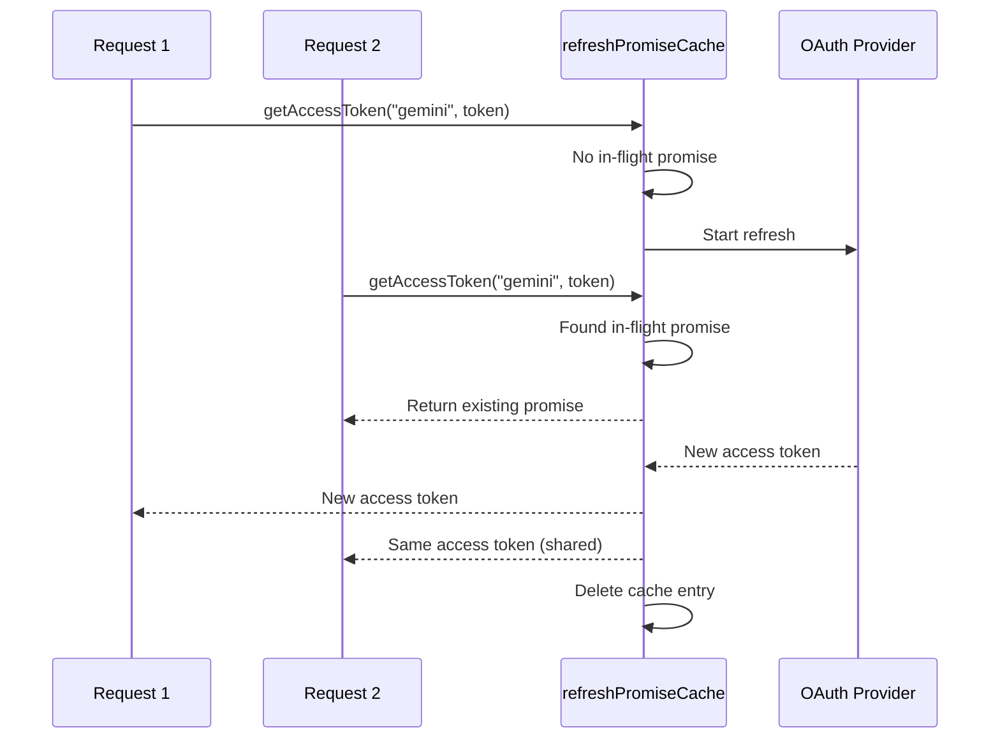

#### Zastępcza maszyna stanu konta

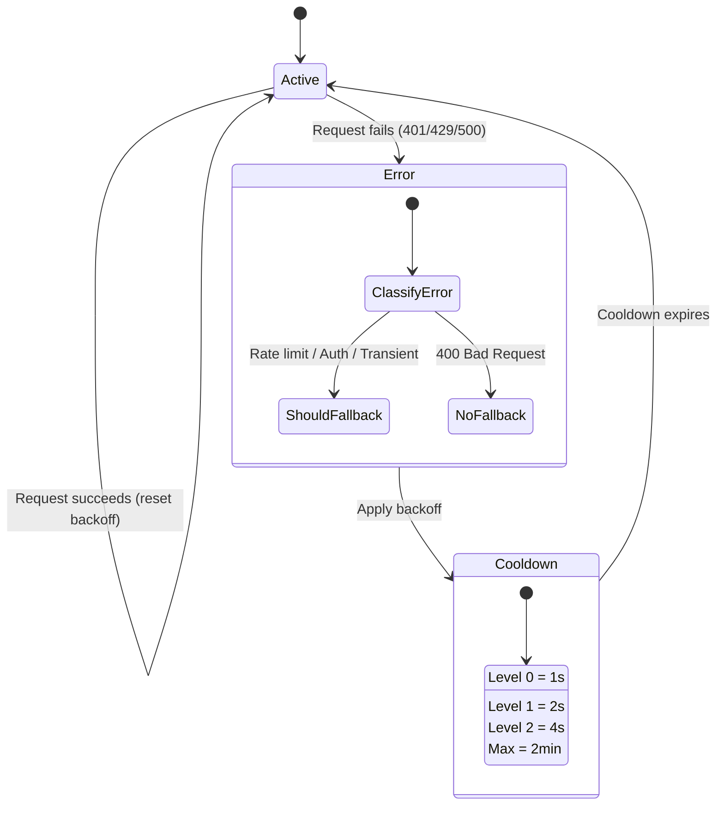

#### Łańcuch modeli Combo

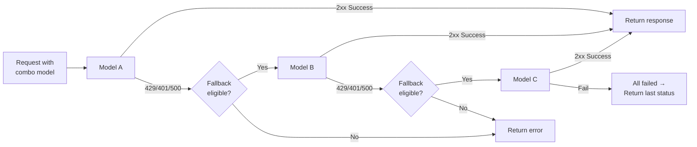

---

### Tłumacz 4.5 (`open-sse/translator/`)

**Silnik tłumaczenia formatów** wykorzystujący system samorejestrujących się wtyczek.

#### Architektura

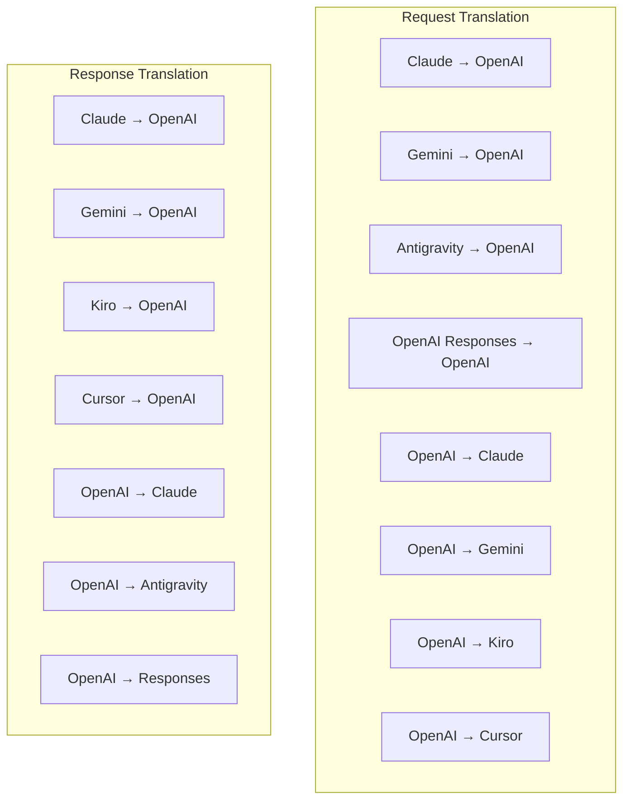

| Katalog      | Pliki        | Opis                                                                                                                                                                                                                                                                                                            |
| ------------ | ------------ | --------------------------------------------------------------------------------------------------------------------------------------------------------------------------------------------------------------------------------------------------------------------------------------------------------------- |
| `request/`   | 8 tłumaczy   | Konwertuj treści żądań między formatami. Każdy plik rejestruje się automatycznie poprzez `register(from, to, fn)` podczas importu.                                                                                                                                                                              |
| `response/`  | 7 tłumaczy   | Konwertuj fragmenty odpowiedzi przesyłanych strumieniowo między formatami. Obsługuje typy zdarzeń SSE, bloki myślowe, wywołania narzędzi.                                                                                                                                                                       |
| `helpers/`   | 6 pomocników | Wspólne narzędzia: `claudeHelper` (ekstrakcja podpowiedzi systemowych, konfiguracja myślenia), `geminiHelper` (mapowanie części/zawartości), `openaiHelper` (filtrowanie formatu), `toolCallHelper` (generowanie identyfikatora, wstrzykiwanie brakującej odpowiedzi), `maxTokensHelper`, `responsesApiHelper`. |
| `index.ts`   | —            | Silnik tłumaczeniowy: `translateRequest()`, `translateResponse()`, zarządzanie państwem, rejestr.                                                                                                                                                                                                               |
| `formats.ts` | —            | Stałe formatu: `OPENAI`, `CLAUDE`, `GEMINI`, `ANTIGRAVITY`, `KIRO`, `CURSOR`, `OPENAI_RESPONSES`.                                                                                                                                                                                                               |

#### Projekt klucza: wtyczki samorejestrujące

```javascript
// Each translator file calls register() on import:
import { register } from "../index.js";
register("claude", "openai", translateClaudeToOpenAI);

// The index.js imports all translator files, triggering registration:
import "./request/claude-to-openai.js"; // ← self-registers
```

---

### 4.6 Narzędzia (`open-sse/utils/`)

| Plik               | Cel                                                                                                                                                                                                                                                                                                                                |
| ------------------ | ---------------------------------------------------------------------------------------------------------------------------------------------------------------------------------------------------------------------------------------------------------------------------------------------------------------------------------- |
| `error.ts`         | Tworzenie reakcji na błędy (format zgodny z OpenAI), analizowanie błędów w górę, ekstrakcja czasu ponownej próby antygrawitacyjnej z komunikatów o błędach, przesyłanie strumieniowe błędów SSE.                                                                                                                                   |
| `stream.ts`        | **SSE Transform Stream** — główny potok przesyłania strumieniowego. Dwa tryby: `TRANSLATE` (tłumaczenie w pełnym formacie) i `PASSTHROUGH` (normalizacja + użycie ekstraktu). Obsługuje buforowanie fragmentów, szacowanie użycia, śledzenie długości treści. Instancje kodera/dekodera na strumień unikają stanu współdzielonego. |
| `streamHelpers.ts` | Narzędzia SSE niskiego poziomu: `parseSSELine` (tolerancja białych znaków), `hasValuableContent` (filtruje puste fragmenty dla OpenAI/Claude/Gemini), `fixInvalidId`, `formatSSE` (serializacja SSE z uwzględnieniem formatu z czyszczeniem `perf_metrics`).                                                                       |
| `usageTracking.ts` | Ekstrakcja użycia tokena z dowolnego formatu (Claude/OpenAI/Gemini/Responses), szacowanie za pomocą oddzielnych współczynników znaków na token narzędzia/wiadomości, dodanie bufora (margines bezpieczeństwa 2000 tokenów), filtrowanie pól specyficzne dla formatu, rejestrowanie konsoli za pomocą kolorów ANSI.                 |
| `requestLogger.ts` | Rejestrowanie żądań w oparciu o pliki (opcja poprzez `ENABLE_REQUEST_LOGS=true`). Tworzy foldery sesji z ponumerowanymi plikami: `1_req_client.json` → `7_res_client.txt`. Wszystkie wejścia/wyjścia są asynchroniczne (odpal i zapomnij). Maskuje wrażliwe nagłówki.                                                              |
| `bypassHandler.ts` | Przechwytuje określone wzorce z Claude CLI (wyodrębnianie tytułu, rozgrzewka, liczenie) i zwraca fałszywe odpowiedzi bez wywoływania żadnego dostawcy. Obsługuje zarówno przesyłanie strumieniowe, jak i inne. Celowo ograniczone do zakresu Claude CLI.                                                                           |
| `networkProxy.ts`  | Rozwiązuje wychodzący adres URL proxy dla danego dostawcy z pierwszeństwem: konfiguracja specyficzna dla dostawcy → konfiguracja globalna → zmienne środowiskowe (`HTTPS_PROXY`/`HTTP_PROXY`/`ALL_PROXY`). Obsługuje wyjątki `NO_PROXY`. Buforuje konfigurację przez 30 sekund.                                                    |

#### Rurociąg przesyłania strumieniowego SSE

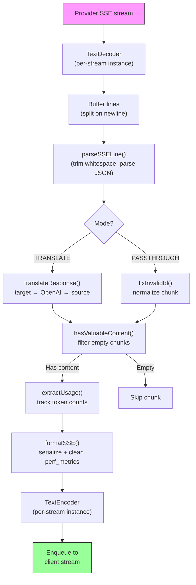

#### Struktura sesji rejestratora żądania

```
logs/
└── claude_gemini_claude-sonnet_20260208_143045/
    ├── 1_req_client.json      ← Raw client request
    ├── 2_req_source.json      ← After initial conversion
    ├── 3_req_openai.json      ← OpenAI intermediate format
    ├── 4_req_target.json      ← Final target format
    ├── 5_res_provider.txt     ← Provider SSE chunks (streaming)
    ├── 5_res_provider.json    ← Provider response (non-streaming)
    ├── 6_res_openai.txt       ← OpenAI intermediate chunks
    ├── 7_res_client.txt       ← Client-facing SSE chunks
    └── 6_error.json           ← Error details (if any)
```

---

### 4.7 Warstwa aplikacji (`src/`)

| Katalog       | Cel                                                                                                            |
| ------------- | -------------------------------------------------------------------------------------------------------------- |
| `src/app/`    | Interfejs sieciowy, trasy API, oprogramowanie pośredniczące Express, procedury obsługi wywołań zwrotnych OAuth |
| `src/lib/`    | Dostęp do bazy danych (`localDb.ts`, `usageDb.ts`), uwierzytelnianie, współdzielone                            |
| `src/mitm/`   | Narzędzia proxy typu „man-in-the-middle” do przechwytywania ruchu dostawcy                                     |
| `src/models/` | Definicje modeli baz danych                                                                                    |
| `src/shared/` | Opakowania wokół funkcji open-sse (dostawca, strumień, błąd itp.)                                              |
| `src/sse/`    | Procedury obsługi punktów końcowych SSE, które łączą bibliotekę open-sse z trasami Express                     |
| `src/store/`  | Zarządzanie stanem aplikacji                                                                                   |

#### Godne uwagi trasy API

| Trasa                                         | Metody            | Cel                                                                                                        |
| --------------------------------------------- | ----------------- | ---------------------------------------------------------------------------------------------------------- |
| `/api/provider-models`                        | POBIERZ/POST/USUŃ | CRUD dla niestandardowych modeli na dostawcę                                                               |
| `/api/models/catalog`                         | OTRZYMAJ          | Zagregowany katalog wszystkich modeli (czat, osadzanie, obraz, niestandardowy) pogrupowany według dostawcy |
| `/api/settings/proxy`                         | POBIERZ/PUT/USUŃ  | Hierarchiczna konfiguracja wychodzącego proxy (`global/providers/combos/keys`)                             |
| `/api/settings/proxy/test`                    | POST              | Sprawdza łączność proxy i zwraca publiczny adres IP/opóźnienie                                             |
| `/v1/providers/[provider]/chat/completions`   | POST              | Dedykowane uzupełnianie czatów dla poszczególnych dostawców z walidacją modelu                             |
| `/v1/providers/[provider]/embeddings`         | POST              | Dedykowane osadzanie dla poszczególnych dostawców z walidacją modelu                                       |
| `/v1/providers/[provider]/images/generations` | POST              | Dedykowane generowanie obrazów dla poszczególnych dostawców z walidacją modelu                             |
| `/api/settings/ip-filter`                     | POBIERZ/WSTAW     | Zarządzanie listą dozwolonych/blokowanych adresów IP                                                       |
| `/api/settings/thinking-budget`               | POBIERZ/WSTAW     | Konfiguracja budżetu tokena rozumowania (przejściowa/automatyczna/niestandardowa/adaptacyjna)              |
| `/api/settings/system-prompt`                 | POBIERZ/WSTAW     | Globalny systemowy zastrzyk monitu dla wszystkich żądań                                                    |
| `/api/sessions`                               | OTRZYMAJ          | Śledzenie i metryki aktywnych sesji                                                                        |
| `/api/rate-limits`                            | OTRZYMAJ          | Stan limitu stawek za konto                                                                                |

---

## 5. Kluczowe wzorce projektowe

### 5.1 Tłumaczenie typu Hub-and-Spoke

Wszystkie formaty są tłumaczone poprzez **format OpenAI jako centrum**. Dodanie nowego dostawcy wymaga jedynie napisania **jednej pary** tłumaczy (do/z OpenAI), a nie N par.

### 5.2 Wzorzec strategii wykonawcy

Każdy dostawca ma dedykowaną klasę wykonawczą dziedziczącą z `BaseExecutor`. Fabryka w `executors/index.ts` wybiera właściwą w czasie wykonywania.

### 5.3 System wtyczek samorejestrujących

Moduły tłumacza rejestrują się przy imporcie poprzez `register()`. Dodanie nowego tłumacza polega po prostu na utworzeniu pliku i zaimportowaniu go.

### 5.4 Zwrot konta z wykładniczym wycofywaniem

Kiedy dostawca zwróci 429/401/500, system może przełączyć się na następne konto, stosując wykładnicze czasy odnowienia (1 s → 2 s → 4 s → maksymalnie 2 minuty).

### Łańcuchy modeli Combo 5.5

„Kombinacja” grupuje wiele ciągów `provider/model`. Jeśli pierwszy się nie powiedzie, automatycznie wróć do następnego.

### 5.6 Stanowe tłumaczenie strumieniowe

Tłumaczenie odpowiedzi utrzymuje stan we wszystkich fragmentach SSE (śledzenie bloków myślenia, gromadzenie wywołań narzędzi, indeksowanie bloków treści) za pośrednictwem mechanizmu `initState()`.

### 5.7 Bufor bezpieczeństwa użytkowania

Do raportowanego użycia dodawany jest bufor o pojemności 2000 tokenów, aby zapobiec przekraczaniu przez klientów limitów okna kontekstowego z powodu narzutu wynikającego z monitów systemowych i translacji formatów.

---

## 6. Obsługiwane formaty

| Formatuj                                  | Kierunek     | Identyfikator      |
| ----------------------------------------- | ------------ | ------------------ |
| Ukończenie czatu OpenAI                   | źródło + cel | `openai`           |
| API odpowiedzi OpenAI                     | źródło + cel | `openai-responses` |
| Antropiczny Claude                        | źródło + cel | `claude`           |
| Google Bliźnięta                          | źródło + cel | `gemini`           |
| Interfejs wiersza polecenia Google Gemini | tylko cel    | `gemini-cli`       |
| Antygrawitacja                            | źródło + cel | `antigravity`      |
| AWS Kiro                                  | tylko cel    | `kiro`             |
| Kursor                                    | tylko cel    | `cursor`           |

---

## 7. Obsługiwani dostawcy

| Dostawca                                  | Metoda autoryzacji               | Wykonawca      | Kluczowe notatki                                                         |
| ----------------------------------------- | -------------------------------- | -------------- | ------------------------------------------------------------------------ |
| Antropiczny Claude                        | Klucz API lub OAuth              | Domyślne       | Używa nagłówka `x-api-key`                                               |
| Google Bliźnięta                          | Klucz API lub OAuth              | Domyślne       | Używa nagłówka `x-goog-api-key`                                          |
| Interfejs wiersza polecenia Google Gemini | OAuth                            | BliźniętaCLI   | Używa punktu końcowego `streamGenerateContent`                           |
| Antygrawitacja                            | OAuth                            | Antygrawitacja | Zastępczy adres wielu adresów URL, niestandardowa analiza ponownych prób |
| OpenAI                                    | Klucz API                        | Domyślne       | Autoryzacja okaziciela standardowego                                     |
| Kodeks                                    | OAuth                            | Kodeks         | Wstrzykuje instrukcje systemowe, zarządza myśleniem                      |
| Drugi pilot GitHuba                       | OAuth + token drugiego pilota    | GitHuba        | Podwójny token, nagłówek VSCode naśladujący                              |
| Kiro (AWS)                                | AWS SSO OIDC lub społecznościowe | Kiro           | Analiza binarnego strumienia zdarzeń                                     |
| Kursor IDE                                | Autoryzacja sumy kontrolnej      | Kursor         | Kodowanie Protobuf, sumy kontrolne SHA-256                               |
| Qwen                                      | OAuth                            | Domyślne       | Autoryzacja standardowa                                                  |
| iFlow                                     | OAuth (podstawowy + nośnik)      | Domyślne       | Nagłówek podwójnego uwierzytelniania                                     |
| OtwórzRouter                              | Klucz API                        | Domyślne       | Autoryzacja okaziciela standardowego                                     |
| GLM, Kimi, MiniMax                        | Klucz API                        | Domyślne       | Kompatybilny z Claude, użyj `x-api-key`                                  |
| `openai-compatible-*`                     | Klucz API                        | Domyślne       | Dynamiczny: dowolny punkt końcowy zgodny z OpenAI                        |
| `anthropic-compatible-*`                  | Klucz API                        | Domyślne       | Dynamiczny: dowolny punkt końcowy zgodny z Claude                        |

---

## 8. Podsumowanie przepływu danych

### Żądanie transmisji strumieniowej

```mermaid
flowchart LR
    A["Client"] --> B["detectFormat()"]
    B --> C["translateRequest()\nsource → OpenAI → target"]
    C --> D["Executor\nbuildUrl + buildHeaders"]
    D --> E["fetch(providerURL)"]
    E --> F["createSSEStream()\nTRANSLATE mode"]
    F --> G["parseSSELine()"]
    G --> H["translateResponse()\ntarget → OpenAI → source"]
    H --> I["extractUsage()\n+ addBuffer"]
    I --> J["formatSSE()"]
    J --> K["Client receives\ntranslated SSE"]
    K --> L["logUsage()\nsaveRequestUsage()"]
```

### Żądanie bez przesyłania strumieniowego

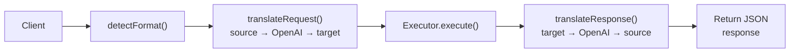

### Przepływ obejściowy (Claude CLI)

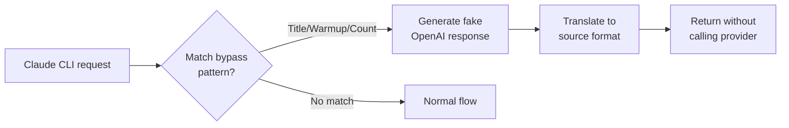
